# Create Action Project in Lobby

In this tutorial, you will create an action project based on Business Partner API. The [Business Partner (A2X)](https://api.sap.com/api/API_BUSINESS_PARTNER/overview) API is already available in API Business Hub. For this workshop you will leverage **Customer - GET API** which will be used to fetch the customer details from SAP S/4HANA system.

## Download open API specification

1. Open [Business Partner (A2X)](https://api.sap.com/api/API_BUSINESS_PARTNER/overview) from SAP Business Accelerator Hub.

    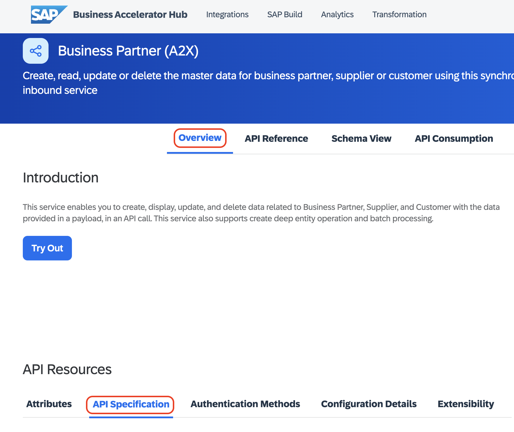

2. Under **API Specification**, click download icon for **OpenAPI JSON**.

    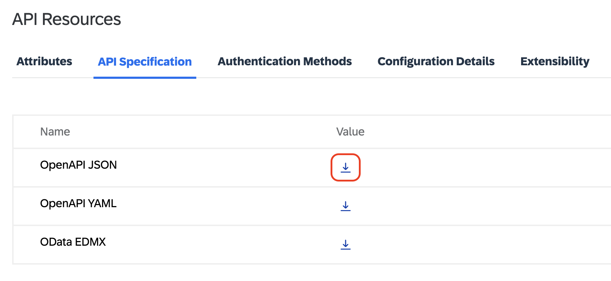

## Create action project

1. Open **SAP Build Lobby**, under **Connectors**, select **Actions**.

    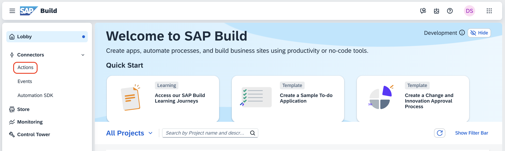

2. Choose **Create**.

    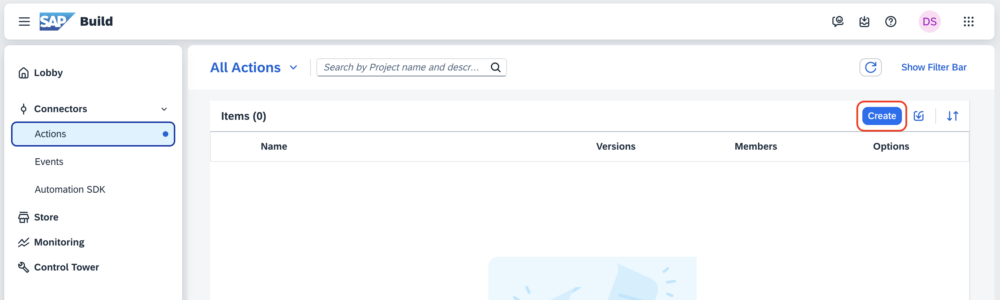

3. In the Choose an **API Source** popup, under **API Specification**, select **Upload API Specification.**

    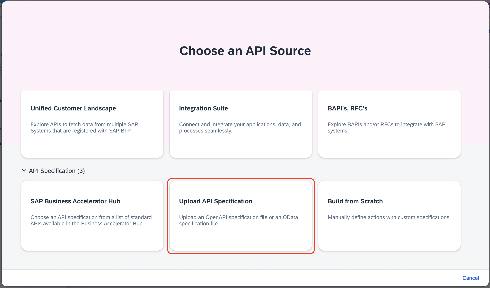

4. Drag and drop or click **Browse Files** to upload open specification file downloaded in step above.

    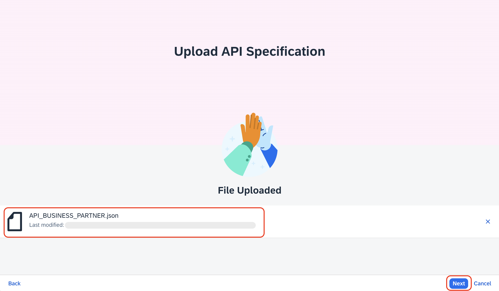

5. Choose **Next**.

6. In the Create an **Action** project popup:

    1. Enter `Business Partner <your-initials><unique-random-number>` in the **Project Name** field. For example, if your name is `John Doe`, then the project name would be **Business Partner-jd12**, (12 is some random number).

    > **Note:** The project name should be unique to identify your project while selecting the action in later stage and also to avoid a duplication error.

    2. Enter the **Description** as **Fetch customer details from the Business Partner API**. 

    3. Click on **Create**.

        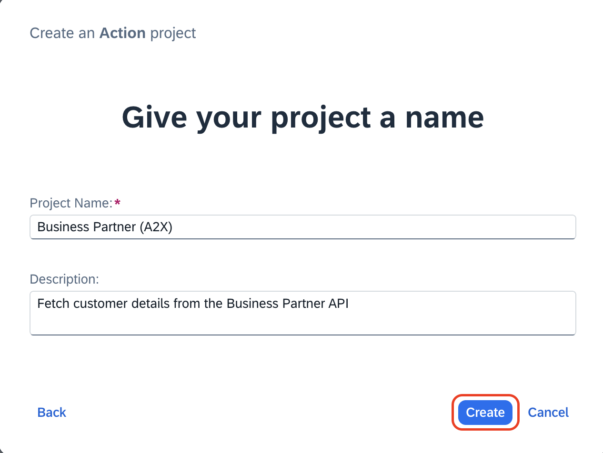

7. Once the action project is created, the action editor will automatically open. 

### Configure action project

1. Once the Action Editor - **Add Actions From Business Partner** is opened, you have to select *GET* method of `/A_Customer` API. Follow the below steps to add it.

    - Scroll the API lists to find the **Customer** API, and click on expand near to that.

        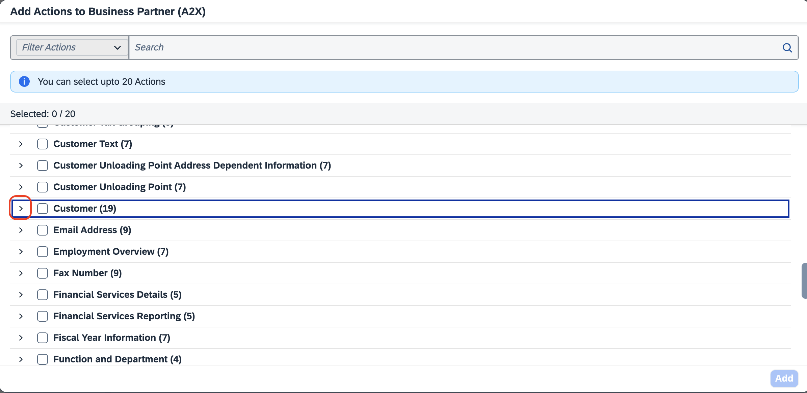

    - Scroll the APIs listed under Customer and select **GET** option for API **/A_Customer**.

        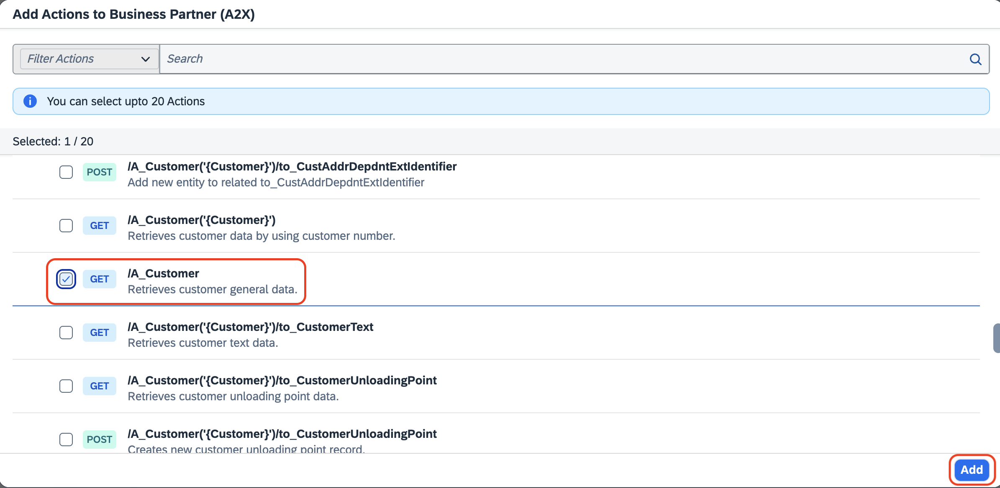

    - Click on **Add**.

    The Action Editor will open with the selected APIs which can be further configured based on the requirements.

2. This Action supports JSON files and the file size is limited to 5 MB, you need to fetch a specific number of records from your data source. This can be done using the `$top` input parameter. For this use case, you will be setting the parameter to 150. This will enable us to fetch the first 150 records and display their details. 

    - Select the **$top** parameter.

    - In the side panel, toggle the **Static** option to **YES**.

    - Enter **150** in the **Value** field.

    - Click on **Save**.

        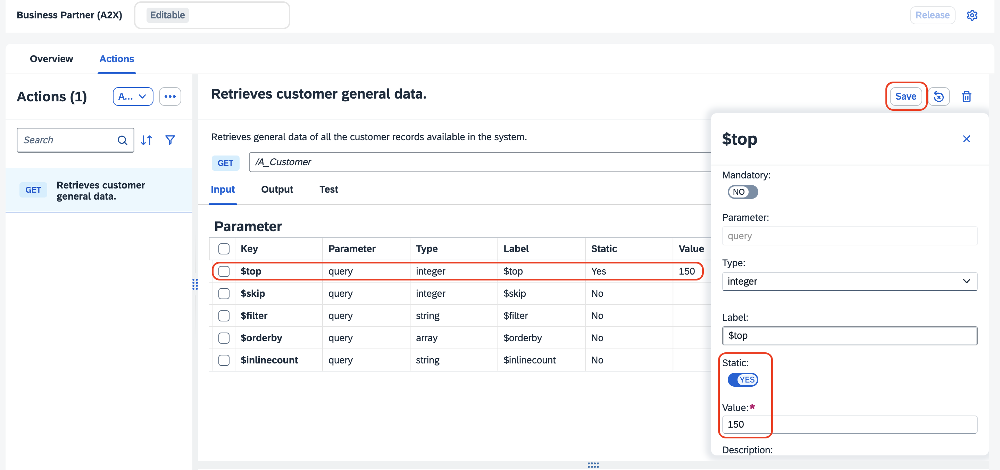

    With this you have configured the action project name and API input fields.

3. Similarly, configure the output fields. Do the following:

    - Click **Output** tab.

    - Expand the output key **d**.

        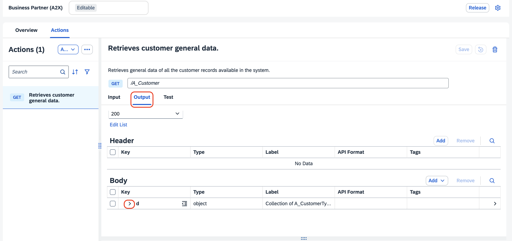

    - Select the **results** key.

    - In the side menu, select the **Tags** dropdown and choose **Main Output Array**.

    - Choose **Save**.

        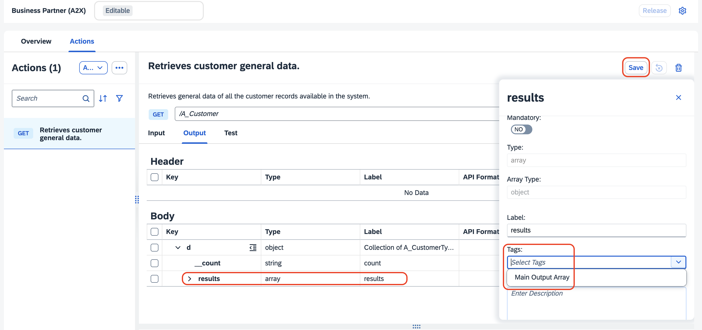

> [!Tip] 
> What is going on?
>
> If this array is not marked as Main Output Array, the Actions Project will not be visible in the Form Editor as a data source.

### Test action project

1. Once the action project is configured and saved, it is time to test the changes and output. To test the API, do the following:

    - Click **Test** tab.

    - Select **Destination** option under **Connectivity**.

    - Select `S4HANA` from the dropdown options.

    > [!Note]
    > The destinations are fetched from the SAP Business Technology Platform. The selected destination is already created in the account configured for this tutorial.

    > Notice that the input value is already picked from the default value entered while configuring the action project.

    - Click **Test**.

        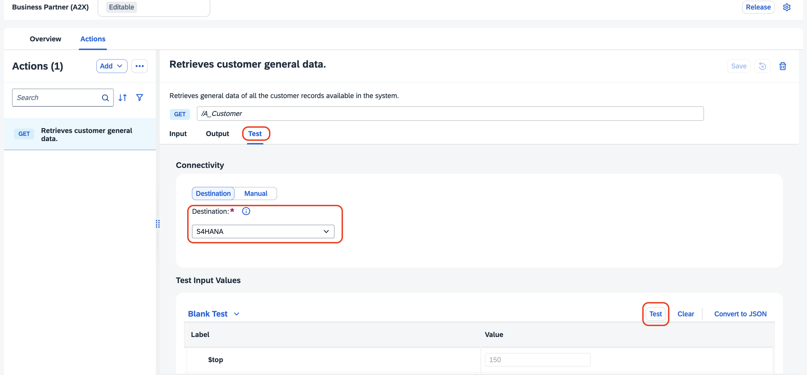

    - Once the execution is successful, you see **200 OK** response with the details of the customers in the backend S/4HANA Cloud system.

        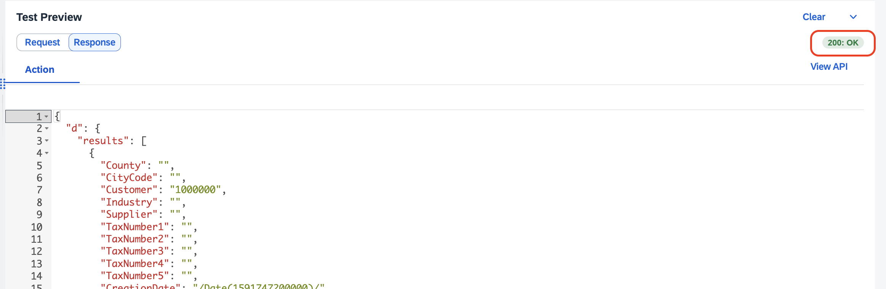

    The action gives a response which, in this use case, returns the customer details and related details. You need to display the customer names which are in an array of objects.

## Release and Publish to the Library

1. Click on **Release**.

    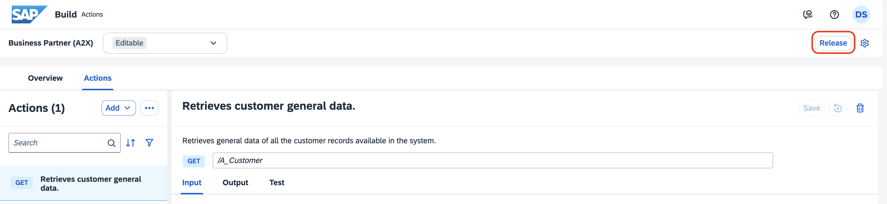

2. Click on **Release** again.

    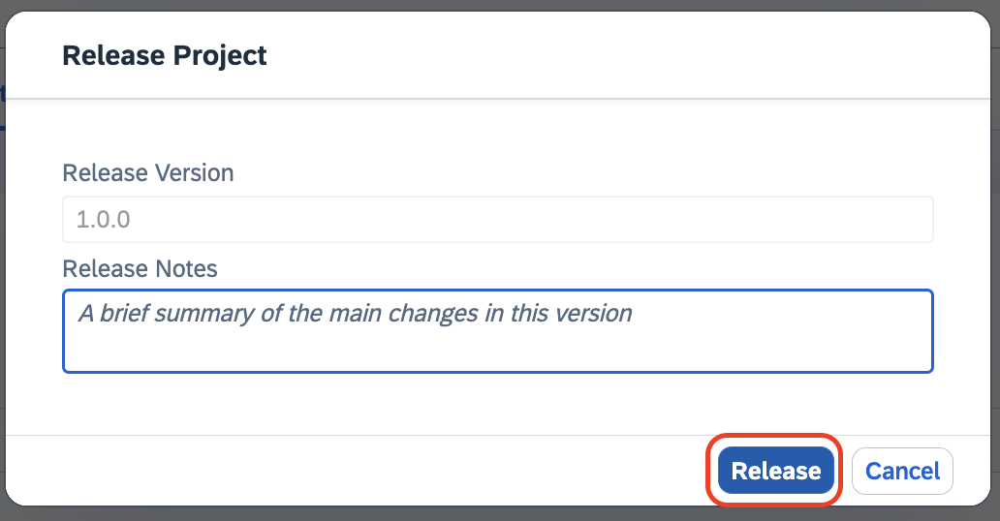

3. Click on **Publish**.

    

4. Click on **Publish** again.

    

**You have successfully created action project for SAP S/4HANA.**

## Next Step

[Consume SAP S/4HANA Business Partner API to the Drop-Down Fields in the Form.](../s4hana/README.md)
