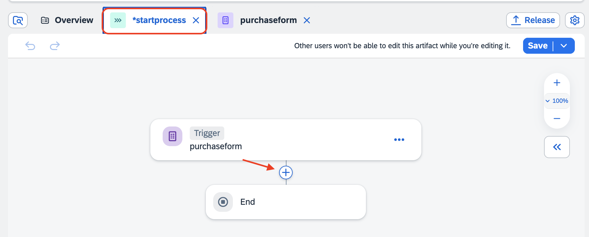
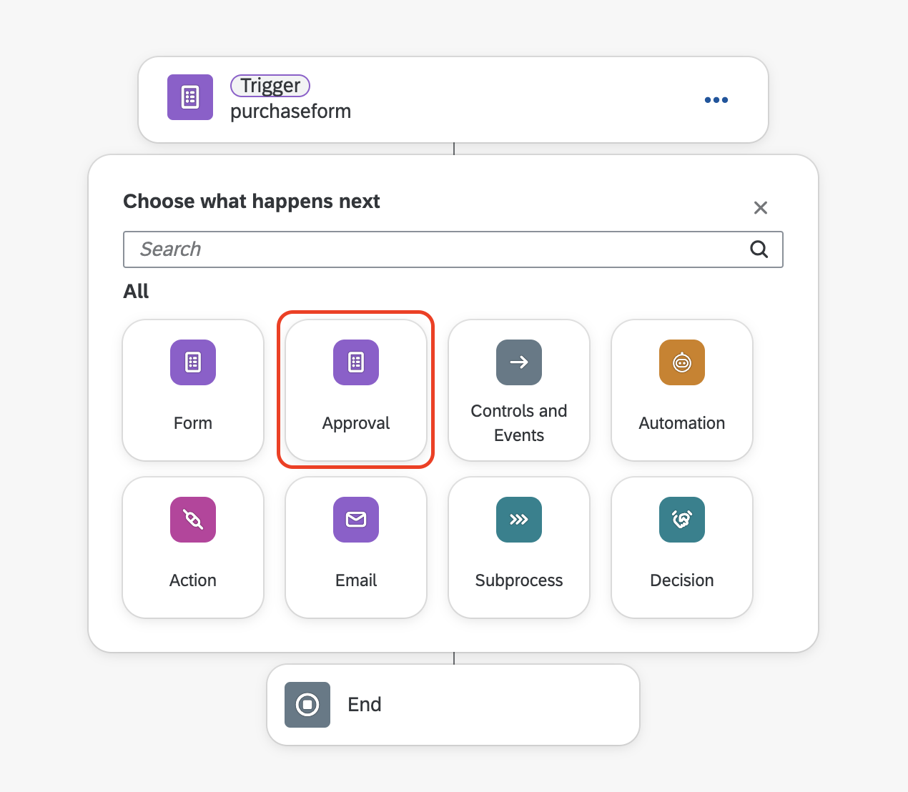
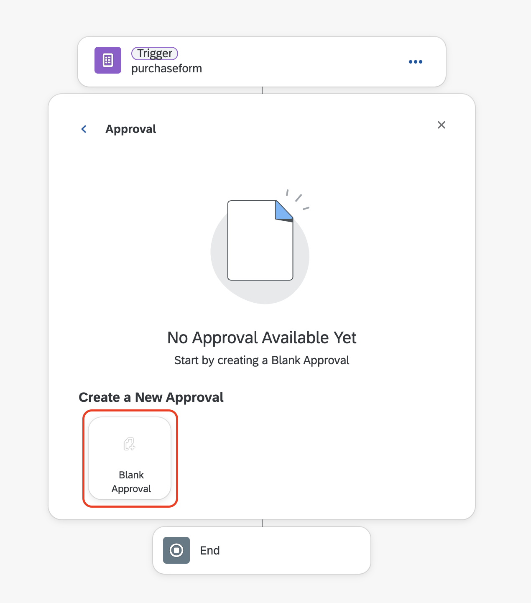
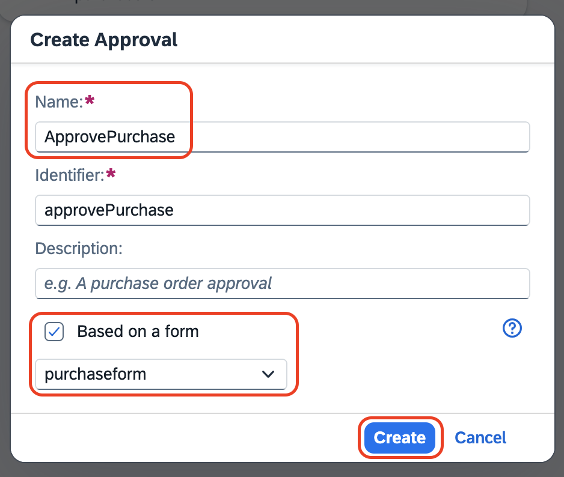
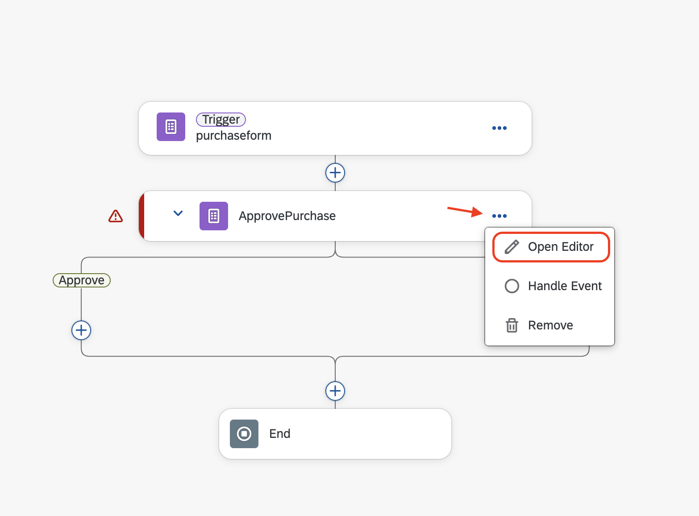
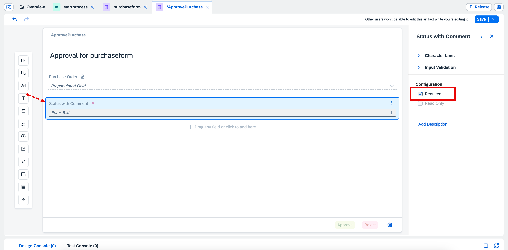
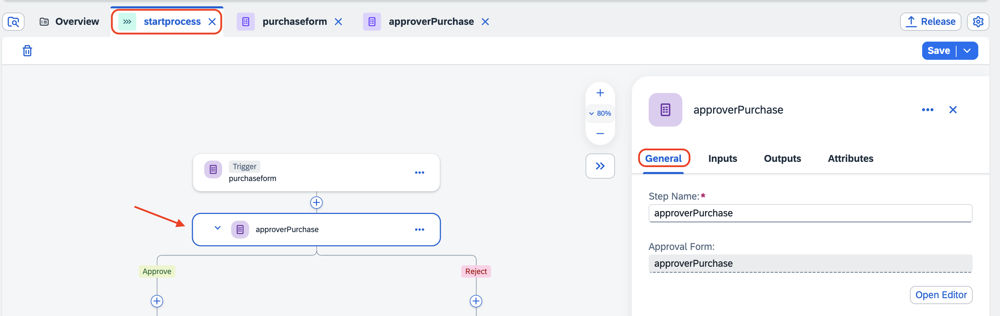
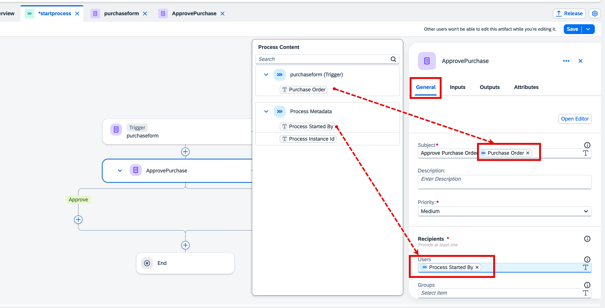
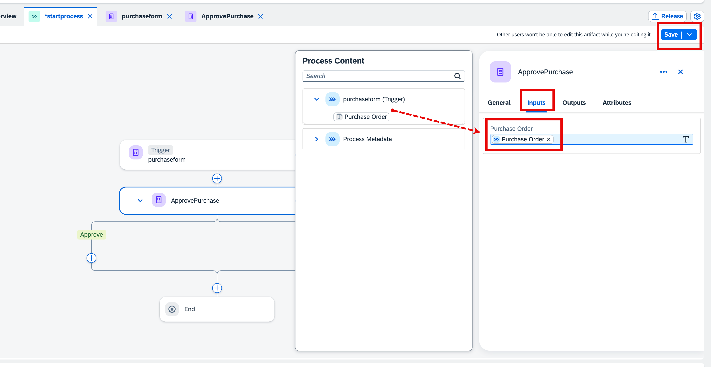

# Create Purchase Order Approval Form.
In this exercise you will create a form to Approve the Purchase and add a comment for approval

1. Go back to startprocess tab, and choose **+** after the trigger. 

    

2. Choose Approval

    

3. Choose **Blank Approval**.

    

4. In **Create Approval** Popup
    1. Enter **Name** as **ApprovePurchase**.
    2. Choose **Based on a form**.
    3. Choose the created form name from dropdown
    4. Click on **Create** Button

        
    

5. In **Approval**, choose **Open Editor**.

    

6. Choose **Text** from the layout. In the text box, enter **Status with Comment**.

7. In the Configuration, choose **Required**.

8. Save the Approval.

     

9. Go back to the **startprocess** tab, click on ApprovePurchase, which opens General tab.
    
     

10. Under **General** tab, do the following:

    1. In the **Subject**, type **Approve Purchase Order**, after that click on the **Purchase Order** from *purchaseform(Trigger)*.

    2. Under the **Recipients** -> **Users**, choose **Process Started By** from Process Metadata.

         

11. Choose **Inputs** tab.

12. In **Purchase Order**, click on the **Purchase Order** from *purchaseform(Trigger)*.

13. Choose **Save**.

     

**You have now completed the development of Approvals.**

## Next Step

[Add CAP Nodejs Action inside SPA](../action/README.md)

