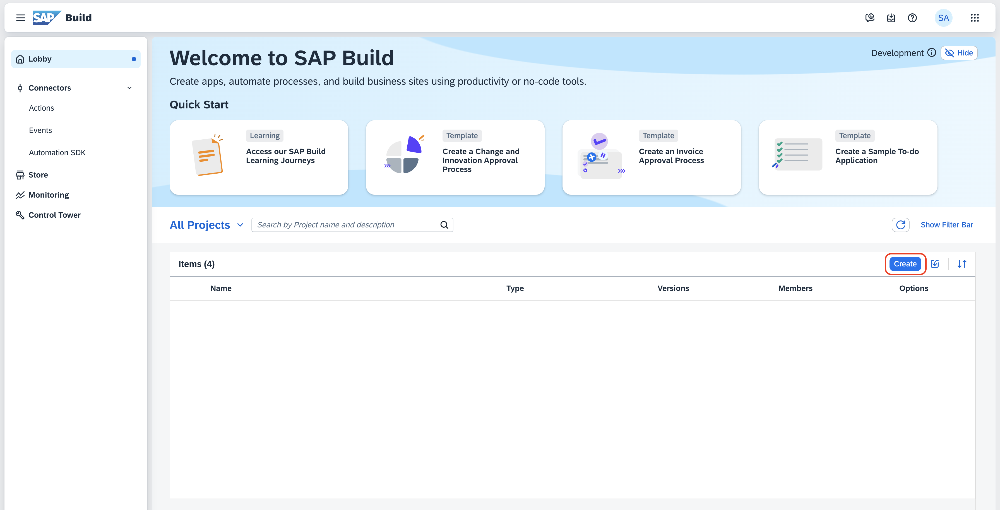
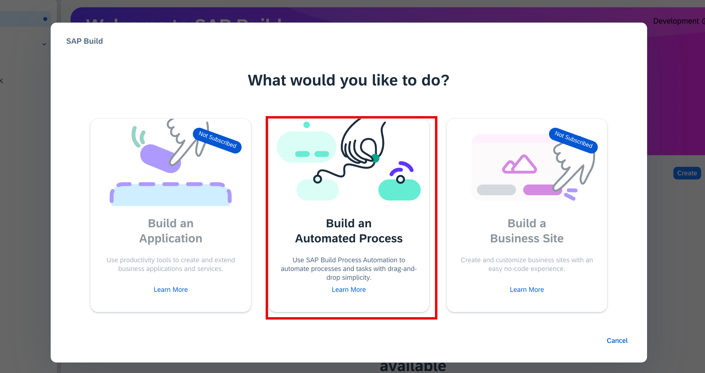
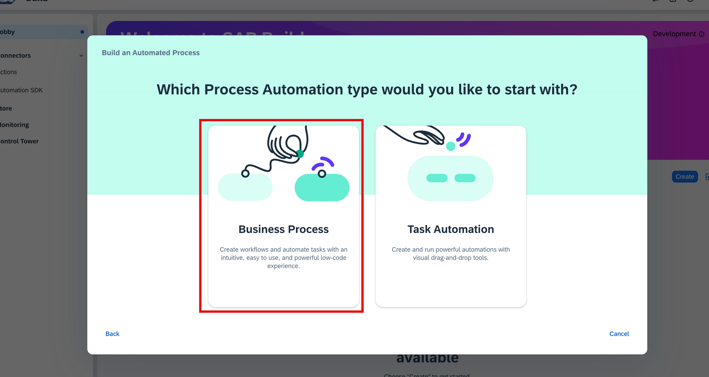
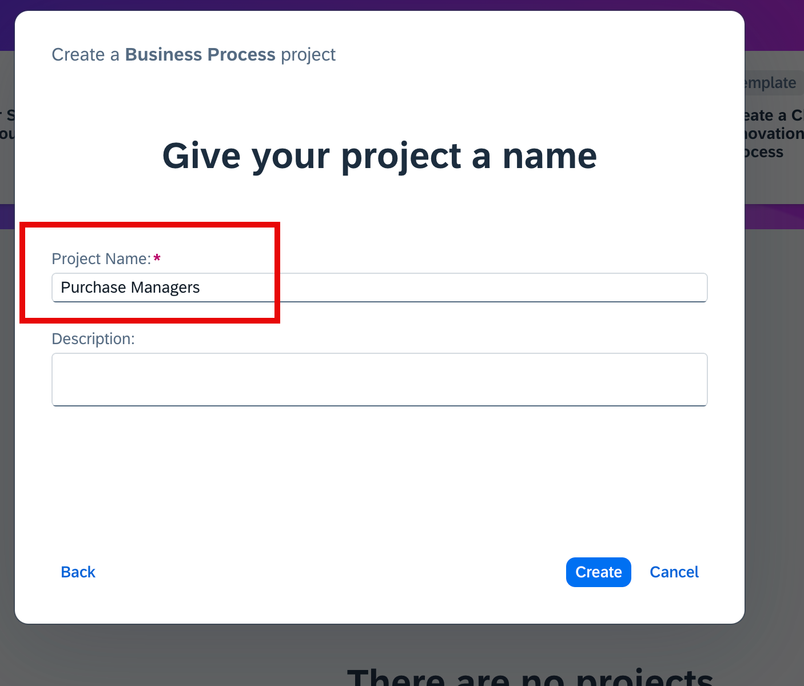
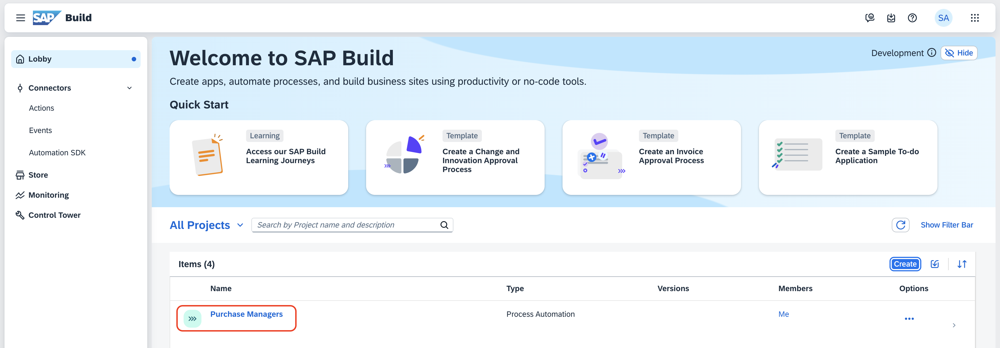
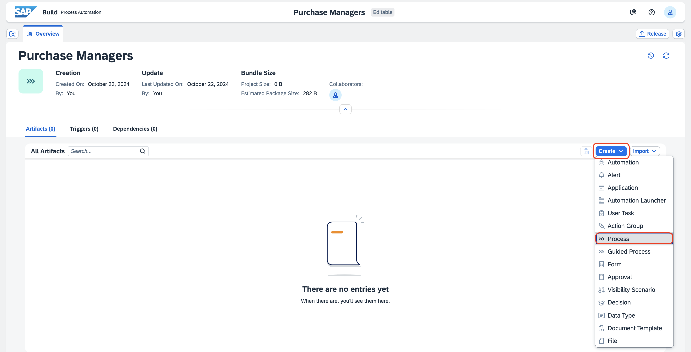
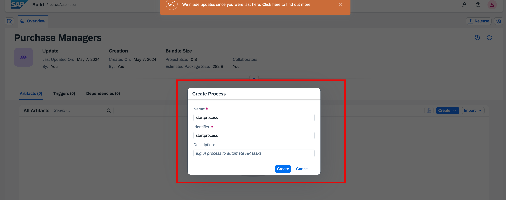

# Create Project in SAP Build Lobby

1. Open **[SAP Build Lobby](https://pw-build-hands-on.eu10.build.cloud.sap/lobby)**.

2. Click on **Create**.

    

3. Choose **Build an Automated Process**

    

4. Choose **Business Process**

    

5. Enter Project Name **Purchase Managers-<UniqueID>** and choose **Create**.
    > Please append a unique id which consists of your initials and random number at the end of Project name e.g if your name is John Doe name the Project Purchase Managers-JD06.

    

6. Please wait until the created project opens up in a new tab automatically.
    > - If any popup comes. Click on Cancel Button
    > - If the created project is not opening, click on the project name
    

7.  Click on Create and choose **process** from the dropdown.
    

8. In the create process popup, enter **startprocess** in the Name field and choose **Create**.

    

**Now you have completed the creation of project and initiated the new process.**

## Next Step

[Build a Purchase Order Form](../form/README.md)

