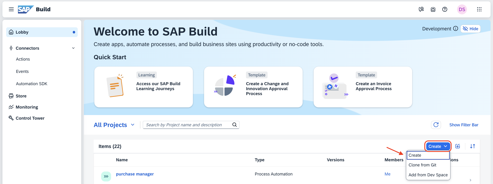
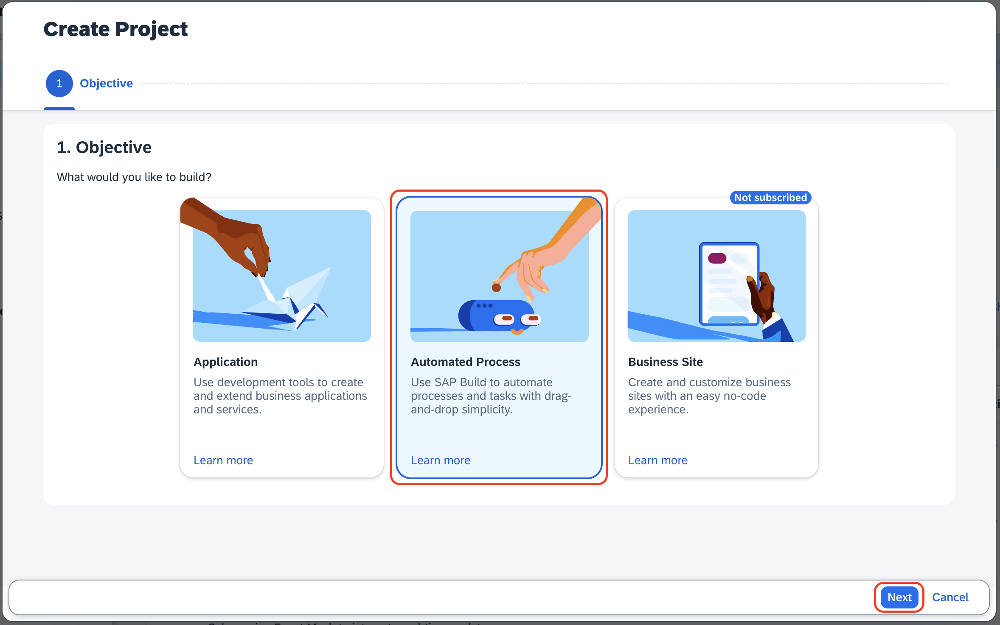
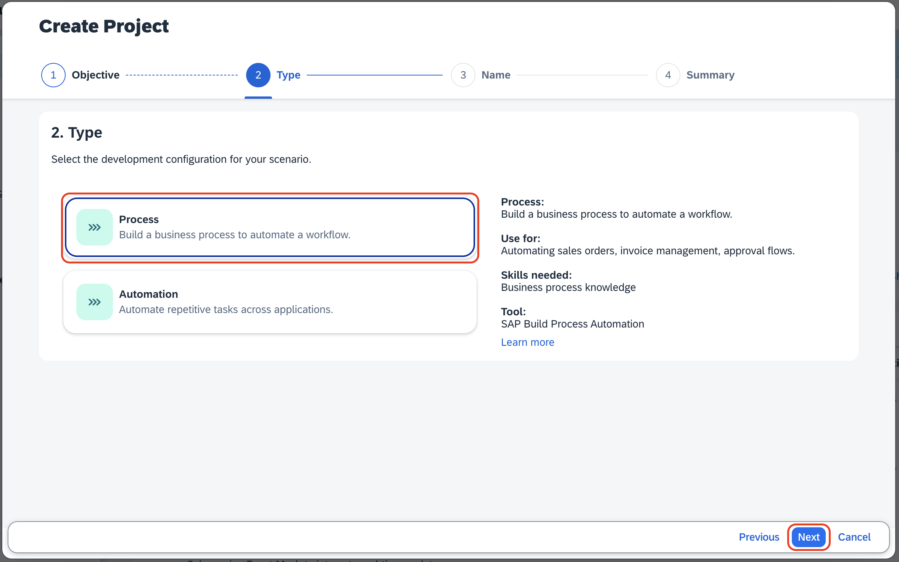
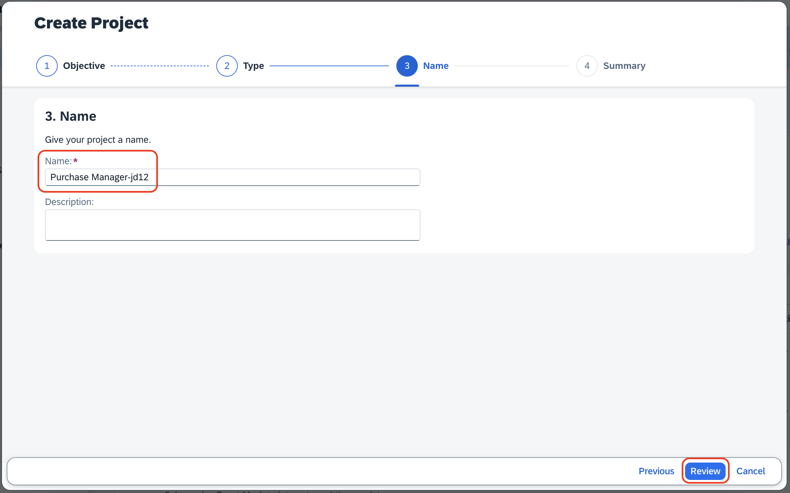
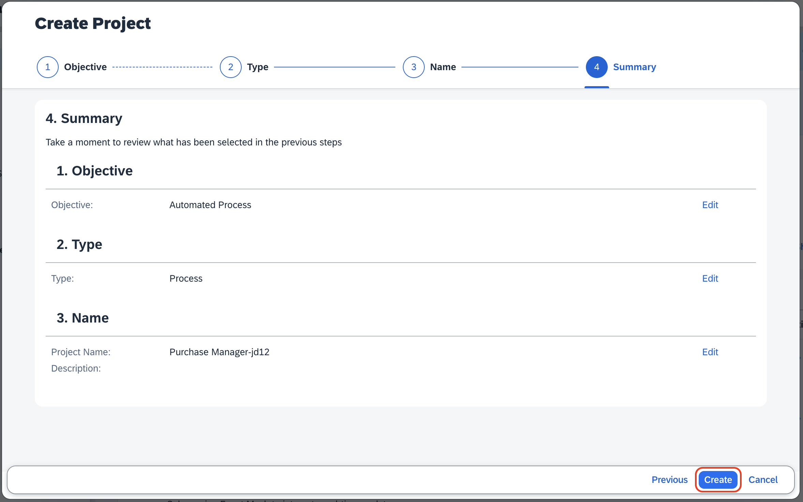
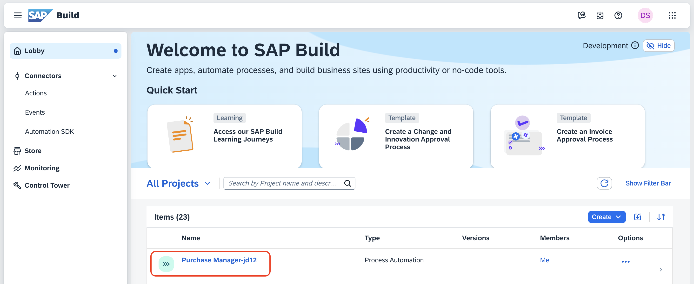

# Create Project in SAP Build Lobby

1. Open **[SAP Build Lobby](https://pw-build-hands-on.eu10.build.cloud.sap/lobby)**.

2. Click on **Create** from the *Create* dropdown.

    

3. In the Create Project dialog, under **Objective**, choose an **Automated Process** and click on **Next**.

    

4. Under **Type**, select the development configuration as **Process**, and click on **Next**.

    

5. Enter `Purchase Manager <your-initials><unique-random-number>` in the **Project Name** field. For example, if your name is `John Doe`, then the project name would be **Purchase Manager-jd12**, (12 is some random number).

    > **Note:** The project name should be unique to identify your project during deployment and also to avoid a duplication error.

6. Click on **Review**.

    

7. In the **Summary** page, review the *Objective, Type and name* given in the previous steps and click on **Create**.

    

8. Please wait until the created project opens up in a new tab automatically.

9. If the created project is not opening, do the following:

    1. Click on the project name.
    
        

    2. Click on **Create** and choose **Process** from the dropdown.
        
        

10. In the create process popup, enter **startprocess** in the Name field and choose **Create**.

    

**Now you have completed the creation of project and initiated the new process.**

## Next Step

[Build a Purchase Order Form](../form/README.md)

