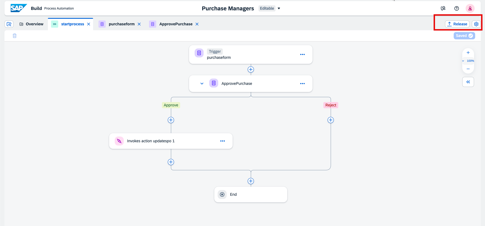
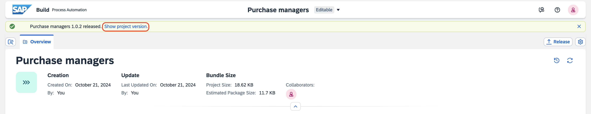
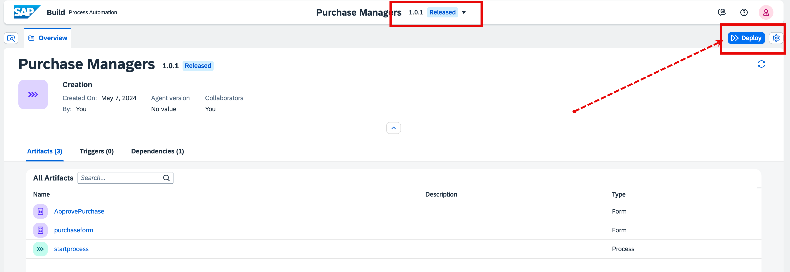
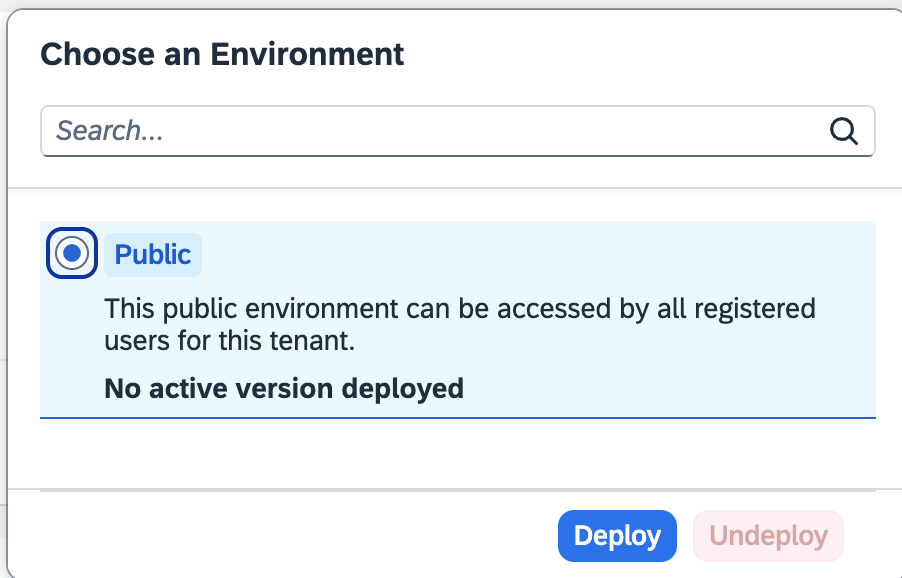
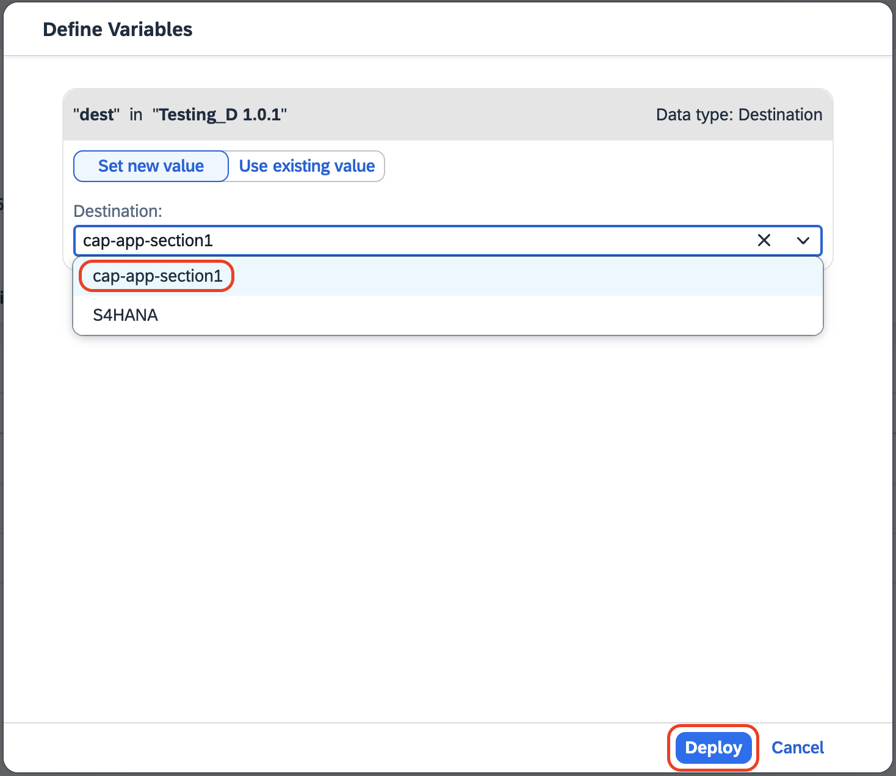
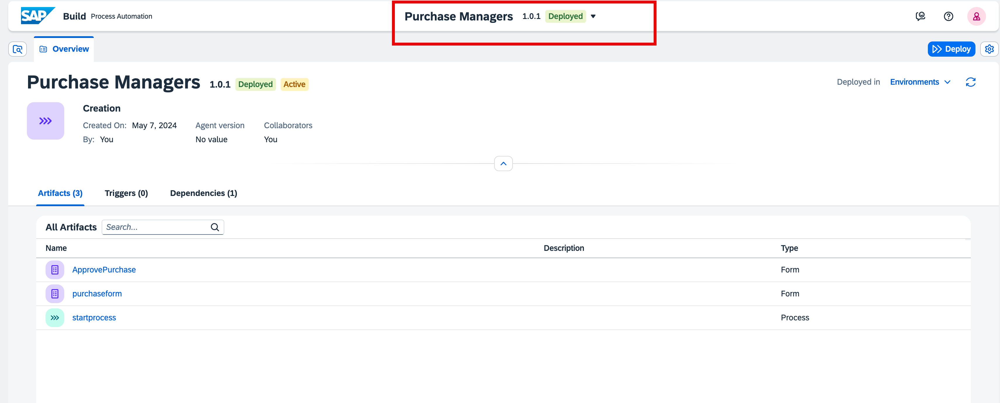

# Release and Deploy the Projects.

1. From the process editor, choose **Release**. In the **Release Project** popup, choose **Release** again.
    
    

2. After release, Click on **Show project version** for deploy.
    
    

3. Choose **Deploy**.
    
    

4. Choose **Public** and then choose **Deploy**.
  
    

5. From the destination, choose **cap-app-section1** from the dropdown and then choose **Deploy**
    
    

6. You will see the project in **Deployed** status.
    
    

**You have Deployed the Project Successfully**

## Next Step

[Run End to End Scenario](../e2e/README.md)
