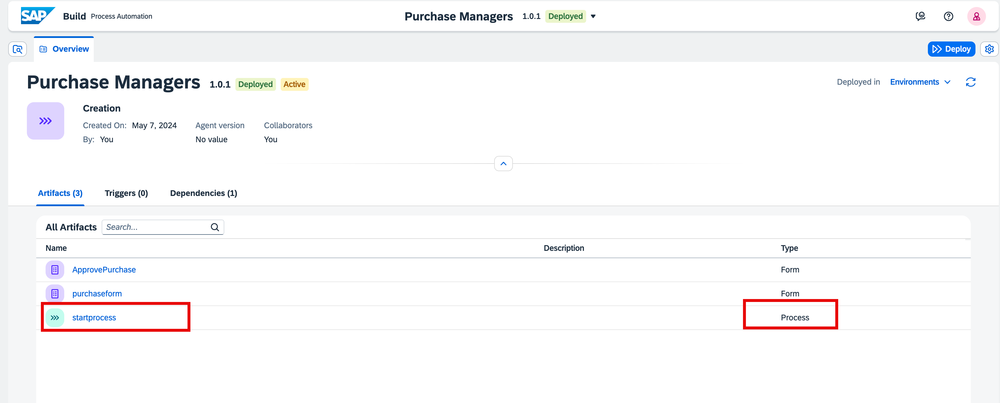
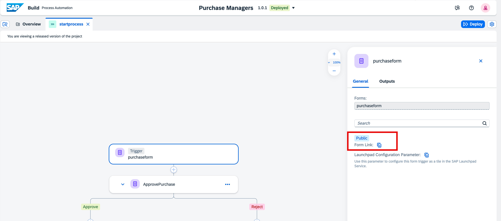
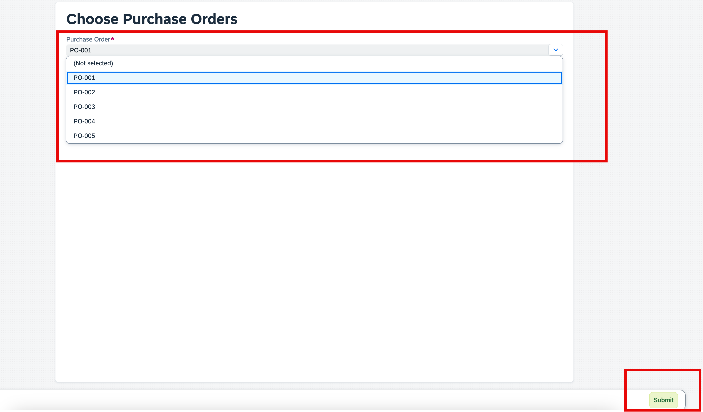
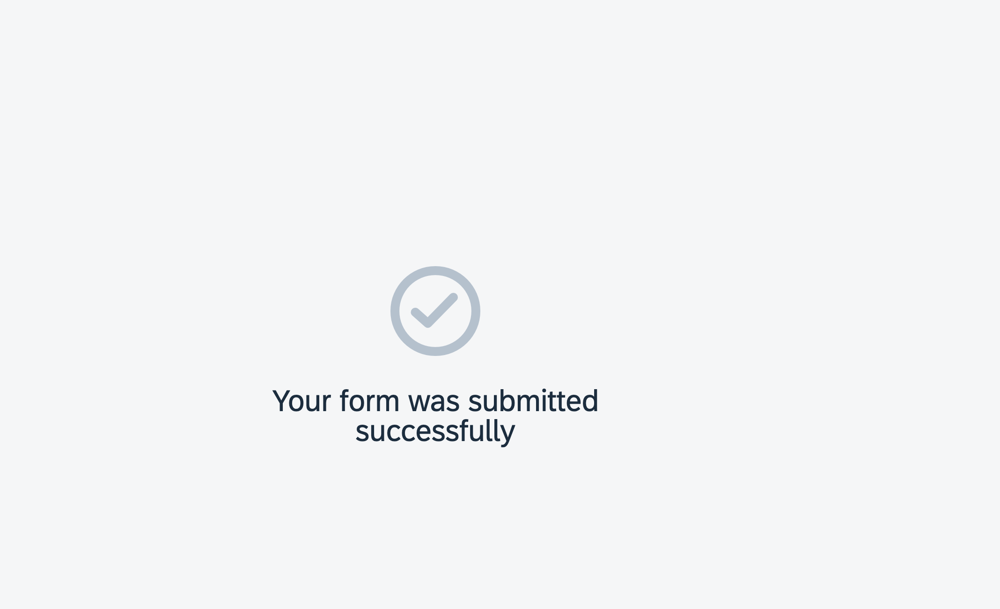
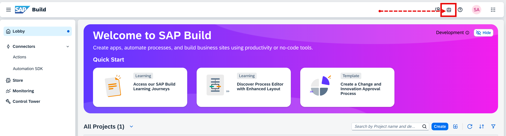
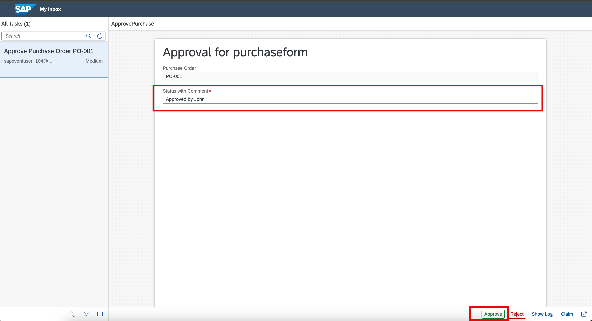
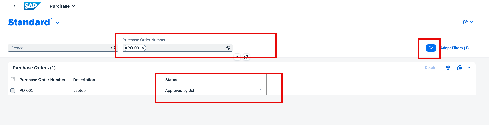
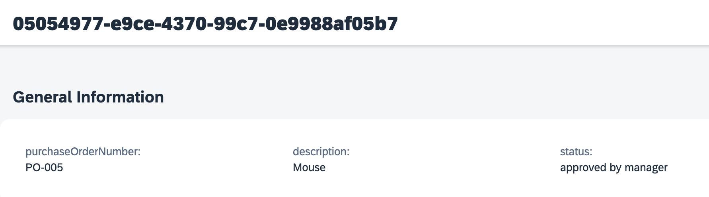

# Test End to End Flow.

## 1. Submit a new PO Approval Form.

1. From the project, click on the process named **startprocess**.
    
    

2. Click on **purchaseform**.

3. Copy Form link from right side, and open in browser.

    

> [!Note]
> If you face any authorization issue open the link in an incognito window.

4. In the form, Choose **Purchase Order** then choose **Submit**.
    
    

5. You form is successfully submitted.
    
    

## 2. Update Status and Approve the PO.

1. From the lobby, Open **My Inbox**.
    
    

2. You will see the task in inbox. Click on the task coming from your ID.

> [!Note]
> After clicking on the task, please wait for sometime till it loads. As it might take few seconds to load.

3. In the Approval form, enter approval text in **Start with Comment** field (add some unique description after that).

4. Choose **Approve**.

    

## 3. Review PO Status in Purchase Order CAP Application.

1. Open [CAP Application](https://hands-on.launchpad.cfapps.eu10.hana.ondemand.com/f1d6d6bf-87c6-480b-8b4e-6ee152fe96aa.purchase.nspurchase-0.0.1/index.html)

2. Filter with your PO. Click on **GO**.
    
    

3. Review status in detail page as well.

    

**Congratulations! You have successfully completed the Exercise 1 of integrating CAP Application in SAP Build Process Automation**
