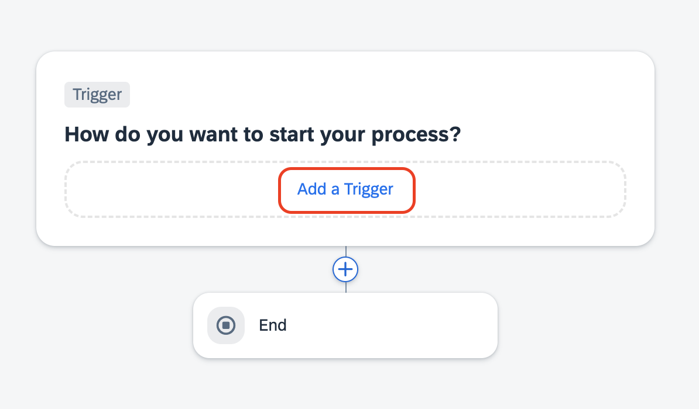
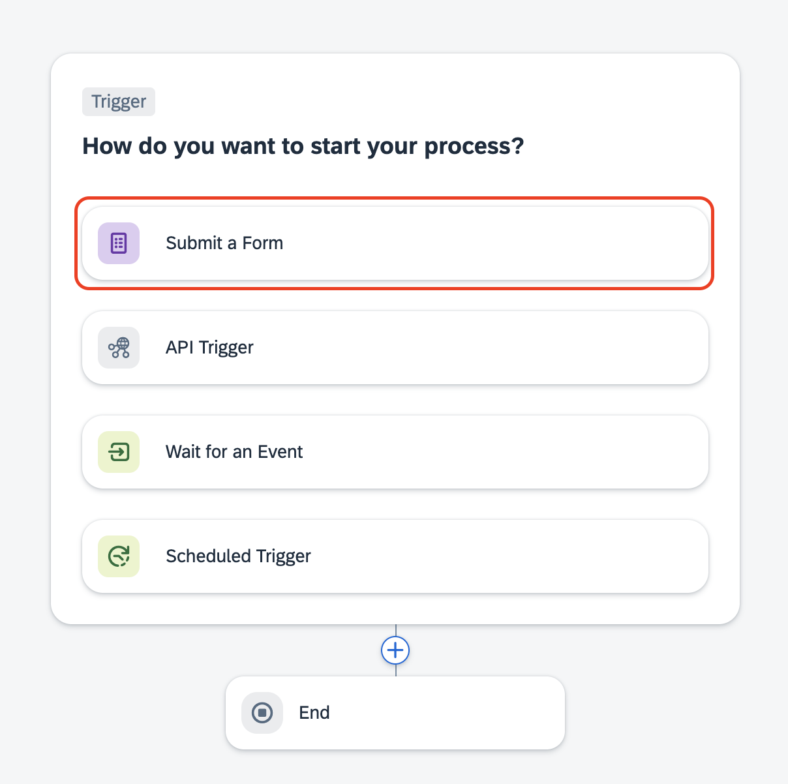
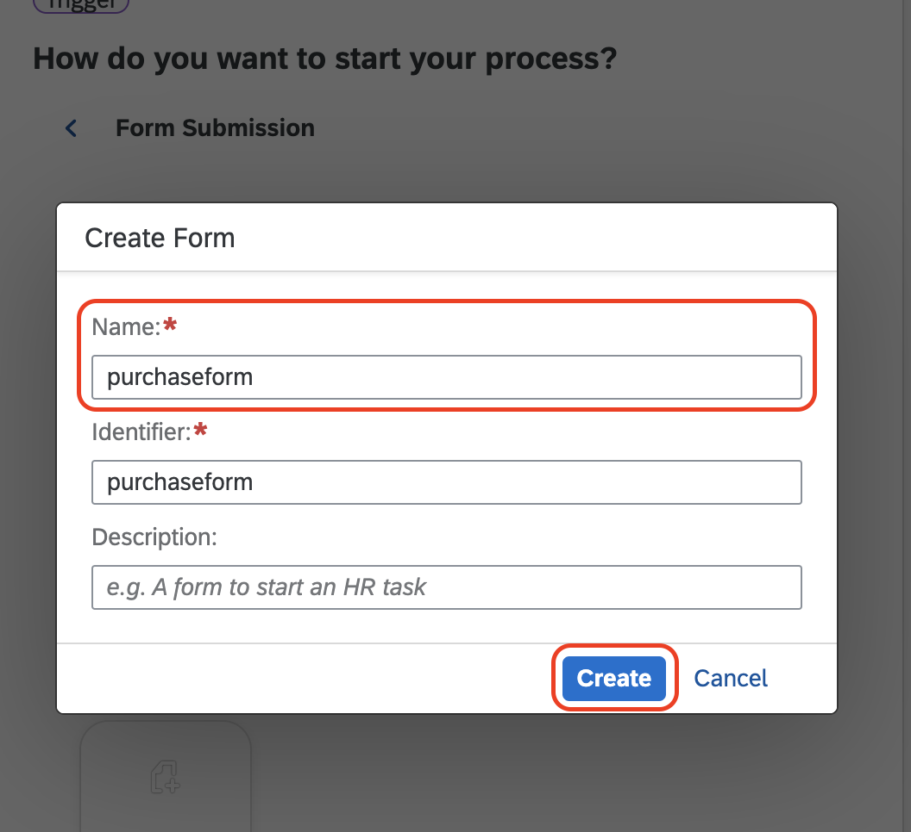
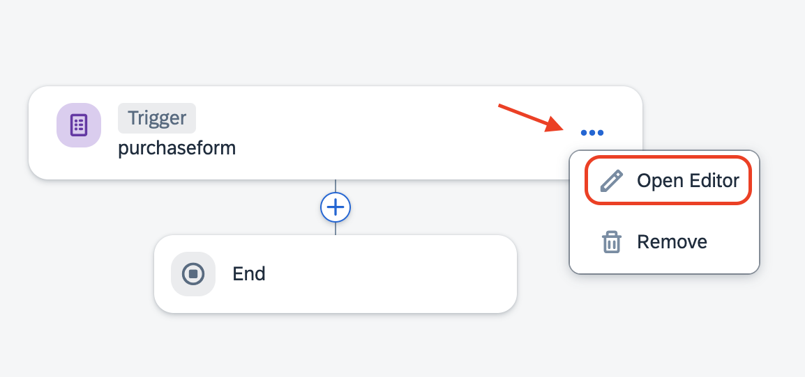
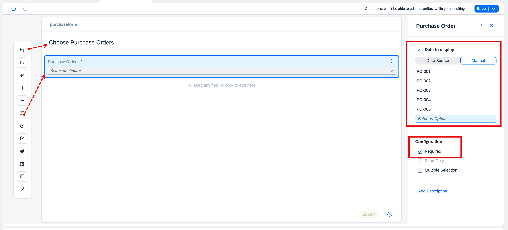

# Create Trigger Form for Purchase Order Approval

1. In the startprocess, click on **Add a Trigger**.

    

2. Click on **Submit a Form**.

    

3. Choose **Blank Form**

    

4. Enter **purchaseform** as the Name of the Form and choose **Create**.

    

5. Choose **Open Editor**

    

#### Now you are inside Form Editor. Lets add the component by drag and drop.

6. Choose header **H1**, and enter **Choose Purchase Order**

7. Choose **Dropdown**, enter name of the dropdown as **Purchase Order**. And in the right side, under **Data to display**, choose **Manual**. Enter below values.

* PO-001
* PO-002
* PO-003
* PO-004
* PO-005

8. In the **Configuration**, choose **Required** and choose **Save**

    

**You have now completed the Trigger Form.**

## Next Step

[Build a Purchase Order Approval](../approval/README.md)

