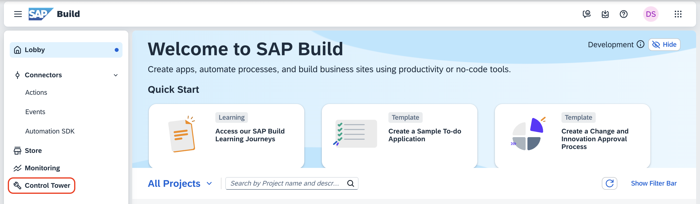
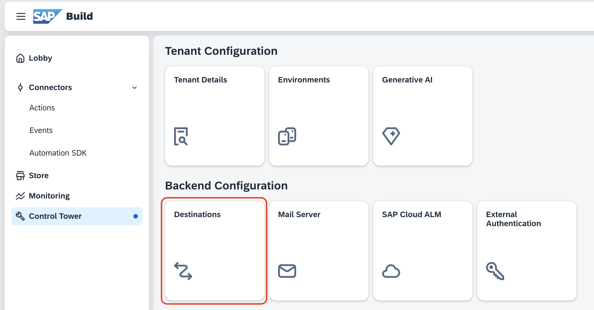
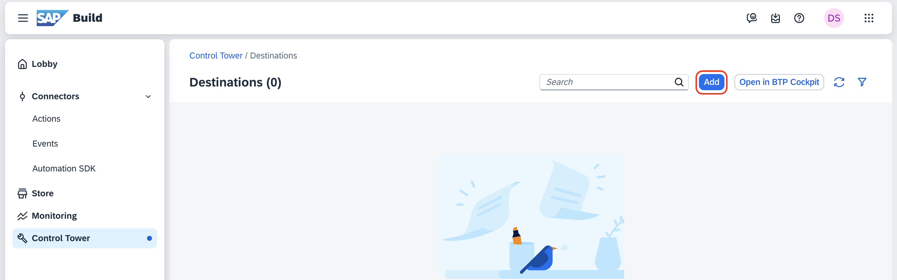
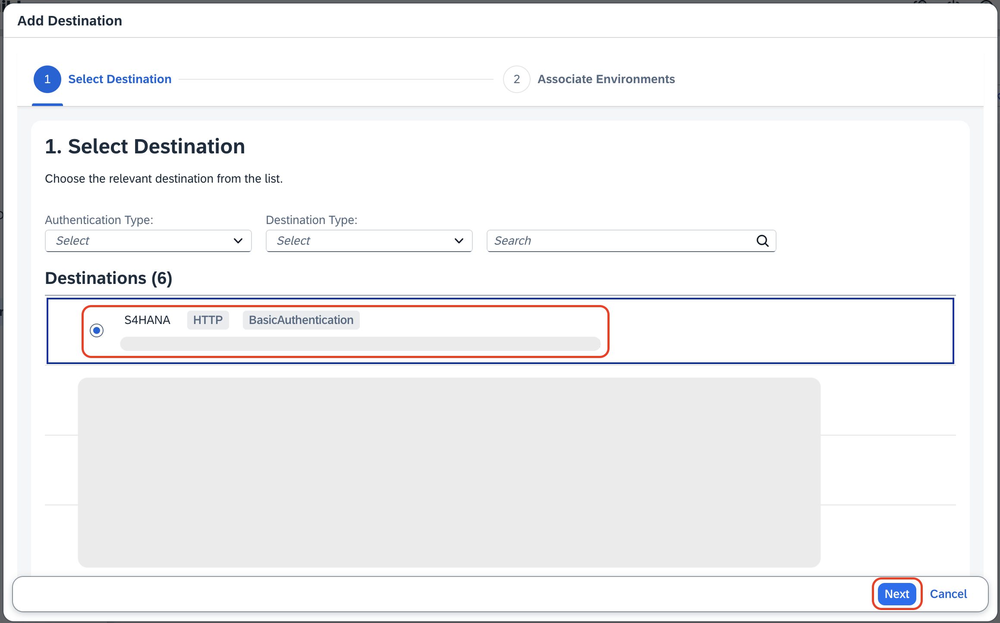
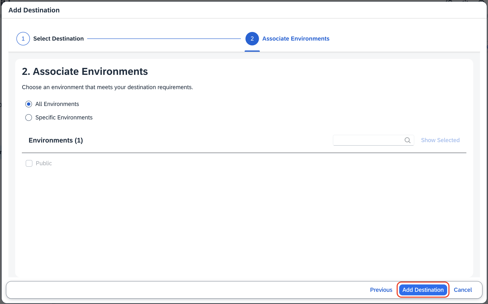

## Prerequisites

> [!Note]
> For this handson we have already set up the below steps. You can directly proceed with [Create Project in SAP Build](../createprocess/README.md)

1. [Setup SAP Build Process Automation in SAP BTP](./setup.md)

2. [Deployment of CAP Application](./deployment.md)

## Create Destinations in SAP BTP Cockpit

**Section 1:**

Integrate CAP NodejS Application in SAP Build Process Automation, for creating destination, follow [Create Destination for CAP Application](./cap-destination.md)

**Section 2:**

Integrate SAP S/4HANA in SAP Build Process Automation, for creating destination, follow [Create Destination for S/4HANA](./s4hana-destination.md)

## Create Destinations in SAP Build

1. Go to the [SAP Build Lobby](https://pw-build-hands-on.eu10.build.cloud.sap/lobby)

2. Click on **Control Tower** from the left Navigation bar.
    
    

3. Under Backend Configuration, click on **Destinations**.

    

4. Click on **Add**.

    

5. Click on the checkmark for *S4HANA*.

6. Click on **Next**.

    

7. Click on **Add Destination**.

    

8. Repeat the Steps 4 to 7 to add cap-app destination.
