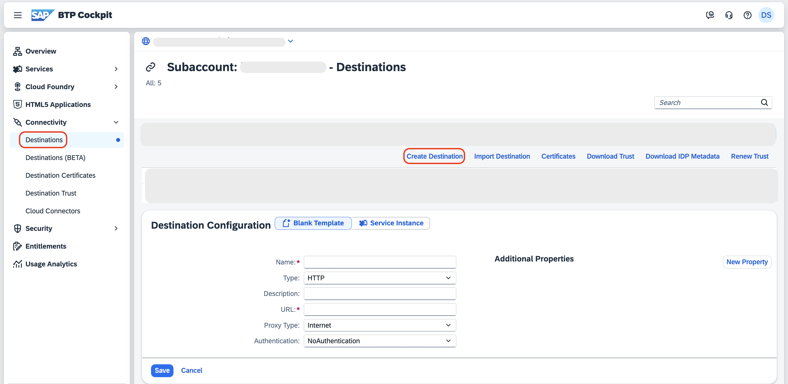
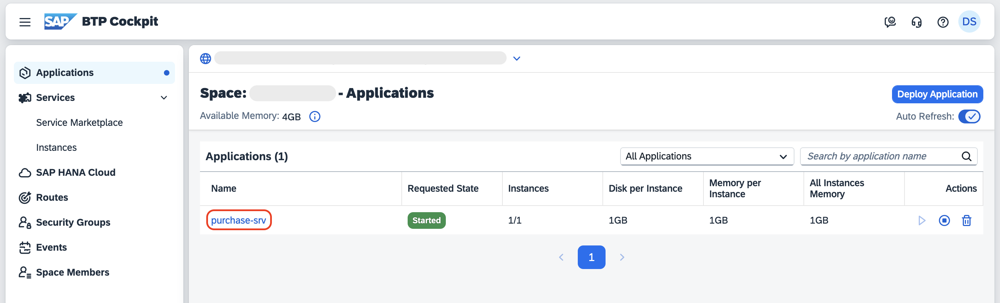
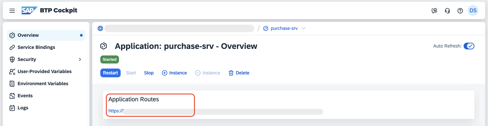
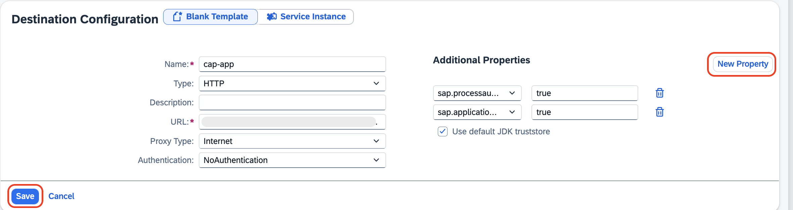
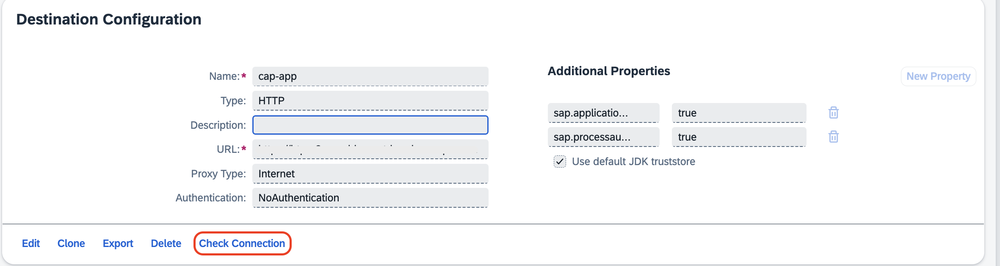
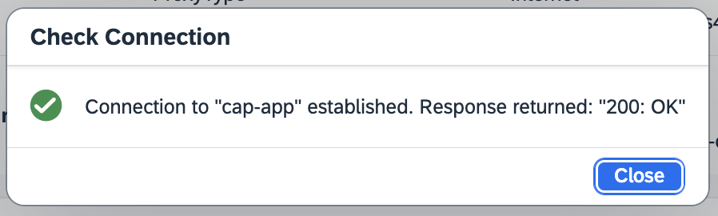

## Create Destination for CAP Application

1. Go to the [SAP BTP Cockpit](https://emea.cockpit.btp.cloud.sap/cockpit#/globalaccount/a9030b2a-ed51-438e-9166-241ce6c0291d/subaccount/643ae448-ea81-4fea-8d95-fb010e4d9f50/subaccountoverview).

2. Click on **Destinations** under **Connectivity** from the left side menu.

3. Click on **Create Destination**.

    

4. For the Destination creation, do the following:

    1. Enter the Name as **cap-app**.

    2. Leave the **Type** as **HTTP** by default.

    3. To retrieve the **URL**, check the steps below.

        1. In the deployed space, select the application *purchase-srv*

            

        2. Copy the application route.

             

            > [!Note] 
            > **CAP application must be already deployed using [Deployment of CAP Application](./deployment.md)**

        3. URL becomes **application-route/service/purchaseOrderApp**

            > Note: Appending the /service and the service name purchaseOrderApp.
    
    4. Leave the **Proxy Type** and **Authentication** with its default value.

    5. Under Additional Properties, click on **New Property**.

    6. Give the property name as **sap.applicationdevelopment.actions.enabled** and its value as **true**.

    7. Click on the **New Property** again.

    8. Give the property name as **sap.processautomation.enabled** and its value as **true**.

    9. Click on **Save**.

        

## Check the connection

1. Click on the created Destination.

2. Click on **Check Connection**.

    

3. You will get a pop up with Connection to "cap-app" established.

    

    