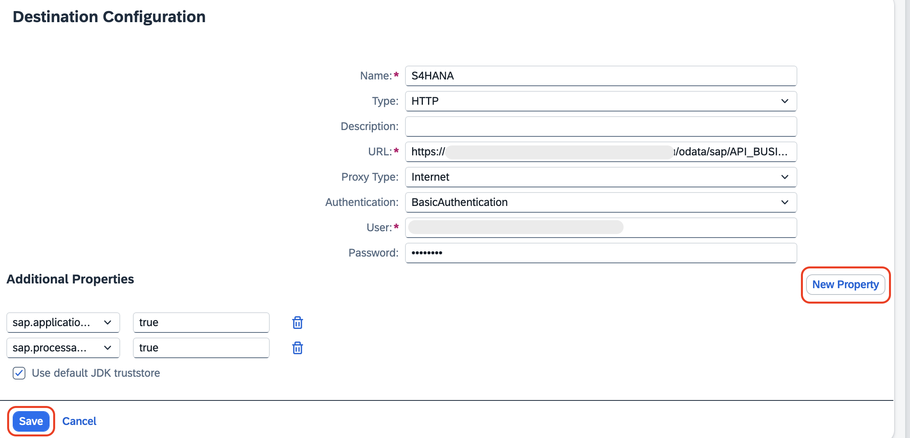
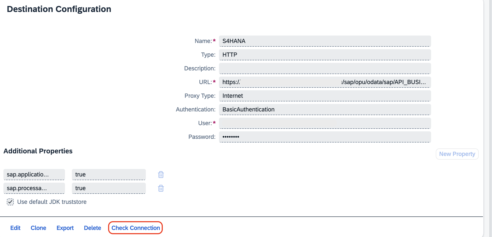
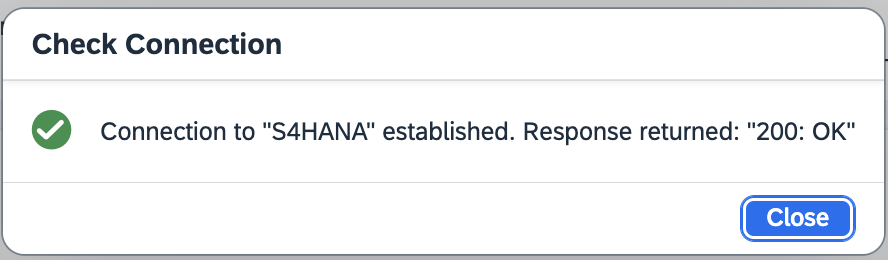

## Create Destination for S/4 HANA Public Cloud

> [!Note]
> To Configure S/4 HANA Public Cloud, and to establish connectivity from SAP BTP, check [Configure S/4 HANA Public Cloud for connectivity from SAP BTP](../../workshops/clean-core-extensibility-cap/setup/s4hana-cloud-config.md).

1. Go to the [SAP BTP Cockpit](https://emea.cockpit.btp.cloud.sap/cockpit/?idp=pesworkshops.accounts.ondemand.com#/globalaccount/a9030b2a-ed51-438e-9166-241ce6c0291d/subaccount/39f42fe8-e715-49e0-850a-316400cceb53/subaccountoverview).

2. Click on **Destinations** under **Connectivity** from the left side menu.

3. Click on **Create Destination**.

    

4. For the Destination creation, do the following:

    1. Enter the name as **S4HANA**.

    2. Leave the **Type** as **HTTP** by default.

    3. URL becomes **s4hana-system-url/sap/opu/odata/sap/API_BUSINESS_PARTNER**

    > Note: *s4hana-system-url* is the S/4HANA Cloud System. Check the prerequisite section to retrieve the information.

    4. Leave the **Proxy Type** as **Internet** by default.

    5. Change the Authentication to **Basic Authentication** from the dropdown.

    6. Enter the User and Password details.
    
    > Note: User and password details can be retrieved from S/4 HANA system. Check the prerequisite section.

    7. Under Additional Properties, click on **New Property**.

    8. Give the property name as **sap.applicationdevelopment.actions.enabled** and its value as **true**.

    9. Click on the **New Property** again.

    10. Give the property name as **sap.processautomation.enabled** and its value as **true**.

    11. Click on **Save**.

        

## Check the connection

1. Click on the created Destination.

2. Click on **Check Connection**.

    

3. You will get a pop up with Connection to "S4HANA" established.

    
