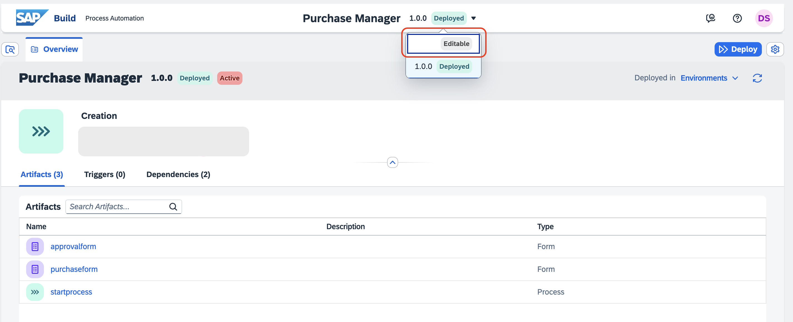
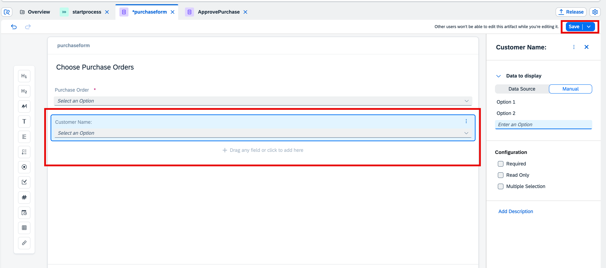
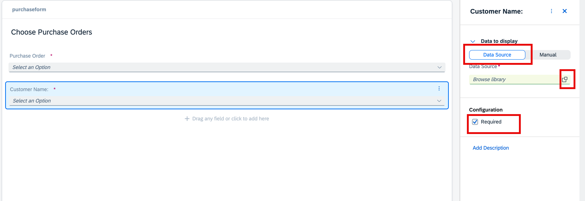
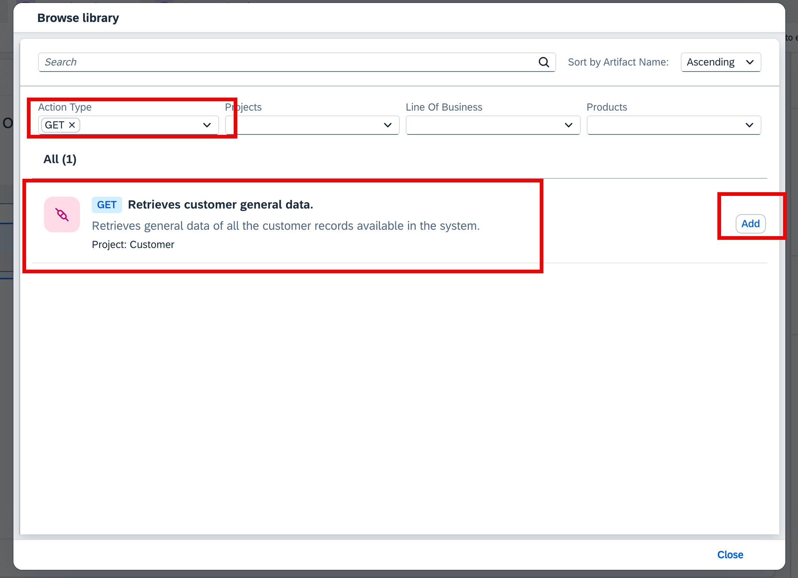
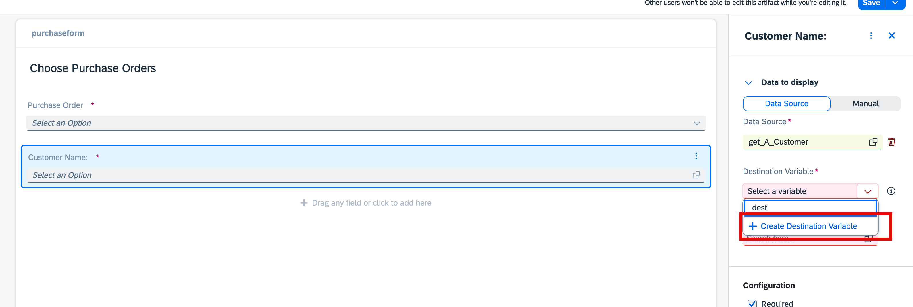
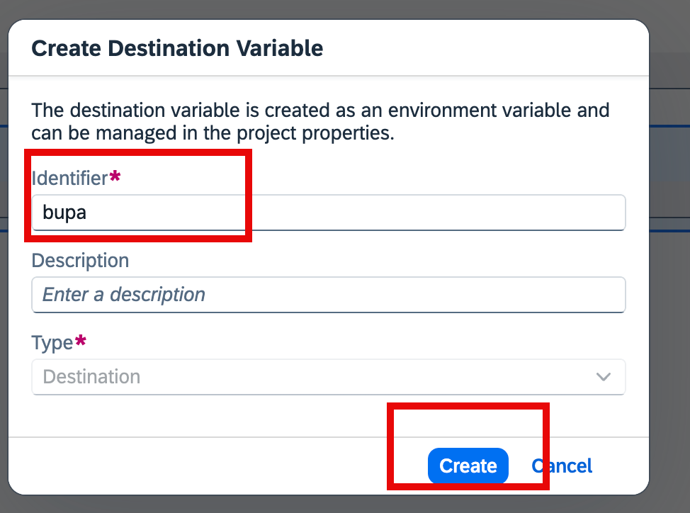
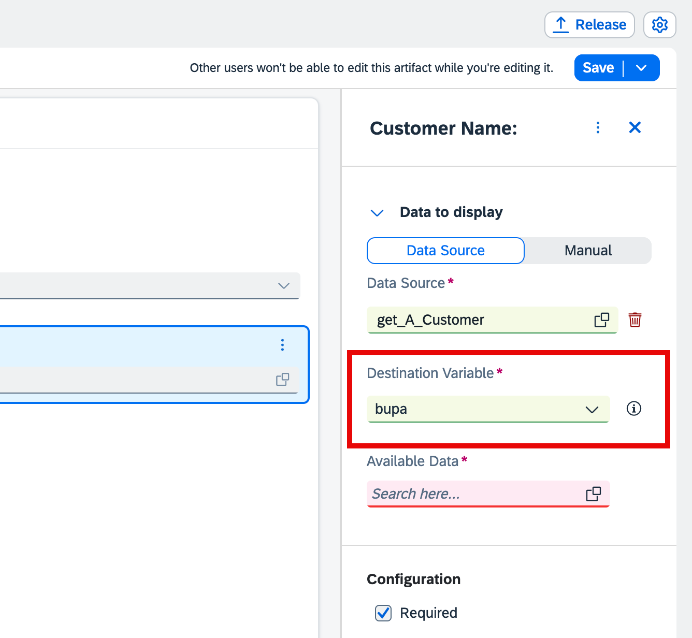
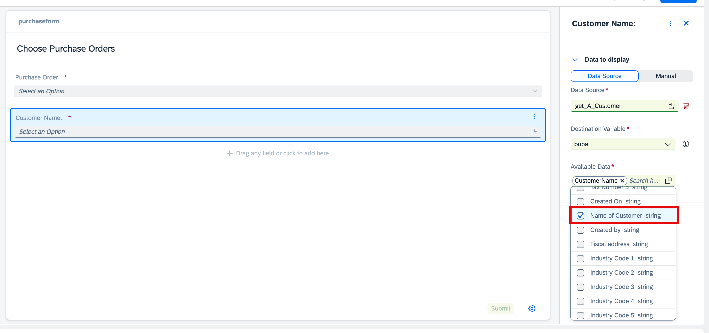
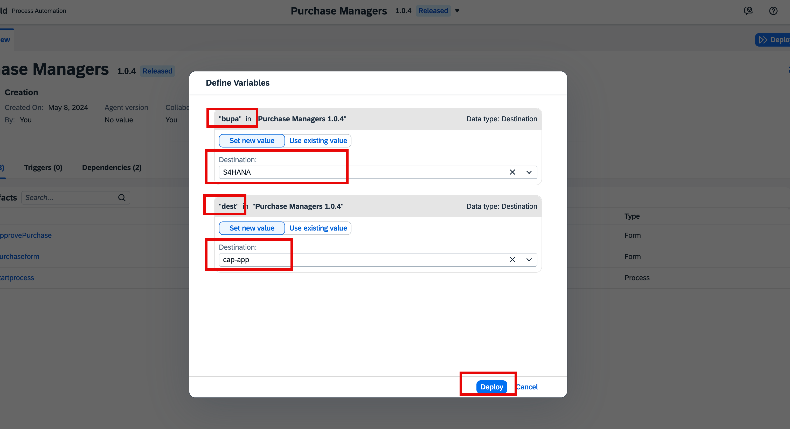

# Consume SAP S/4HANA Business Partner API to the Drop-Down Fields in the Form.

## Prerequisite

[Create Business Partner Action Project in SAP Build Actions](https://developers.sap.com/tutorials/spa-business-partner-action-create.html)

> [!NOTE]  
> Actions has already been created for this session.

## Create a dropdown in order processing form

The Business Process will be in Deployed state. To edit the process and forms, change the state from *Deployed* to *Editable*.

1. Select the **Purchase Form** which you have created in last project.

2. Drag and drop a **Dropdown** field in the form and enter the name as **Customer Name**.

3. Choose **Save**.

    

## Add action project to dropdown.

1. Select the **Customer Name** dropdown.

2. For **Data to display**, choose **Data Source**.

3. For **Data Source** field, select the **value-help** option.

    

4. In the **Browse Library** pop-up, choose **GET Retrieves customer general data**.

5. Select the **Add** option for the action project you created earlier.

    

6. Create Destination Variable.

    

> [!IMPORTANT]  
> In this exercise, we are giving the name of variable as **bupa**

7. Once detination is created, from the dropdown, choose **bupa**.

    

8. Choose the **Customer Name** option from the dropdown.

    

> [!NOTE]  
> The customer name in the dropdown are coming from the metadata of SAP S/4HANA api.

9. **Save** the form.

10. **Release** the project.

11. **Deploy** the project.

    

> [!CAUTION]
> Please make sure that you have chosen the correct destination for deployment. Please see the above screenshot for more clarification.

## Next Step

[Test the dropdown filtering in the form](../s4hane2e/README.md)

