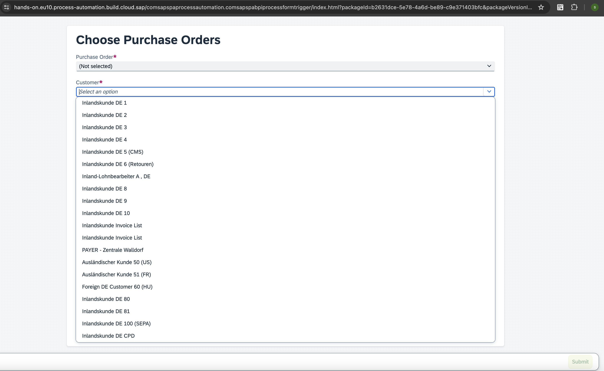

# Test the Dropdown Filtering in the Form

1. Select the **purchaseform** artifact and copy the deployed form link.

    

2. Paste the link into a new browser tab/window to open it.

3. Select the dropdown button for the **Customer Name** field. You can see all the customer names fetched by the action project from the **SAP S/4HANA System**.

    

**Congratulations! You have successfully completed the Exercise 2 of integrating S/4HANA in SAP Build Process Automation**
