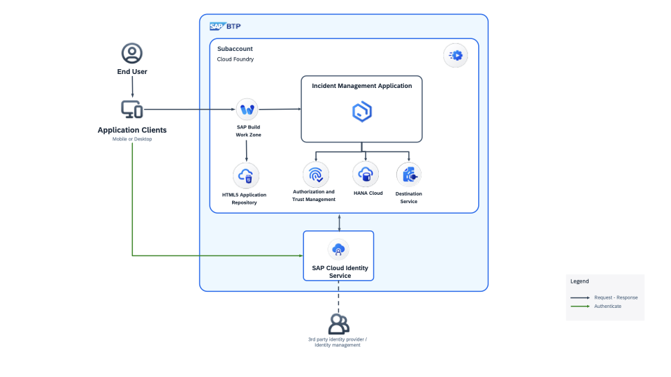

# Mastering Clean Core on SAP BTP: A Hands-On Journey with VIBE Coding & MCP

In this hands-on exercise, you will learn to develop a full-stack SAP BTP application based on SAP Cloud Application Programming Model (CAP), Fiori-based application , extend it using VIBE codeing and MCP and deploy to BTP.

## What You Will Build
- Build an extension app for S/4 HANA Cloud using CAP
- VIBE code in SAP Business Application Studio using **Cline**, connect to tools like **CAP MCP server** and **SAP Fiori MCP server** to extend the CAP application

You will extend the **Incident Management** CAP application by adding a `Resolution Note` field to the `Incidents` entity, enforcing business rules around it, and writing automated tests — all guided by natural-language prompts in Cline.

## Key Capabilities of Agentic Coding With MCP

Agentic coding with MCP servers transforms your development workflow by providing AI assistants that understand your specific codebase and development patterns:

- **Context-Aware Code Generation** — The CAP MCP server gives Cline direct access to your CDS model definitions, entity relationships, and CAP documentation, eliminating hallucinations.
- **Fiori-Aware UI Updates** — The SAP Fiori MCP server ensures UI annotations are added in the correct place following SAP Fiori elements conventions.
- **Natural Language Prompts** — Describe what you want in plain English; Cline handles the file changes, syntax, and verification.
- **Automated Validation** — Cline verifies the CDS model compiles and the service is correctly exposed after every change.

# Business Scenario

In this hands-on exercise, you will build an application called Incident Management using SAP Build Code. The business scenario of the Incident Management application is the following:

ACME is a popular Electronics company. ACME hires call center support representatives to process and manage customer incidents. A call center support representative (Processor) receives a phone call from an existing customer and creates a new incident on behalf of the customer. The newly created incident is based on a customer complaint received during the phone call. The call center support representative also adds the conversation with the customer to the incident for future reference.

# Solution Diagram

## Prerequisites

- [Configure Cline in SAP Business Application Studio](./document/setup-cline.md)

## Exercise 1: Understand the CodeBase

1. [Setup the application](../topic2/part1/clone.md)
2. [Understand the application structure](./#)
3. [Test the application locally ](./add-resolution-note.md)

## Exercise 2: Extend the application with External Service

1. [Update the Business Scenario](./document/add-remote-service/README.md)
2. [Extend the Incident Management аpplication](./document/add-remote-service/extend-app-cf.md)
3. [Run a developer test Locally](./document/add-remote-service/test-with-mock.md)

## Exercise 3: Extend the Incident Management Application with Coding Agent

1. [Set Up MCP Servers for Agentic Coding](./setup-mcp-servers.md)
2. [Add Resolution Note — Field, Business Logic & Tests](./add-resolution-note.md)

## Exercise 4: Deploy in SAP BTP, Cloud Foundry Runtime

1. [Create Space in SAP BTP](./document/create-space.md)
2. [Deploy to SAP BTP, Cloud Foundry Runtime](./document/deploy-cf.md)
3. [Integrate Your Application with SAP Build Work Zone, Standard Edition](./document/integrate-workzone.md) 

## Summary

By completing this exercise, you will have used agentic coding with MCP servers to:

- Add a new field to a CAP CDS model and expose it in a SAP Fiori elements UI — with a single prompt
- Implement business validation logic (mandatory field on status change) in a CAP service handler
- Protect user input against SQL injection patterns
- Write and run automated Jest tests following the OData Draft Choreography pattern

