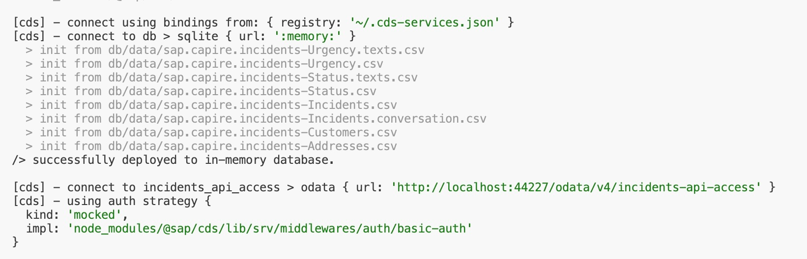
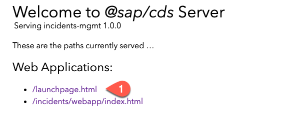
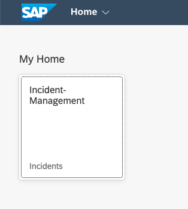

# Add Resolution Note to the Incident Management Application

In this section, you will use **Cline** in SAP Business Application Studio to extend the Incident Management application with a `Resolution Note` field. The work is organized into three chapters:

- **Chapter 1** — Add the field to the CDS model and SAP Fiori UI
- **Chapter 2** — Add business logic (mandatory validation + SQL injection check)
- **Chapter 3** — Add automated tests

## Prerequisite

You have set up the MCP servers and defined the `AGENTS.md` rules following the steps at [Set Up MCP Servers for Agentic Coding](setup-mcp-servers.md).

---

## Chapter 1: Add the Resolution Note Field

In this chapter, you will add the `resolutionNote` field to the `Incidents` entity in the CDS model and expose it in the SAP Fiori elements UI.

1. Open **Cline** in SAP Business Application Studio.

2. Enter the following prompt:

    ```
    Add a new field 'Resolution Note' to the 'Incidents' entity in the CDS model and UI using cds-mcp and fiori-mcp servers
    ```

3. Cline will use the **CAP MCP server** to look up the `Incidents` entity definition and find the correct file location:

4. Cline will update `db/schema.cds` to add the new field to the `Incidents` entity:

    ```js
    entity Incidents : cuid, managed {
      customer       : Association to Customers;
      title          : String  @title : 'Title';
      urgency        : Association to Urgency default 'M';
      status         : Association to Status default 'N';
      resolutionNote : String @title : 'Resolution Note'; // [!code ++]
      conversation   : Composition of many {
        key ID       : UUID;
            timestamp : type of managed:createdAt;
            author    : type of managed:createdBy;
            message   : String;
      };
    }
    ```

5. Cline will update `app/incidents/annotations.cds` to include the new field in the UI:

    ```js
    ...
    { // [!code ++]
        $Type : 'UI.DataField', // [!code ++]
        Value : resolutionNote, // [!code ++]
        Label : '{i18n>ResolutionNote}', // [!code ++]
    }, // [!code ++]
    ...
    ```

6. Cline will confirm the changes with an output similar to:

    ```
    ## Changes Made:
    1. CDS Model (db/schema.cds): Added `resolutionNote : String @title : 'Resolution Note';`
       to the Incidents entity.
    2. UI Annotations (app/incidents/annotations.cds): Added the Resolution Note field
       to the Details field group in the UI, making it visible in the incident details section.
    3. Internationalization (app/incidents/webapp/i18n/i18n.properties): Added the label
       `ResolutionNote=Resolution Note` for proper UI display.
    4. Verification: Confirmed the CDS model compiles successfully and the field is
       properly exposed through both ProcessorService and AdminService.

    ## Field Location in UI:
    The Resolution Note field will appear in the Details section of the incident object
    page, alongside the Status and Urgency fields.
    ```

> [!Tip]
> The `cds-mcp` and `fiori-mcp` servers help Cline find the relevant file and the correct syntax to add the new field. Cline generates a tool call to check the `Incidents` entity and relevant information is returned, such as its elements and file location. It also generates a tool call to check the CAP documentation for the correct annotation syntax.

### Test the Field

1. Start the application locally:

    ```bash
    cds watch
    ```

2. To open the server URL in terminal click on `http://localhost:4004`.

   

3. There are two URLs under web applications:
 
    - */launchpage.html* uses a [local launchpage](!https://pages.github.tools.sap/cap/golden-path/develop/Launchpage/Launchpage)
    - */incidents/webapp/index.html* uses the *index.html* from [ui5 app](!https://pages.github.tools.sap/cap/golden-path/develop/btp-app-create-ui-fiori-elements/btp-app-create-ui-fiori-elements)
    - Choose the *launchpad.html*.
    
   


4.  When you are prompted to authenticate, use the following credentials:
 
    - Username: `alice`
    - Password: Empty / No Password   
    
    > You find the user settings in the `.cdsrc.json file`.

5. Testing the scenario - while creating a new incident, the value help for customers loads data from the mock service.
   * Open the Incident Management application and select one incident.
  
      
  

6. The **Resolution Note** field should now be visible in the incident Object Page.


> [!Note]
> Cline may generate slightly different code. Please make sure the final `db/schema.cds` includes the `resolutionNote` field and `app/incidents/annotations.cds` includes the corresponding `UI.DataField` entry.

---

## Chapter 2: Add Business Logic

In this chapter, you will add two validations to `srv/services.js`:
1. `resolutionNote` is **mandatory** when setting status to Resolved (`R`) or Closed (`C`)
2. `resolutionNote` must not contain **SQL injection patterns**

### 2.1: Mandatory Resolution Note on Resolve or Close

This validation ensures that a user cannot set an incident's status to **Resolved** (`R`) or **Closed** (`C`) without providing a resolution note.

1. In **Cline**, enter the following prompt:

    ```
    I have a CAP project with an Incidents app. When someone tries to close or resolve an incident, they must provide a resolution note explaining what was done. 

    Add validation to prevent closing/resolving incidents without a resolution note:

    - If status is changed to "Resolved" or "Closed" but no resolution note is provided, show an error
    - Check if they're adding a resolution note now, or if one was already added before
    - Make sure it works with the draft system

    The incident has a status_code field ('R' for Resolved, 'C' for Closed) and a resolutionNote field.
    ```

2. Cline will use the **CAP MCP server** to check the entity and documentation:

    ```shell
    search_model
    Arguments
    {
      "projectPath": "/path/to/your/project",
      "name": "Incidents",
      "kind": "entity",
      "topN": 1
    }
    ```

    ```shell
    search_docs
    Arguments
    {
      "query": "before UPDATE handler service implementation Node.js req.error"
    }
    ```

3. Cline will update `srv/services.js` with the mandatory check inside `onUpdate`:

    ```js
    // Mandatory resolutionNote when resolving or closing // [!code ++]
    const newStatus = req.data.status_code; // [!code ++]
    if (newStatus === 'R' || newStatus === 'C') { // [!code ++]
      const noteInRequest = req.data.resolutionNote?.trim(); // [!code ++]
      const noteInDB = noteInRequest === undefined // [!code ++]
        ? (await SELECT.one(req.subject, i => i.resolutionNote).where({ ID: req.data.ID }))?.resolutionNote?.trim() // [!code ++]
        : undefined; // [!code ++]
      if (!noteInRequest && !noteInDB) { // [!code ++]
        return req.reject(400, 'A Resolution Note is required before resolving or closing an incident.'); // [!code ++]
      } // [!code ++]
    } // [!code ++]
    ```

4. Cline will confirm:

    ```
    ## Changes Made:
    1. srv/services.js: Added a mandatory resolutionNote check inside the onUpdate handler.
       - Rejects with HTTP 400: "A Resolution Note is required before resolving or
         closing an incident."
    ```

> [!Tip]
> Cline checks both the incoming request payload and the existing database record. A user can set the resolution note in a previous save and then change the status in a separate update — both flows are covered.

### 2.2: SQL Injection Check on Resolution Note

1. In **Cline**, enter the following prompt:

    ```
    In the same srv/services.js, before saving the resolution note, check if it contains suspicious patterns commonly used in SQL injection attacks — things like --, ;, DROP, SELECT, INSERT, DELETE, UPDATE, UNION, ', /*, */. If any are found, reject the request with an error saying the input contains invalid characters.
    ```

2. Cline will extend `onUpdate` with the SQL injection check placed **before** the mandatory note validation:

    ```js
    // SQL injection check on resolutionNote // [!code ++]
    if (req.data.resolutionNote) { // [!code ++]
      const sqlPatterns = /--|;|'|\/\*|\*\/|\b(DROP|SELECT|INSERT|DELETE|UPDATE|UNION)\b/i; // [!code ++]
      if (sqlPatterns.test(req.data.resolutionNote)) { // [!code ++]
        return req.reject(400, 'Resolution Note contains invalid characters or patterns.'); // [!code ++]
      } // [!code ++]
    } // [!code ++]
    ```

3. Cline will confirm:

    ```
    ## Changes Made:
    1. srv/services.js: Added SQL injection check inside the onUpdate handler.
       - Rejects with HTTP 400: "Resolution Note contains invalid characters or patterns."
       - The check runs before the mandatory note validation to fail fast on bad input.
    ```

> [!Note]
> Cline may generate slightly different code. Please make sure the final `srv/services.js` looks like this:

```js
const cds = require('@sap/cds')

class ProcessorService extends cds.ApplicationService {
  init() {
    this.before("UPDATE", "Incidents", (req) => this.onUpdate(req));
    this.before("CREATE", "Incidents", (req) => this.changeUrgencyDueToSubject(req.data));
    return super.init();
  }

  changeUrgencyDueToSubject(data) {
    if (data) {
      const incidents = Array.isArray(data) ? data : [data];
      incidents.forEach((incident) => {
        if (incident.title?.toLowerCase().includes("urgent")) {
          incident.urgency = { code: "H", descr: "High" };
        }
      });
    }
  }

  async onUpdate(req) {
    const { status_code } = await SELECT.one(req.subject, i => i.status_code).where({ ID: req.data.ID });

    if (status_code === 'C')
      return req.reject(`Can't modify a closed incident`);

    // SQL injection check on resolutionNote
    if (req.data.resolutionNote) {
      const sqlPatterns = /--|;|'|\/\*|\*\/|\b(DROP|SELECT|INSERT|DELETE|UPDATE|UNION)\b/i;
      if (sqlPatterns.test(req.data.resolutionNote)) {
        return req.reject(400, 'Resolution Note contains invalid characters or patterns.');
      }
    }

    // Mandatory resolutionNote when resolving or closing
    const newStatus = req.data.status_code;
    if (newStatus === 'R' || newStatus === 'C') {
      const noteInRequest = req.data.resolutionNote?.trim();
      const noteInDB = noteInRequest === undefined
        ? (await SELECT.one(req.subject, i => i.resolutionNote).where({ ID: req.data.ID }))?.resolutionNote?.trim()
        : undefined;
      if (!noteInRequest && !noteInDB) {
        return req.reject(400, 'A Resolution Note is required before resolving or closing an incident.');
      }
    }
  }
}
module.exports = { ProcessorService }
```

### Test the Business Logic

1. Run `cds watch` and open `http://localhost:4004`.

2. **Test mandatory note validation:**
   - Set **Status** to **Resolved** or **Closed** with an empty **Resolution Note** and choose **Save**.
   - Expected error: *A Resolution Note is required before resolving or closing an incident.*

3. **Test SQL injection check:**
   - Enter `Fixed; DROP TABLE Incidents--` in the **Resolution Note** field and choose **Save**.
   - Expected error: *Resolution Note contains invalid characters or patterns.*

4. **Test the happy path:**
   - Enter `Issue resolved after replacing the faulty component.`, set **Status** to **Resolved**, and choose **Save**.
   - The incident should be saved successfully.

---

## Chapter 3: Add Automated Tests

In this chapter, you will add Jest tests that verify the business logic using the OData Draft Choreography pattern.

### Understanding the Test Pattern

The project uses the CAP test framework (`@sap/cds`) with Jest. Tests follow the **OData Draft Choreography** pattern:

1. **Create** a draft incident (`POST`)
2. **Activate** the draft (`draftActivate`) to make it a real record
3. **Edit** the active record to open a new draft (`draftEdit`)
4. **Patch** the draft with new values (`PATCH`)
5. **Activate** the draft again to trigger `before UPDATE` handlers

The `before UPDATE` handler — where the validations live — is triggered during `draftActivate`.

### Add the Tests

1. In **Cline**, enter the following prompt:

    ```
    I have a CAP Node.js project with Jest tests in test/test.js. The Incidents entity has a resolutionNote field with two validations in the before UPDATE handler:
    1. resolutionNote is mandatory when status_code is set to 'R' (Resolved) or 'C' (Closed)
    2. resolutionNote must not contain SQL injection patterns like --, ;, DROP, SELECT, etc.

    Add a new describe block 'Resolution Note Business Logic' at the end of test/test.js with tests for:
    - Creating and activating a draft incident
    - Failing to resolve without a resolution note (expect HTTP 400)
    - Resolving successfully with a resolution note (verify resolutionNote and status_code in response)
    - Failing when resolution note contains SQL injection patterns (expect HTTP 400)
    - Accepting a valid resolution note without SQL patterns
    - Cleaning up by deleting the incident

    Follow the same draft choreography pattern used in the existing tests.
    ```

2. Cline will add a new `describe` block to `test/test.js`:

    ```js
    describe('Resolution Note Business Logic', () => { // [!code ++]
      let incidentId // [!code ++]
     // [!code ++]
      it('+ Create an incident for resolution note testing', async () => { // [!code ++]
        const { status, data } = await POST(`/odata/v4/processor/Incidents`, { // [!code ++]
          title: 'Test incident for resolution note', // [!code ++]
          status_code: 'N' // [!code ++]
        }) // [!code ++]
        incidentId = data.ID // [!code ++]
        expect(status).to.equal(201) // [!code ++]
      }) // [!code ++]
     // [!code ++]
      it('+ Activate the draft', async () => { // [!code ++]
        const response = await POST( // [!code ++]
          `/odata/v4/processor/Incidents(ID=${incidentId},IsActiveEntity=false)/ProcessorService.draftActivate` // [!code ++]
        ) // [!code ++]
        expect(response.status).to.eql(201) // [!code ++]
      }) // [!code ++]
     // [!code ++]
      describe('Mandatory Resolution Note Validation', () => { // [!code ++]
        it('Should fail to resolve an incident without a resolution note', async () => { // [!code ++]
          await POST( // [!code ++]
            `/odata/v4/processor/Incidents(ID=${incidentId},IsActiveEntity=true)/ProcessorService.draftEdit`, // [!code ++]
            { PreserveChanges: true } // [!code ++]
          ) // [!code ++]
          await PATCH(`/odata/v4/processor/Incidents(ID=${incidentId},IsActiveEntity=false)`, { // [!code ++]
            status_code: 'R' // [!code ++]
          }) // [!code ++]
          try { // [!code ++]
            await POST( // [!code ++]
              `/odata/v4/processor/Incidents(ID=${incidentId},IsActiveEntity=false)/ProcessorService.draftActivate` // [!code ++]
            ) // [!code ++]
          } catch (error) { // [!code ++]
            expect(error.response.status).to.eql(400) // [!code ++]
            expect(error.response.data.error.message).to.include('A Resolution Note is required before resolving or closing an incident') // [!code ++]
          } // [!code ++]
        }) // [!code ++]
     // [!code ++]
        it('Should resolve an incident successfully when a resolution note is provided', async () => { // [!code ++]
          const response = await PATCH(`/odata/v4/processor/Incidents(ID=${incidentId},IsActiveEntity=false)`, { // [!code ++]
            status_code: 'R', // [!code ++]
            resolutionNote: 'Issue has been resolved successfully.' // [!code ++]
          }) // [!code ++]
          expect(response.status).to.eql(200) // [!code ++]
          const activated = await POST( // [!code ++]
            `/odata/v4/processor/Incidents(ID=${incidentId},IsActiveEntity=false)/ProcessorService.draftActivate` // [!code ++]
          ) // [!code ++]
          expect(activated.status).to.eql(200) // [!code ++]
          expect(activated.data.status_code).to.eql('R') // [!code ++]
          expect(activated.data.resolutionNote).to.eql('Issue has been resolved successfully.') // [!code ++]
        }) // [!code ++]
      }) // [!code ++]
     // [!code ++]
      describe('SQL Injection Check on Resolution Note', () => { // [!code ++]
        it('Should fail when resolution note contains SQL injection patterns', async () => { // [!code ++]
          await POST( // [!code ++]
            `/odata/v4/processor/Incidents(ID=${incidentId},IsActiveEntity=true)/ProcessorService.draftEdit`, // [!code ++]
            { PreserveChanges: true } // [!code ++]
          ) // [!code ++]
          await PATCH(`/odata/v4/processor/Incidents(ID=${incidentId},IsActiveEntity=false)`, { // [!code ++]
            resolutionNote: "Fixed; DROP TABLE Incidents--" // [!code ++]
          }) // [!code ++]
          try { // [!code ++]
            await POST( // [!code ++]
              `/odata/v4/processor/Incidents(ID=${incidentId},IsActiveEntity=false)/ProcessorService.draftActivate` // [!code ++]
            ) // [!code ++]
          } catch (error) { // [!code ++]
            expect(error.response.status).to.eql(400) // [!code ++]
            expect(error.response.data.error.message).to.include('Resolution Note contains invalid characters or patterns') // [!code ++]
          } // [!code ++]
        }) // [!code ++]
     // [!code ++]
        it('Should accept a valid resolution note without SQL patterns', async () => { // [!code ++]
          const response = await PATCH(`/odata/v4/processor/Incidents(ID=${incidentId},IsActiveEntity=false)`, { // [!code ++]
            resolutionNote: 'Resolved after thorough investigation.' // [!code ++]
          }) // [!code ++]
          expect(response.status).to.eql(200) // [!code ++]
          const activated = await POST( // [!code ++]
            `/odata/v4/processor/Incidents(ID=${incidentId},IsActiveEntity=false)/ProcessorService.draftActivate` // [!code ++]
          ) // [!code ++]
          expect(activated.status).to.eql(200) // [!code ++]
          expect(activated.data.resolutionNote).to.eql('Resolved after thorough investigation.') // [!code ++]
        }) // [!code ++]
      }) // [!code ++]
     // [!code ++]
      it('- Delete the Incident', async () => { // [!code ++]
        const response = await DELETE(`/odata/v4/processor/Incidents(ID=${incidentId},IsActiveEntity=true)`) // [!code ++]
        expect(response.status).to.eql(204) // [!code ++]
      }) // [!code ++]
    }) // [!code ++]
    ```

3. Cline will confirm:

    ```
    ## Changes Made:
    1. test/test.js: Added 'Resolution Note Business Logic' describe block with 6 tests:
       - Create and activate a draft incident
       - Mandatory note validation: fail without note (HTTP 400)
       - Mandatory note validation: succeed with note (verify resolutionNote + status_code)
       - SQL injection check: fail with malicious input (HTTP 400)
       - SQL injection check: succeed with valid input
       - Cleanup: delete the incident
    ```

> [!Tip]
> After a failed `draftActivate`, the draft remains open. The next test can continue patching the same draft without creating a new `draftEdit` — it reuses the draft left open by the failed activation.

### Run the Tests

1. Open a terminal and run:

    ```bash
    npm test
    ```

2. All tests should pass:

    ```
    PASS test/test.js
      Resolution Note Business Logic
        ✓ + Create an incident for resolution note testing
        ✓ + Activate the draft
        ✓ - Delete the Incident
        Mandatory Resolution Note Validation
          ✓ Should fail to resolve an incident without a resolution note
          ✓ Should resolve an incident successfully when a resolution note is provided
        SQL Injection Check on Resolution Note
          ✓ Should fail when resolution note contains SQL injection patterns
          ✓ Should accept a valid resolution note without SQL patterns

    Tests: 22 passed, 22 total
    ```

> [!Note]
> The existing "Close Incident" test also requires a `resolutionNote` when setting `status_code` to `C`. Make sure that test includes `resolutionNote: 'Closing the incident after resolution.'` in its PATCH payload.

---

## Summary

With three focused prompts to Cline, you have:

- Added the `resolutionNote` field to the CDS model and SAP Fiori UI
- Enforced a mandatory resolution note when resolving or closing incidents
- Protected the field against SQL injection patterns
- Written and verified automated Jest tests covering all validation scenarios

## Next Steps:

- [Create Space in SAP BTP](./document/create-space.md)
