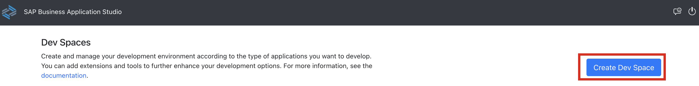
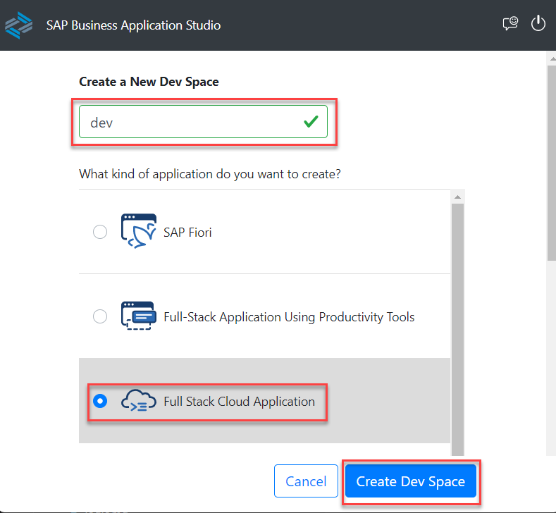
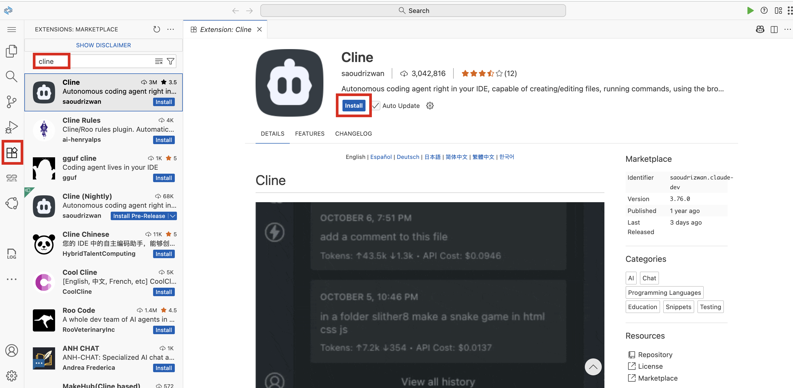
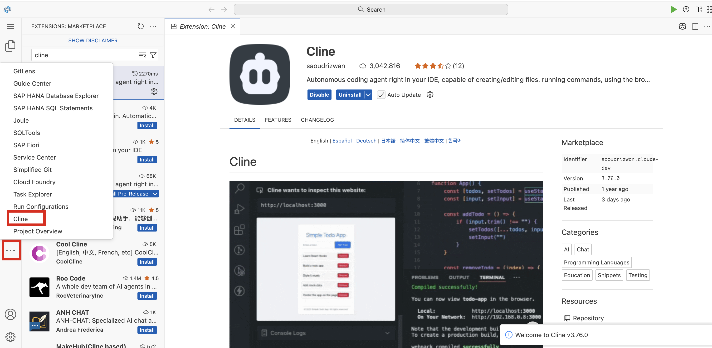
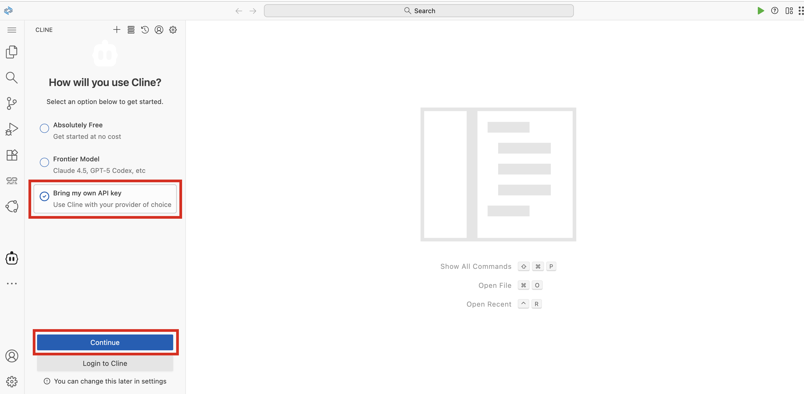
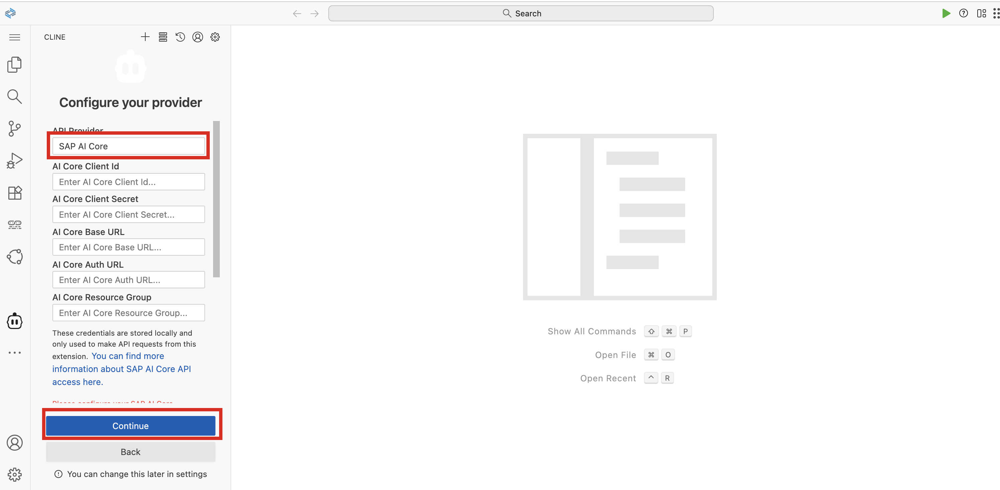

# Configure Cline in SAP Business Application Studio

In this section, you will configure the Cline AI coding assistant in SAP Business Application Studio using SAP AI Core as the API provider.

## Steps

### Step 1: Navigate to Services and Instances

1. In the SAP BTP cockpit, navigate to **Services** > **Instances and Subscriptions**.

2. Choose **SAP Business Application Studio** to open it.

    

### Step 2: Create a Dev Space

1. Choose **Create Dev Space**.

    

### Step 3: Configure the Dev Space

1. Enter a name for your dev space.

2. Select **Full Stack Cloud Application** in the features section.

3. Choose **Create dev Space**.

    

### Step 4: Open the Dev Space

1. Once the dev space status changes to **Running**, choose it to open.

    

### Step 5: Install the Cline Extension

1. Once the Business Application Studio workspace is open, choose the **Extensions** icon in the left navigation pane.

2. Search for **Cline** in the extensions marketplace.

3. Choose **Install** to install the Cline extension.

    

### Step 6: Open Cline

1. Once Cline is installed, choose it from the left navigation pane.

    

### Step 7: Select API Key Option

1. Select **Bring your own API key** and choose **Continue**.

    

### Step 8: Select SAP AI Core as API Provider

1. In the API provider search field, search for and select **SAP AI Core**.

2. Enter the API key credentials for SAP AI Core.

3. Select the deployed model from the available options.

    

4. Choose **Continue** to complete the Cline configuration.

    