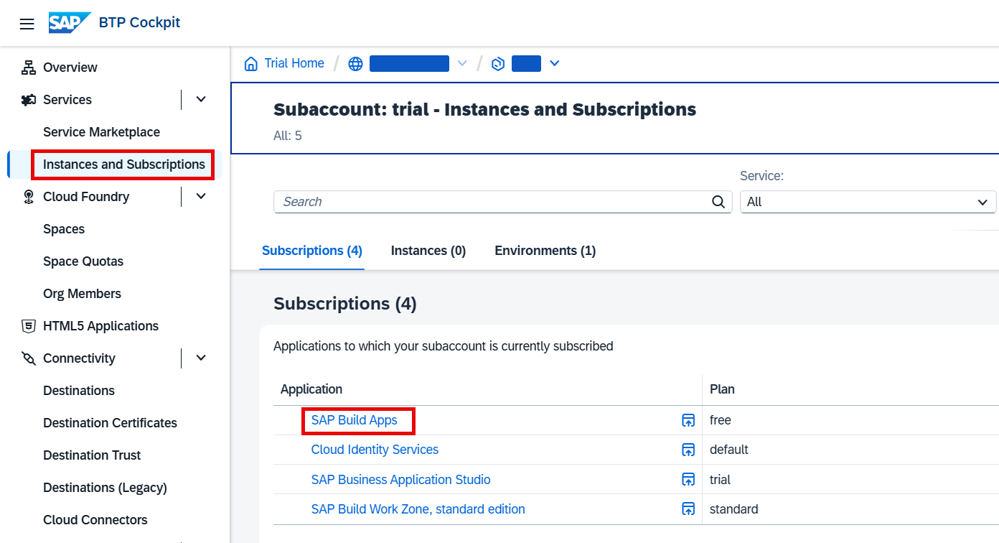
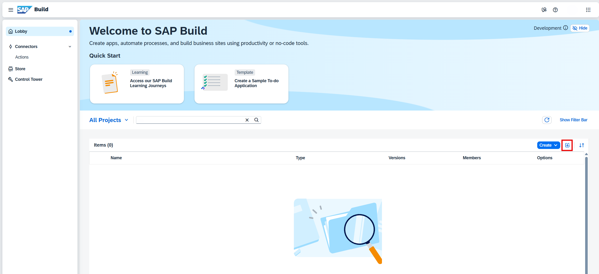
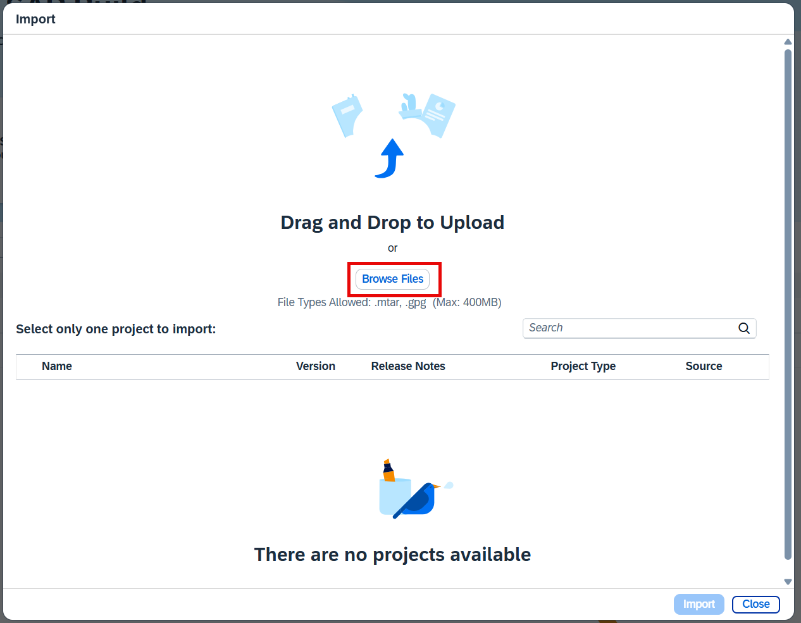
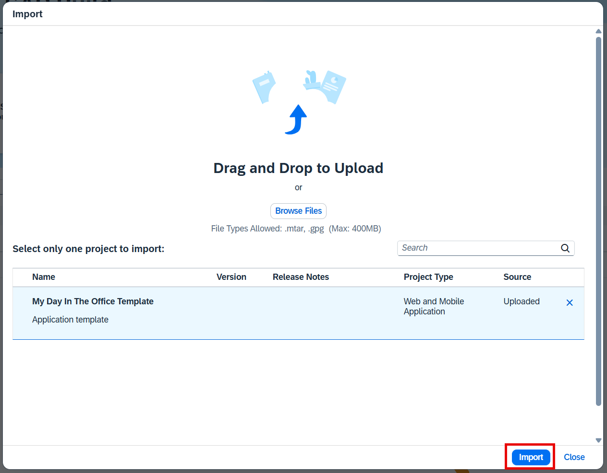
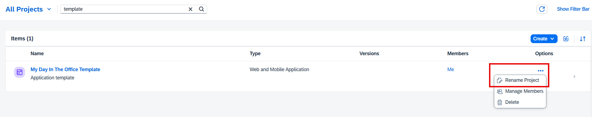
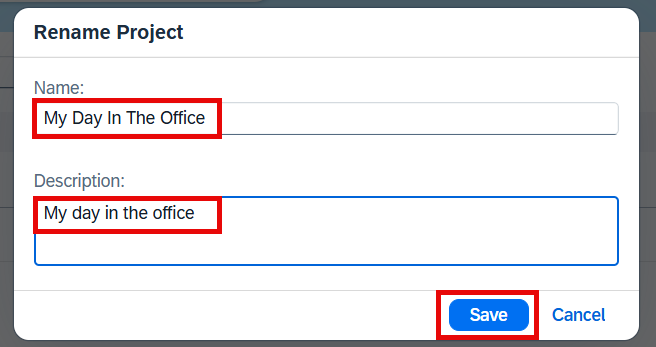
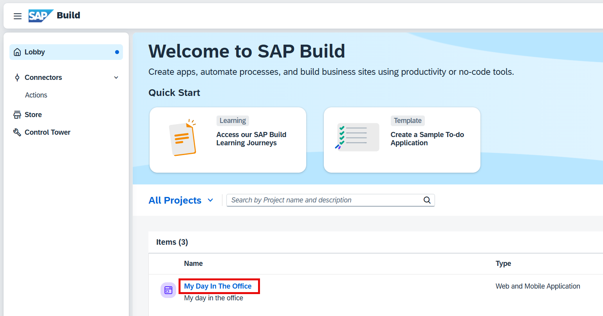
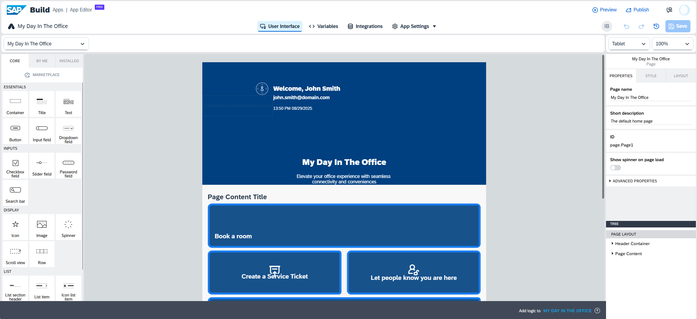

# Import template

## Introduction

In this exercise, you will be working with a pre-made application template. This situation often occurs in real projects: another developer may have already started building the app and added some features. Your task now is to extend it by implementing additional functionality and adjusting the design.

## Content

1. Go to your **SAP BTP Subaccount**. Choose **Instances and Subscriptions** and then choose **SAP Build Apps**.

     

2. In **SAP Build Lobby** choose **Import** button.

     

3. Choose **Browse Files** and select the file `My Day In The Office Template.mtar` from the assets folder which you have downloaded in the previous exercises.

     

4. Select uploaded file and then choose **Import**.

     

5. Open **Options** menu and then choose **Rename Project**.

     

6. Enter the following data and then choose **Save**:

    | Field | Data |
    | ----- | ---- |
    | **Name** | My Day In The Office |
    | **Description** | My day in the office |

     

7. Choose the name of the app to open it.

     

8. The main page of the app will be shown in the editor.

    

## Next Step

[Adding integrations to the app](./integration.md)