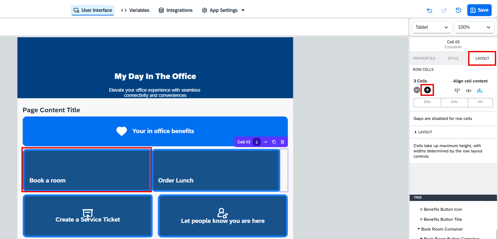

# Update Main Page

## Introduction

In this task, you will update the application’s main page by adding navigation buttons for the two new pages and making small adjustments to the app’s design.

## Content

1. In the page selector dropdown list, select **My Day in The Office** page.

     

2. Drag **Container** component to the page, right between **Page Content Title** and **Book a room** button.

     

3. Choose **Style** and select **Duplicate** for the **Information** style.

     

4. Enter **Main Page Special Button** to the **New style class name** field and then choose **OK**.

     

5. Apply the new style by selecting it. Afterwards choose **Edit**.

     

6. Select **FAVORITE** in the **Background color** field and then choose **Overwrite**.

     

7. Choose **Layout** tab, set the **Horizontal** layout with the middle components alignment as shown on the screenshot below.

     

8. Scroll down and choose **Custom** in the **Width and Height** section. Then select **Set height** from the dropdown list and enter **90px** to the **Set height** field.

     

9. Choose **Properties** tab and enter **Benefits Button** to the **Component display name** field.

     

10. Drag **Title** and **Icon** components to the new container as shown at the screenshot below.

     

11. Choose the new title field and enter the following data:

    | Field | Value |
    | ----- | ----- |
    | Content | Your in office benefits |
    | Component display name | Benefits Button Title |

     

12. Choose **Style** tab and then select **Buttons Text** style.

     

13. Choose **Layout** tab and then choose **Fit content** in the **Width and Height** section.

     

14. Select the new icon component and enter the following data:

    | Field | Value |
    | ----- | ----- |
    | Icon | heart |
    | Component display name | Benefits Button Icon |

     

15. Choose **Style** tab and then choose **Buttons Icon** style.

     

16. Choose **Benefits Button** container and then choose **Add logic to Benefits Button**.

     

17. Drag **Open page** logic block to the canvas. Connect it to the **Component Tap** event and then select **Benefits** in the **Page** field.

     

18. Choose **Book a room** container button. Then choose **Duplicate**.

     

19. Having the new button selected, enter **Order Lunch Button** to the **Component display name** field.

     

20. Choose a title inside the new button and enter **Order Lunch** to the **Content** field.

     

21. Choose **Book a room** button and then choose **Layout** tab. Increase the number of cells once with the **+** button to add a separator.

     

22. Drag **Book a room** button to the right.

     

23. Choose **Order Lunch** button and open the logic canvas. Drag **Receive Event** block to the canvas and select **Component tap** for the **Event source** field.

     

24. Drag **Open page** logic block to the canvas. Connect it to the **Component Tap** event and then select **Order Lunch** in the **Page** field.

     

25. In the components tree choose **Header Container**. Set the new **Background Image** for it. Use `office.jpg` file from the *Assets folder* for upload.

     

26. For the buttons **Order Lunch** and **Book a room** set the following backgrounds:

    | Button | File from the *Assets folder* |
    | ------ | ----------------------------- |
    | Order Lunch | `lunch.jpg` |
    | Book a room | `room.jpg` |

     

27. Choose **Book a room** button and then choose **Style** tab. Call the context menu for the **Main Screen Buttons** style and choose **Edit**.

     

28. Set **Border style** to **none** and then choose **Overwrite**. You could also notice that for the background color they use the color named **TILE**. In the next step you want to change it in the app theme.

     

29. Choose **App Settings** > **Theme**.

     

30. Choose **Tile** color and enter `#333333` to the **HEX** field.

     

31. Choose **User Interface**. Now you can see the main page with the updated design.

    

## Next Step

[Preview Application](./preview.md)