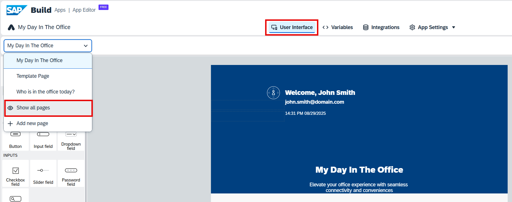
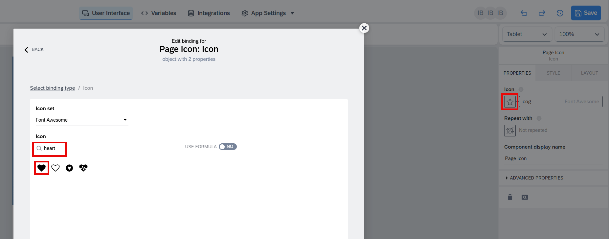
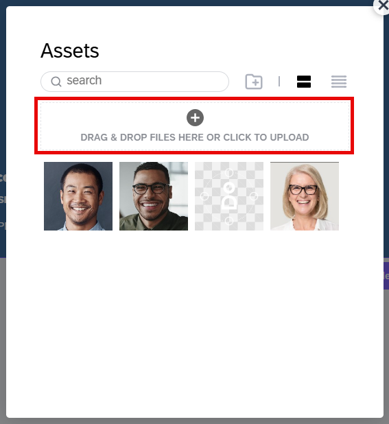
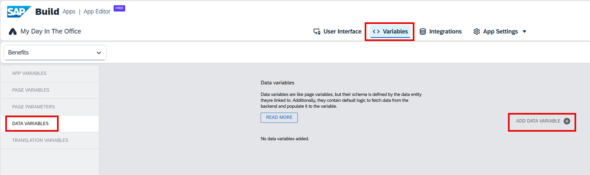

# Creating a page with the employee benefits

## Introduction

In this exercise, you will create a new page to display employee benefits. For simplicity, we won’t work with benefit assignments; instead, we will directly read data from the **Benefits** business object. This way, we don’t need to prepare any business data in the backend system. In a real-world scenario, the integration would be more complex.

## Content

1. Choose **User Interface** tab. In the pages dropdown list choose **Show all pages**.

     

2. The application template contains already a page template which can be used to create new pages. This page template has some components on it (e.g. header container with a navigation button). This will ensure that all the new pages have a similar interface.

    Choose a context menu for the **Template Page**. Then choose **Duplicate**

     

3. Choose the copied page.

     

4. Enter **Benefits** to the **Page name** field (if you don't see this field, make sure that no visual component is selected). Then choose **Page Title** component in the preview section.

     

5. Enter **Your in office benefits** to the **Content** field. You can rename other fields in the same way:

    | Field | Value |
    | ----- | ----- |
    | Page Description | Find information on benefits available to you |
    | Title | Your Benefits |

     

    Choose a big icon under the page name and description.

6. Choose a star button in the **Icon** section. In the popup window search for **heart** and then choose a black heart icon.

     

7. In the components tree choose **Header Container**. Choose **Browse** button in the **Background Image** section.

     

8. Choose **Drag & Drop Files Here or Click To Upload**. Then choose `benefits.jpg` file from the assets folder you've downloaded earlier.

     

9. Select this new uploaded picture.

     

10. Choose **Use Image**.

     

11. Choose **Variables** tab and then choose **Data Variables**. Choose **Add Data Variable**.

     

12. Select **Benefit** enity from the list.

     

13. We don't want to show all the benefits from the backend system, so let's add some filter. Choose **X** button in the **Filter condition** section.

     

14. Choose **Object with properties**.

     

15. Choose **Add condition**.

     

16. You can enter conditions now. Enter the following conditions (using **Add Condition** button for every new line). Choose **ALL** button in the **Match...** section (it should get renamed to **ANY**). Then choose **Save**.

    | Property | Condition type | Compared value |
    | -------- | -------------- | -------------- |
    | benefitId | equal | 748 |
    | benefitId | equal | 889 |
    | benefitId | equal | 1126 |
    | benefitId | equal | 1141 |
    | benefitId | equal | 161625 |

     

17. Choose **User Interface** tab and then choose **By Me** tab in the component list section. Drag the **Benefits Container** component to the **Page Content** container on your page.

     

18. You can check that you placed the component correct by calling the context menu and checking **Select parent element**. It should be **Page Content**.

     

19. Enter **Benefit** to the **Component display name** field and then choose a button in the **Repeat with** section.

     

20. Choose **Data and Variables**.

     

21. Choose **Data variable**.

     

22. Choose **Benefit1** and then choose **Save**.

     

23. Choose a button in the **benefit** section.

     

24. Choose **Data item in repeat**.

     

25. Choose **current** and then select **benefitName** in the list.

     

26. Enter **Samples benefit** in the **Optional preview value** field and then choose **Save**.

     

27. Choose a star button in the **icon** section.

     

28. Choose **Formula** and then enter the following formula in the field (it will add a custom icon for every benefit type). Then choose **Save**.

    ~~~js
    IF(repeated.current.benefitId=="748",{set: "fontAwesome", name: "cutlery"},IF(repeated.current.benefitId=="1126",{set: "fontAwesome", name: "bicycle"},IF(repeated.current.benefitId=="1141",{set: "fiori", name: "bus-public-transport"},IF(repeated.current.benefitId=="889",{set: "fontAwesome", name: "car"},IF(repeated.current.benefitId=="161625",{set: "fontAwesome", name: "futbol-o"},{set: "fontAwesome", name: "star"})))))
    ~~~

     

29. Now your Employee's Benefit page is ready.

    

## Next Step

[Update Main Page](./main-page.md)