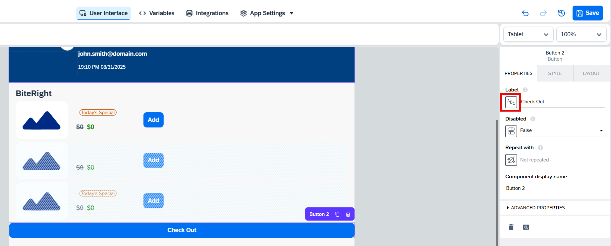
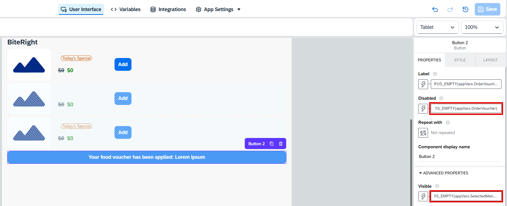

# Creating a page with meals

## Introduction

In this exercise, you will build a page for placing lunch orders. As part of our business scenario, we assume that our company has a contract with a catering provider called *BiteRight*, and we integrate with their backend system through an API.

## Content

1. Choose **User Interface** tab. In the pages dropdown list choose **Show all pages**.

     

2. Choose a context menu for the **Template Page**. Then choose **Duplicate**

     

3. Choose the copied page.

     

4. Change/rename all the title components (including the main icon) using the following data:

    | Field | Value |
    | ----- | ----- |
    | Page Name | Order Lunch |
    | Page Title | Order Lunch |
    | Page Description | Shows the daily lunch menu |
    | Title | BiteRight |
    | Icon Name | bell |

     

5. In the components tree choose **Header Container**. Choose **Browse** button in the **Background Image** section.

     

6. Choose **Drag & Drop Files Here or Click To Upload**. Then choose `benefits.jpg` file from the assets folder you've downloaded earlier.

     

7. Select this new uploaded picture and then choose **Use Image** at the new screen.

     

8. Choose **Variables** tab and then choose **Data Variables**. Choose **Add Data Variable**.

     

9. Select **Menu** enity from the list.

    

10. Choose **User Interface** tab and then choose **By Me** tab in the component list section. Drag the **Food Menu Item** component to the **Page Content** container on your page.

     

11. You can check that you placed the component correct by calling the context menu and checking **Select parent element**. It should be **Page Content**. Choose **Wrap in a container** option.

     

12. Enter **Food Item Container** in the **Component Display Name** field. Then choose a button in the **Repeat with** section.

     

13. Choose **Data and Variables** > **Data variable** > **Menu1** and then choose **Save**.

     

14. Choose **Food Menu Item 1** component from the component tree. In the **Advanced Properties** section bind custom fields as shown below:

    | Field | Binding |
    | ----- | ------- |
    | ItemName | **Data item in repeat** > **current** > **name** |
    | IsTodaysSpecial | **Data item in repeat** > **current** > **todaysSpecial** |
    | ItemPrice | **Data item in repeat** > **current** > **price** |
    | ItemSpecialPrice | **Data item in repeat** > **current** > **specialOfferPrice** |

    

15. For the **ImageURL** field, use the formula binding and assign the following formula:

    ~~~js
    URL(repeated.current.imageURL)
    ~~~

    

16. Choose **Variables** tab and then select **App Variables** from the list. Then choose **Add App Variable**.

     

17. Choose **From scratch**.

     

18. Enter **SelectedMenuItem** to the **Variable name** field.

      

19. Choose **User Interface** tab. Drag **Button** component into the **Food Item Container**.

      

20. Call the context menu for the new button. Then choose **Select parent element** > **Food Item Container**.

      

21. Choose **Layout** tab and set Layout as **Horizontal** with the middle components alignment as shown at the picture.

      

22. Choose **Food Menu Item 1** from the components tree. Choose **Layout** tab, scroll down and choose **Exact size** in the **Width and Height** section. Enter **300px** to the **Width** field.

      

23. Choose the new button and then open binding dialog for the **Label** field.

      

24. Choose **Formula** and enter the following formula. Then choose **Save**.

    ~~~js
    IF(repeated.current.name == appVars.SelectedMenuItem, "Added", "Add")
    ~~~

      

25. Having the **Add** button selected, choose **Add logic to Button 1**.

      

26. Drag **Set app variable** logic block to the canvas.

      

27. Connect the new block with the **Component tab** event. Choose **SelectedMenuItem** for the **Variable name** field. Then open binding dialog for the **Assigned value** field.

      

28. Choose **Data item in repeat** > **current** > **name** and then choose **Save**.

      

29. Choose **Variables** tab and then select **App Variables** from the list. Then choose **Add App Variable** > **From Scratch**. Enter **OrderVoucher** in the **Variable name** field.

      

30. Choose **User Interface** tab. Drag **Button** component into the **Page Content** container, right in the bottom.

      

31. Call the binding dialog for the **Label** field of the new button.

     

32. Choose **Formula** and enter the following formula:

    ~~~js
    IF(IS_EMPTY(appVars.OrderVoucher),"Check Out","Your food voucher has been applied: " + appVars.OrderVoucher)
    ~~~

      

33. Select formula bindings for the fields **Disabled** and **Visible** as well. Copy the following formulas there:

    - for **Disabled**:

    ~~~js
    !IS_EMPTY(appVars.OrderVoucher)
    ~~~

    - for **Visible**:

    ~~~js
    !IS_EMPTY(appVars.SelectedMenuItem)
    ~~~

      

34. Having the voucher button selected, choose **Add logic to Button 2**.

      

35. Drag the following logic blocks to the canvas and connect them as shown on the screenshot below:

    - Get record
    - Set app variable

      

36. Choose **Get record** logic block. Select **getVoucher** as the **Resource name**. Choose the following bindings for the fields:

    | Field | Binding |
    | ----- | ------- |
    | email | **Data and Variables** > **System variable** > **Currently logged in user** > **email** |
    | menuItem | **Data and Variables** > **App variable** > **SelectedMenuItem** |

      

37. Choose **Set app variable** logic block. Select **OrderVoucher** as the **Variable name**. Then call the binding menu for the field **Assigned value**.

      

38. Choose **Output value of another node**.

      

39. Select **Get record** in the **Select logic node** field. Then choose **voucherCode**. Afterwards, choose **Save**.

     

40. The **Order Lunch** page is ready now.

## Next Step

[Update Main Page](./main-page.md)