# Preview Application

## Introduction

In this exercise, you will thoroughly test and explore all the features of your application. You will have the opportunity to examine each functionality in detail, verify that everything works as intended, and ensure that the application meets the expected requirements. This process will help you identify any issues or areas for improvement before final deployment.

## Content

1. Choose **Preview**.

    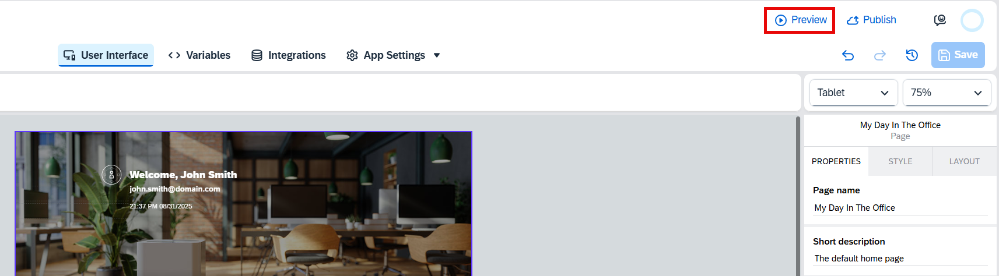 

2. Choose **Open web preview** (alternatively you can test the application with your mobile device).

    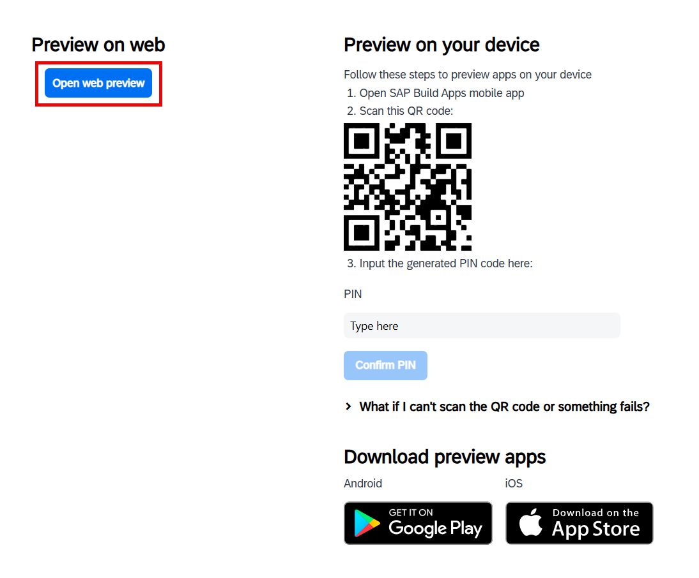 

3. Find your application and then choose **Open**.

    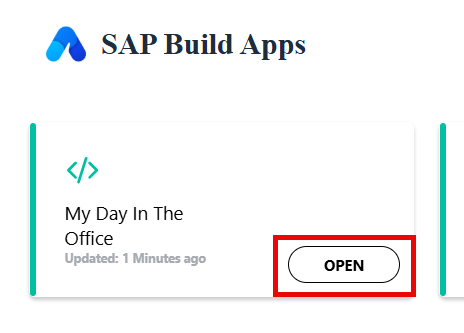 

4. Choose **Let people know you are here** button. The button text will be changed (this functionality wasn't in scope of this tutorial).

    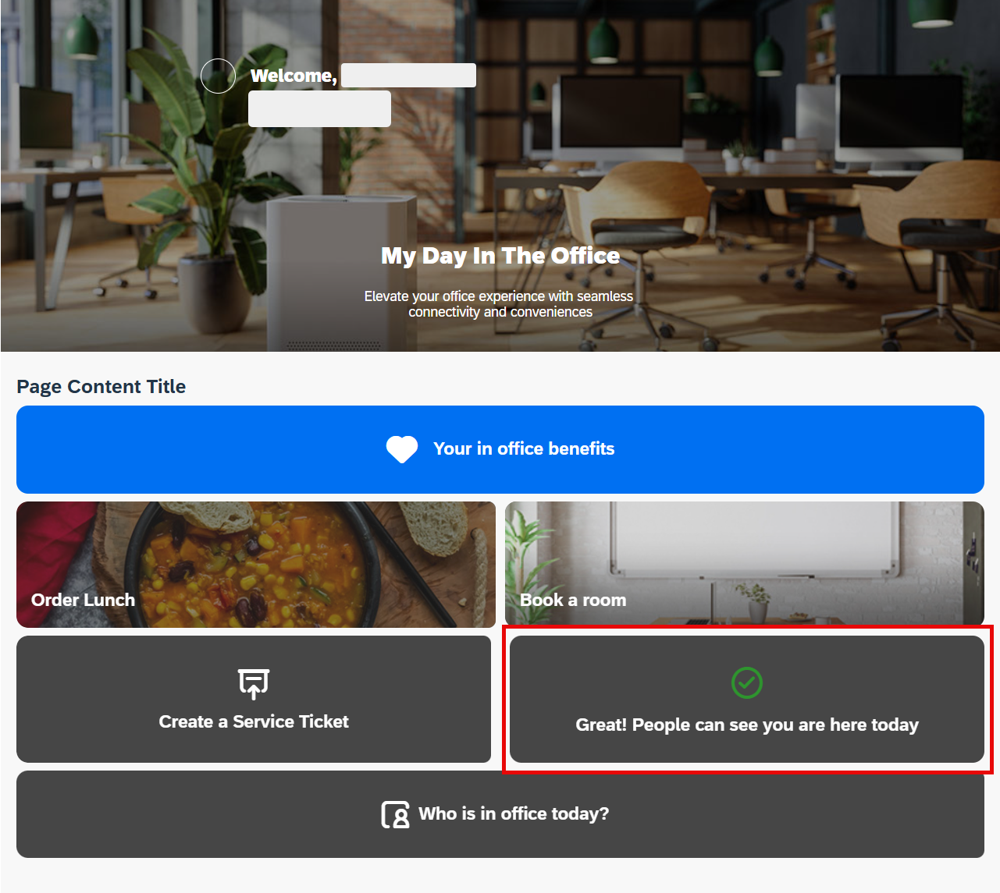 

5. Choose **Who is in office today?**. 

    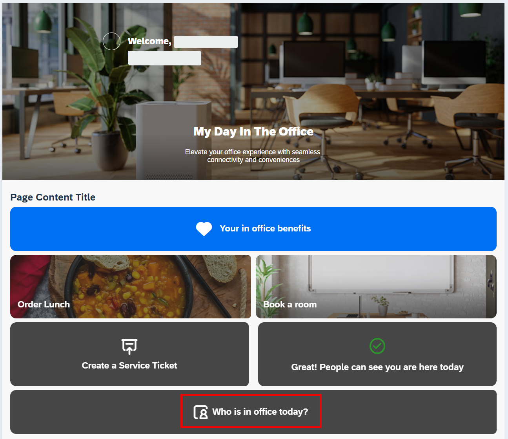 

6. A new page will be opened. You will see the list of colleagues (this functionality wasn't in scope of this tutorial). Choose **Back**.

    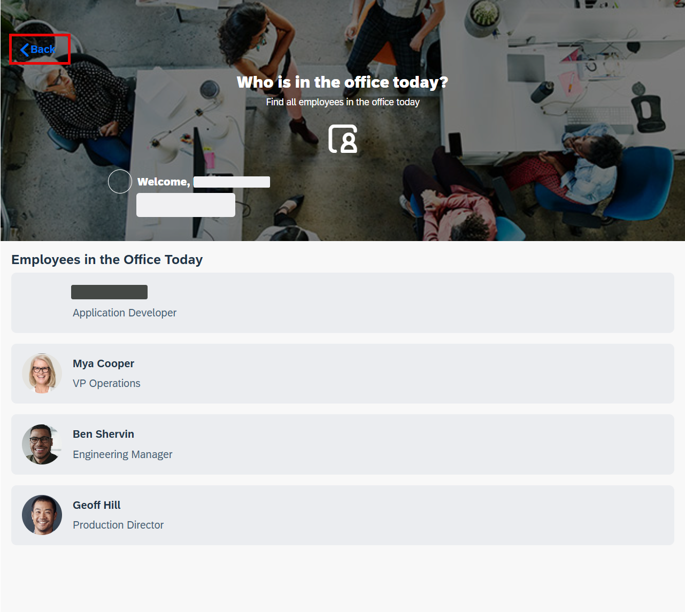 

7. Choose **Your in office benefits**.

    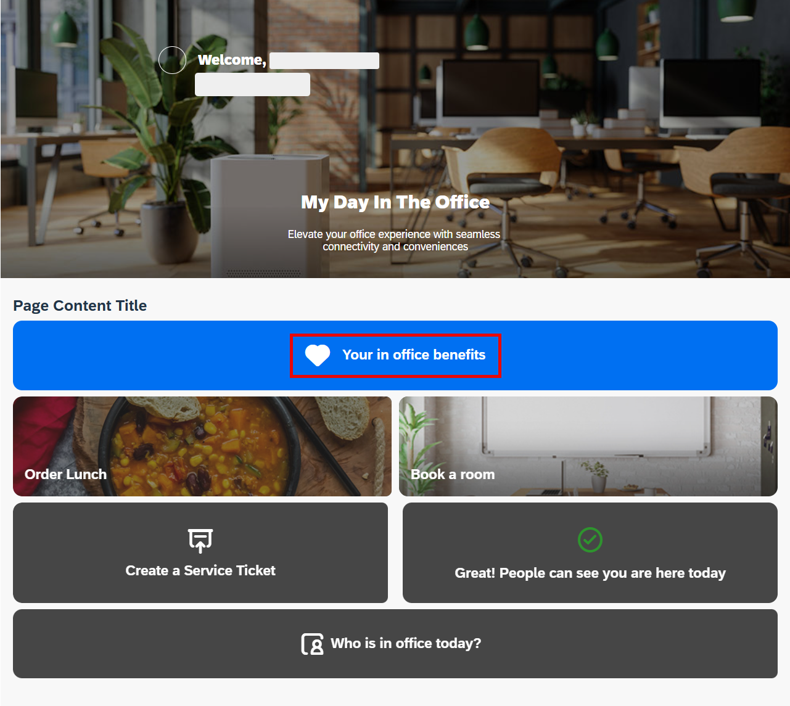 

8. You will see your new page with the list of benefits. This data is coming live from **SAP SuccessFactors** (or from the **SAP Business Accelerator Hub** sandbox system). Choose **Back**.

    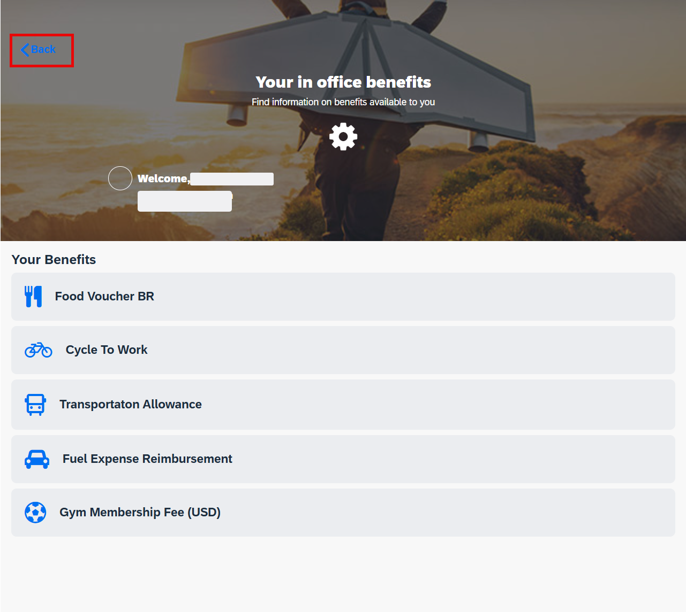 

9. Choose **Order Lunch**.

    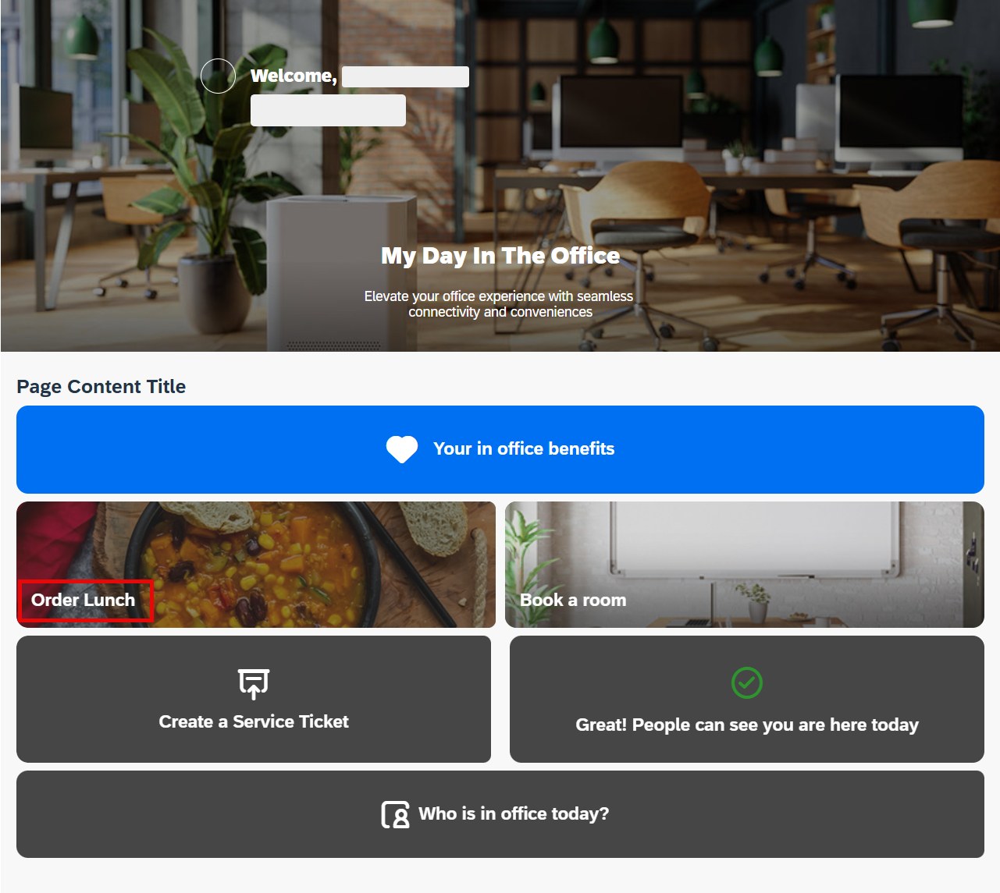 

10. You will see your new page with the lunch menu options. This data is coming live from the catering company API (mock application in this case). Choose **Add** for the any option you like.

    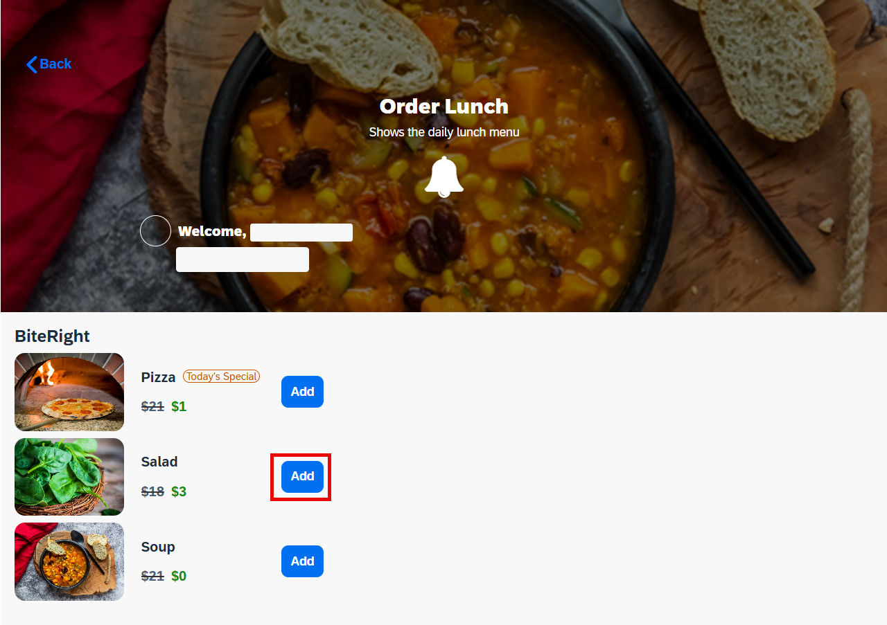 

11. Choose **Check Out** to order the menu item.

    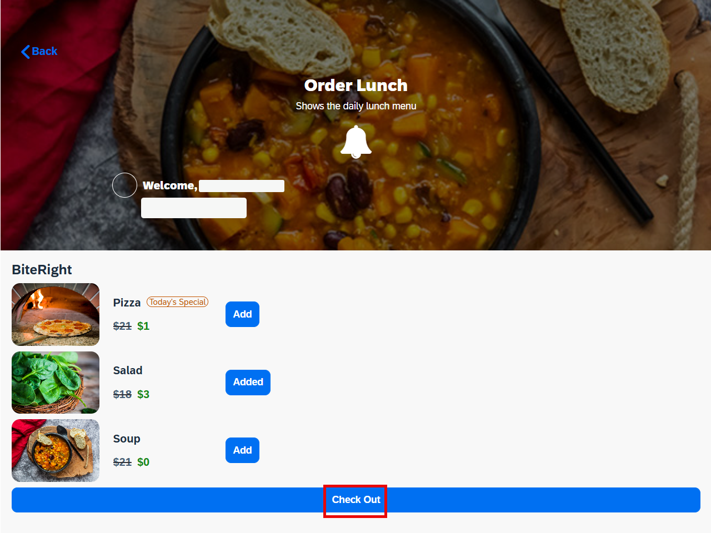 

12. If the order was successful you will see the voucher code. This data has come from the API.

    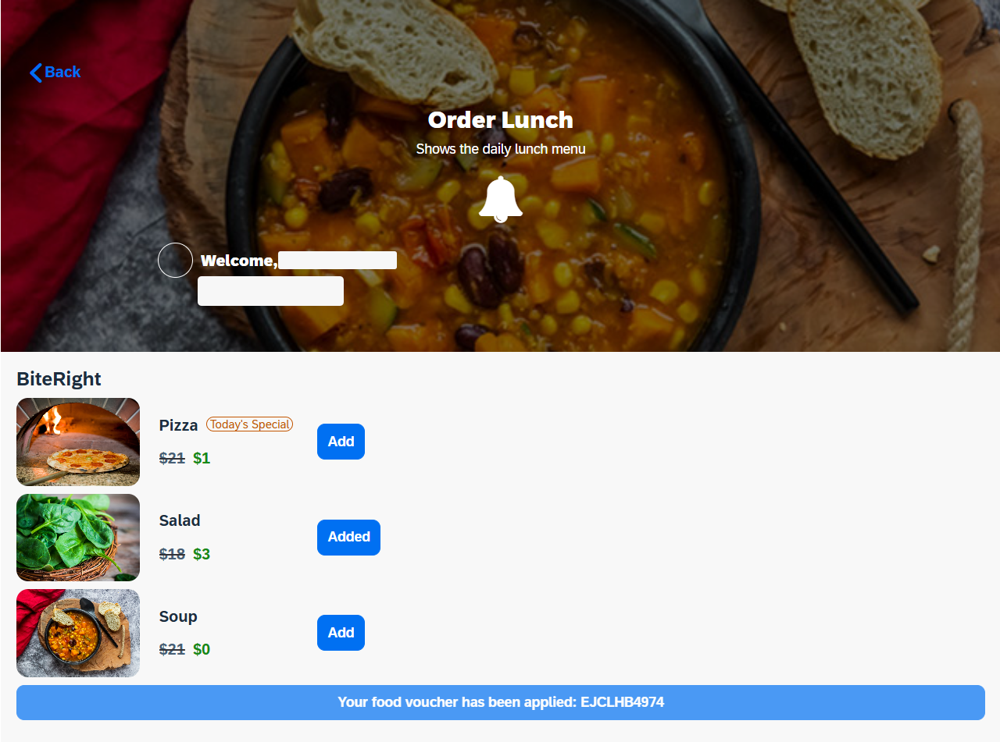

## Result

Your application, integrated with SAP SuccessFactors and a third-party catering API service, is now ready. You have successfully added new functionality and updated the design. You can preview and test the application. The next step is deployment — follow the [link](https://developers.sap.com/tutorials/build-apps-deply..html) to learn more.