# Integration setup for 3rd Party Food Provider

## Introduction

In this exercise, you will implement an integration with a fictional catering company called BiteRight. Since we don’t want to rely on real services, we will use a simple mock application instead. The sample API documentation for BiteRight can be found [here](./BiteRightAPI.md).

## Content

1. Go to your *Assets folder* and open file `manifest.yml` in any text editor. Change the application name by adding some unique prefix (for example, **catering-sample-ABC12345**). It's necessary as the application name is used to generate the application route, which should be unique for every Cloud Foundry organization.

   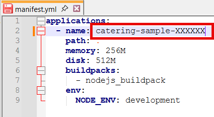 

2. Open your SAP BTP Subaccount and then choose **Cloud Foundry** > **Spaces**. Choose the space you have created (e.g. **dev**).

    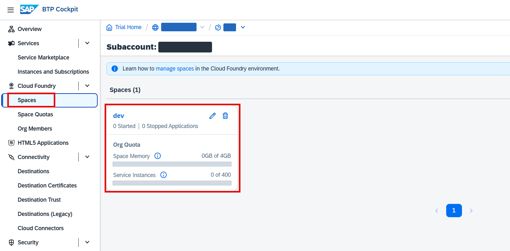 

3. Choose **Deploy Application**.

    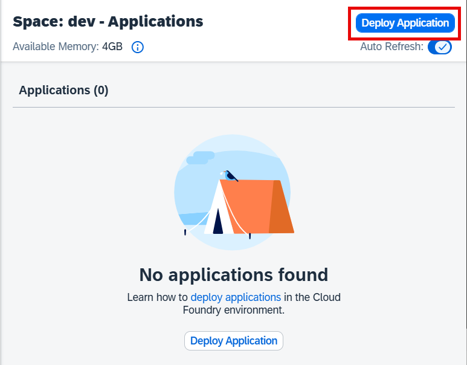 

4. Using **Browse** button choose the following files from your *Assets folder*. At the end, choose **Deploy**.

    | Field | File name |
    | ----- | --------- |
    | File location | `catering-sample.zip` |
    | Manifest location | `manifest.yml` |

    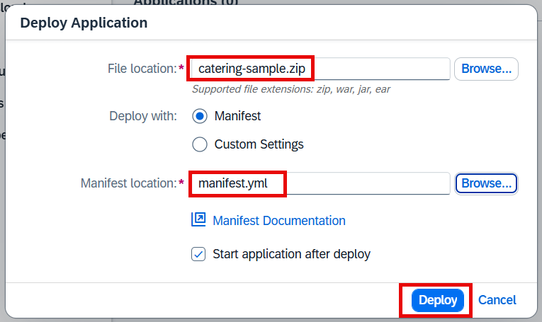 

5. After the application is uploaded, open it.

    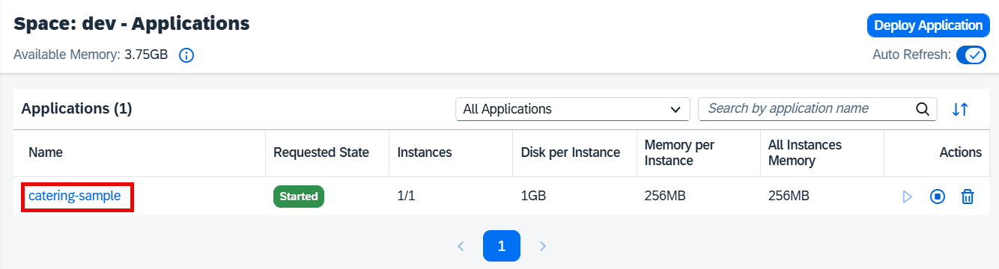 

6. Make sure that the status is **Started**. Copy the application URL in the **Application Routes** section.

    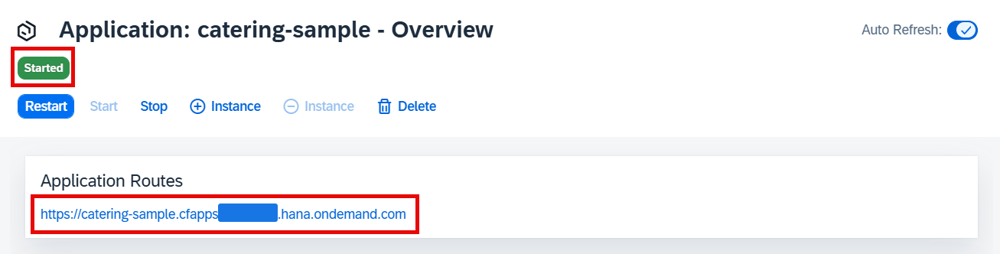 

7. Go back to your SAP BTP Subaccount. Choose **Connectivity** > **Destinations**. Then choose **Create**.

    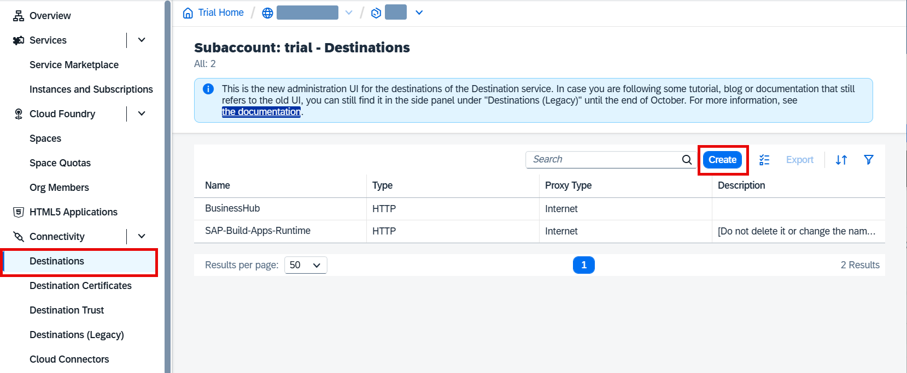 

8. Choose **From File**. Then choose **Create**.

    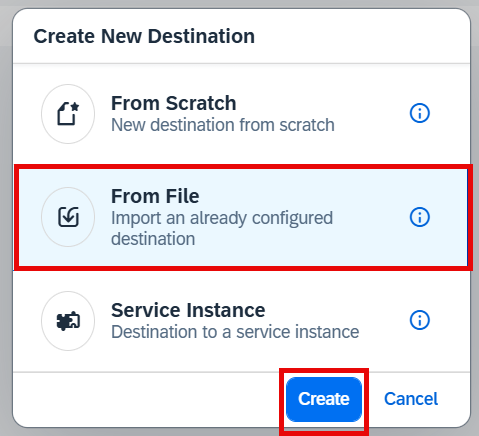 

9. Select `CateringAPI.json` file from your *Assets folder*. You will get a success message afterwards. Choose **OK**. 

    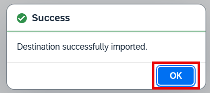 

10. Select your new **CateringAPI** destination and then choose **Edit**.

    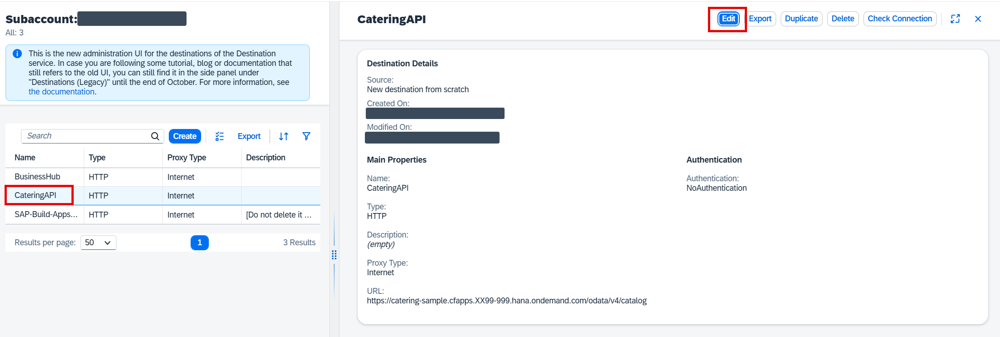 

11. Insert the URL from the step 5 into the field **URL**, followed by `/odata/v4/catalog`. Then choose **Save**.

    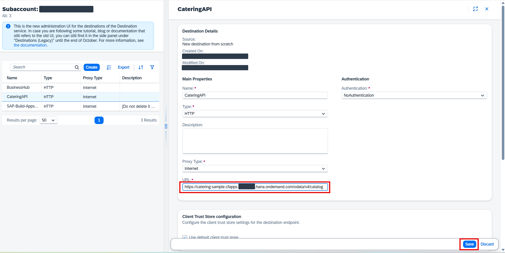

12. The connectivity with the catering company is now set.

## Next Step

[Creating application in SAP Build Apps: Import template](../app/create-project.md)