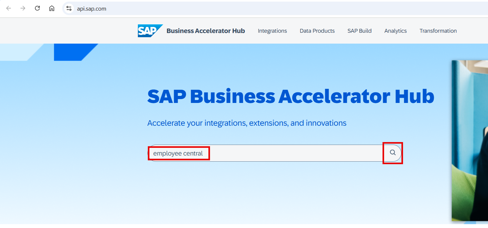
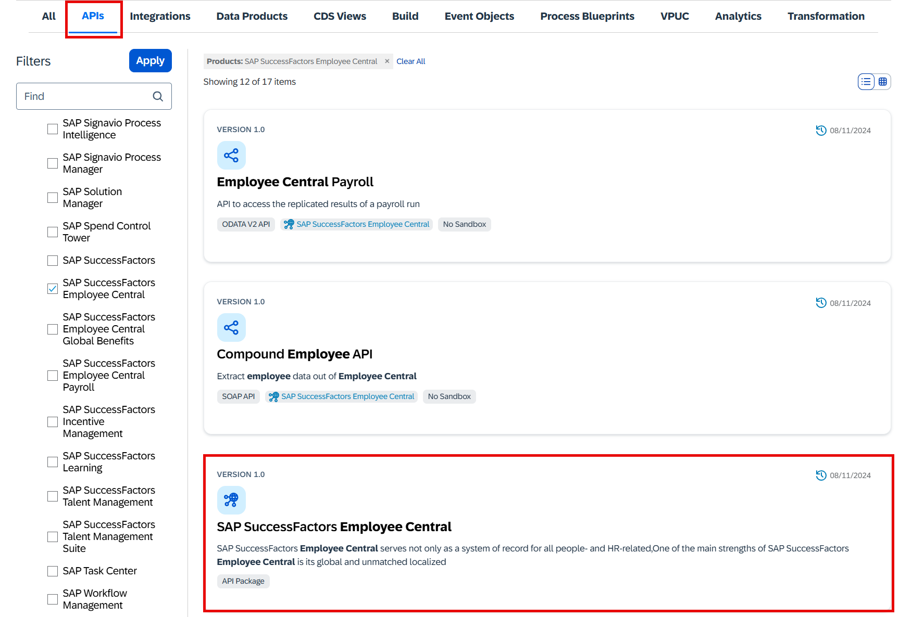
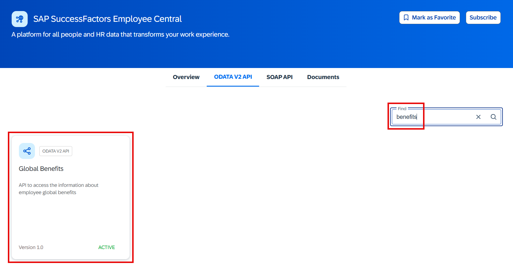
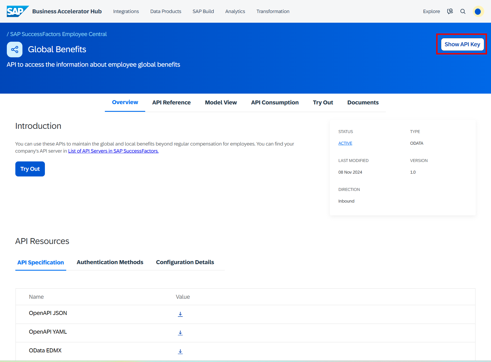
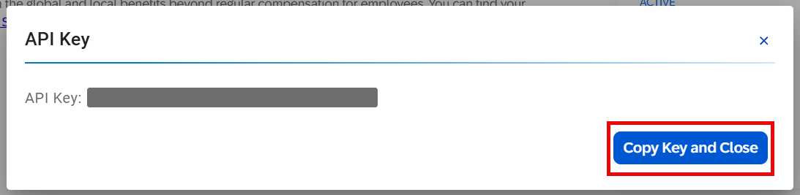
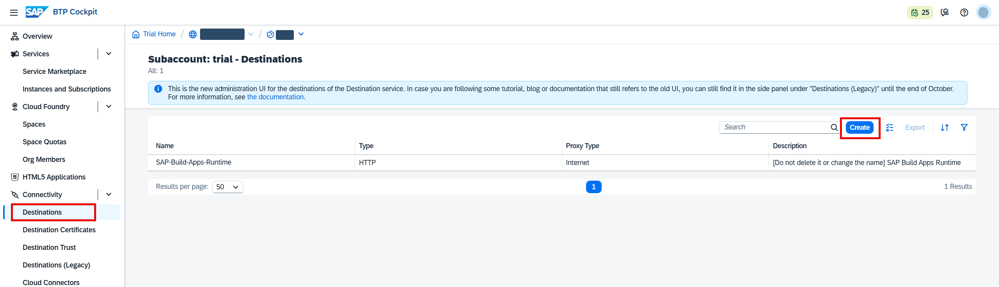
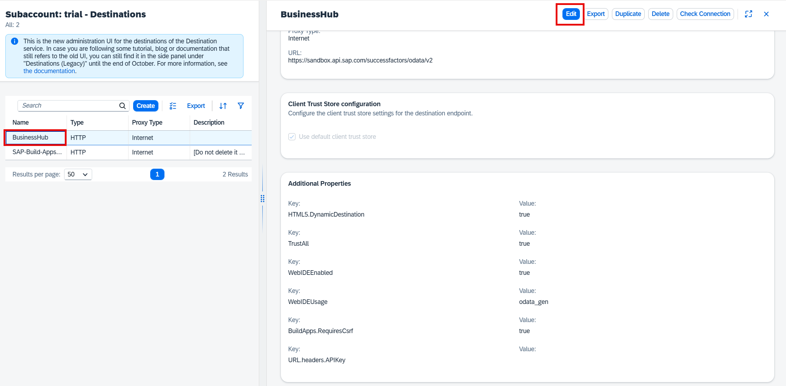
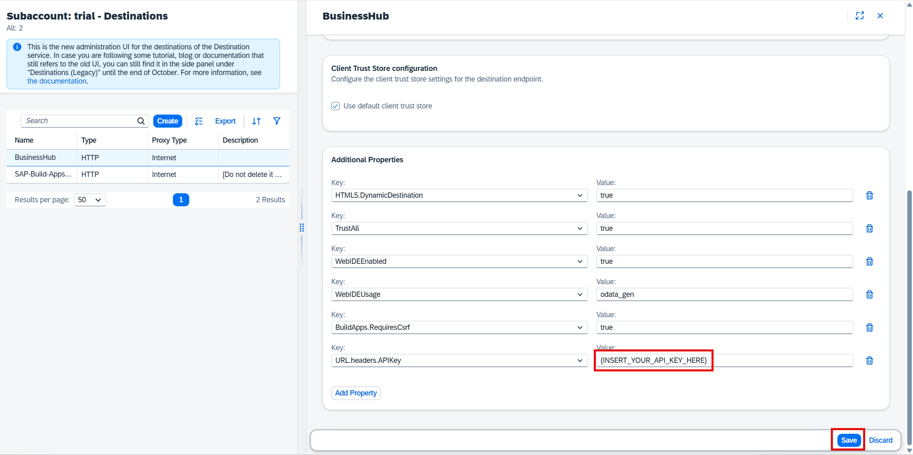

# Integration setup for Success Factors

## Introduction

In this exercise, you will learn how to integrate SAP SuccessFactors with SAP BTP applications. For demonstration purposes, the real system is replaced by an integration with SAP Business Accelerator Hub. This approach allows you to avoid configuring your actual system and instead use test data. In real-world scenarios, sandbox systems should never be used, and API keys must always be kept secure. For further details, refer to this link: [Configuring Integration Between SAP SuccessFactors and SAP BTP](https://help.sap.com/docs/successfactors-platform/using-admin-center/configuring-integration-between-sap-successfactors-and-sap-btp).

## Content

1. Open [SAP Business Accelerator Hub](api.sap.com). Search for `employee central`.

     

2. Choose **APIs** tab. Then select **SAP SuccessFactors Employee Central** from the list of APIs.

     

3. Search for **benefits**. Then choose **Global Benefits**.

     

4. In this documentation you can find all the information on the API, try it out in the sandbox system, check the reference, etc. Choose **Show API Key** button.

     

5. Choose **Copy Key and Close**. The API key is now in your clipboard. You can temporarily note it somewhere.

     

6. Go to you SAP BTP Subaccount. Choose **Connectivity** > **Destinations**. Then choose **Create**.

     

7. Choose **From File**. Then choose **Create**.

     

> **IMPORTANT NOTE:** Here and later in the exercises you will need some additional files (like destination files, application code, images, etc.). Download and unzip [this folder](../assets/assets.zip) somewhere on your computer. This folder will be refered as *Assets folder* later through the whole tutorial.

8. Select `BusinessHub.json` file from your *Assets folder*. You will get a success message afterwards. Choose **OK**.

     

9. Select your new **BusinessHub** destination and then choose **Edit**.

     

10. Paste your API key to the `URL.headers.APIKey` parameter value. Then choose **Save**.

    

11. The connectivity with SAP Business Accelerator Hub is now set.

## Next Step

[Integration setup for 3rd Party Food Provider](./destinations-catering.md)