# Creating a Frontend Application with SAP Build Apps

## Introduction
The frontend application should access all the data prepared before. The warehouse user should be able to search for the specific purchase order item and see all the checks which are relevant for the product. The user can decide whether additional checks are necessary to be done and store all the information found after inspection. In case of any check fails the corresponding defect should be created in the SAP System to be managed by the back office later.


## Task Flow
In this exercise, you will perform the following tasks:

1. Create a new application from a template
2. Install integration with the data from the SAP System
3. Create a data variable used for search
4. Add search button logic
5. Add search results list
6. Add next page navigation logic
7. Add checklists page initialization logic
8. Add save checks button logic
9. Test the application 

## Prerequisites
* You have successfully created the all the previous exercised
* Nice to have the initial SAP Build Apps skills. You can check this [learning journey](link-to-app400) before.


## Content

### Task 1: Create a new application

1. Open SAP Build Apps lobby
   
   a) Go to your SAP BTP subaccount.
   
   b) Select **Instances and Subscriptions**.
   
   c) Select **Go to Application** icon next to the **SAP Build Apps** application to open the SAP Build Apps lobby.

   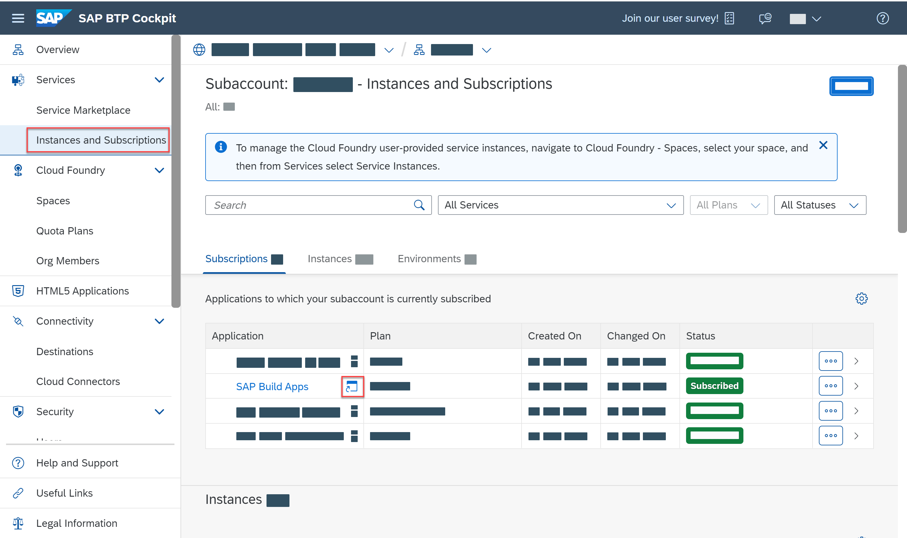

   d) Login with your user and password if prompted.

2. Import a template application - TODO - copy from template

    a) Download the template from [here](https://github.com/SAP-samples/s4hana-extensions-with-sap-build-apps-learning-journey/raw/main/delivery-check-app.mtar)
    
    b) Select **Import** button.
    
    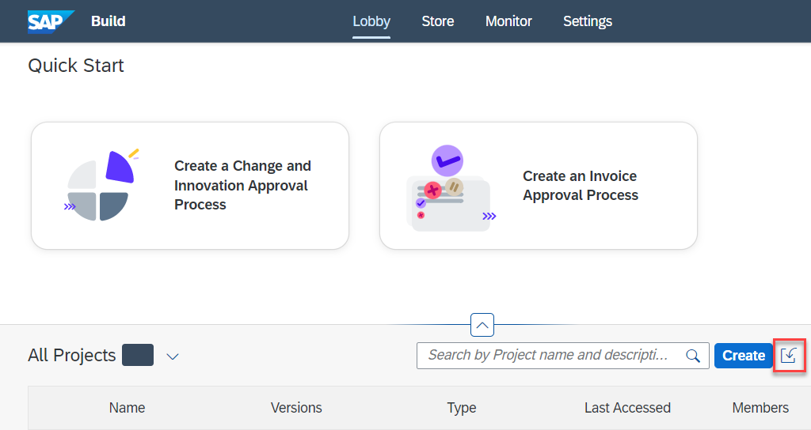

    c) Select **Browse** button and then pick the file in the popup.

    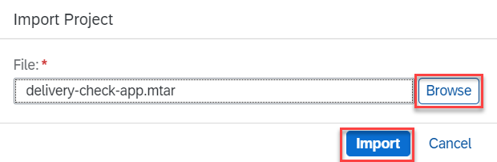

3. Go to the application by selecting its name
  


### Task 2: Install data integration

1. Set SAP BTP Authentication

    a) Select **Auth** button to switch to the authentication section. Choose **Enable Authentication** button there.

    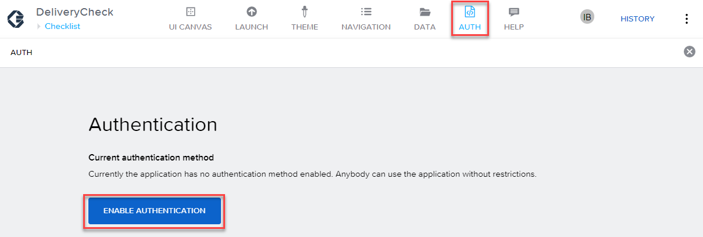

    b) Select **SAP BTP authentication** tile in the popup.

    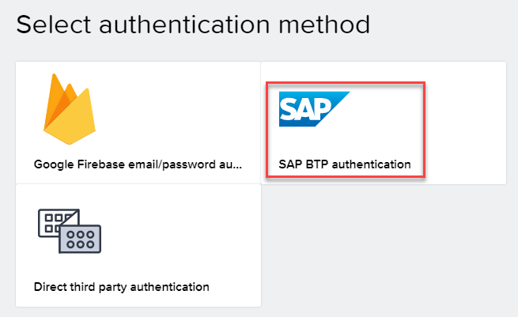

    c) Confirm adding of views and flows by choosing **OK** button.

    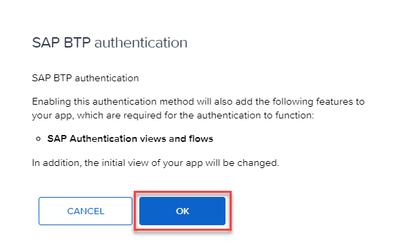

2. Add SAP Systems integration

    a) Choose **Add integration** button and then select **BTP Destinations** button.

    
    
    b) In the destinations list select **S4HC_BASIC_PO** destination (or **MOCK_PURCHASE_ORDER** if you use a mock server).

    
    
    c) Choose **Install Integration button**.
    
    
    
    d) Select **PurchaseOrderItem** entity and choose **Enable Data Entity** button.

    
    
    e) Repeat the steps (a) to (d) with the following destinations and entities:

      - Destination **S4HC_BASIC_PCLFN** (or **MOCK_PRODUCT_CLASSIFICATION** in case of mock server usage), entity **A_ProductCharcValue**

      - Destination **S4HC_BASIC_DEFECT** (or **MOCK_DEFECT** in case of mock server usage), entity **Defect**

      - Destination **S4HC_BASIC_GRCHECK_\<YOUR_ID\>** (or **MOCK_CUSTOM_OBJECT** in case of mock server usage), entity **YY1_GRCHECK_\<YOUR_ID\>**

      - Destination **S4HC_BASIC_CHECKLIST_\<YOUR_ID\>** (or **MOCK_CHECKLIST** in case of mock server usage), entity **YY1_CHECKLIST_\<YOUR_ID\>**

        In case of **YY1_CHECKLIST_\<YOUR_ID\>** entity make sure that you have marked the checkbox **to_CHECKLIST_ITEM**:

        

    f) The final SAP Systems integration list should look like the following:

    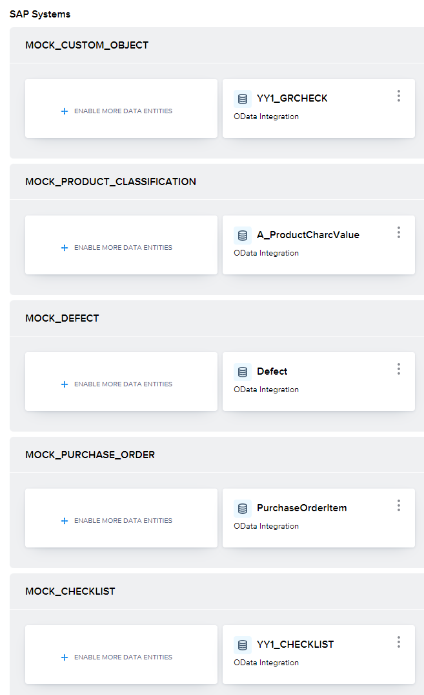

    g) Later we will need to know which internal ID was assigned to the product classification characteristic. It could be done on the fly with the help of several APIs. But for the sake of tutorial simplicity this ID will be hardcoded in the application. To get this ID open the product classification integration and find the enabled entity. 
    
    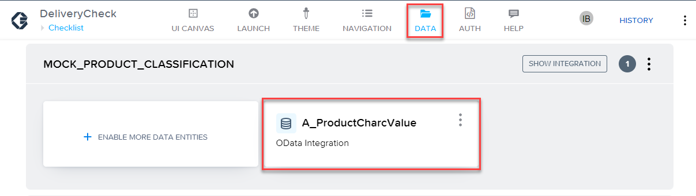
    
    h) Select **Browse Real Data** button.

    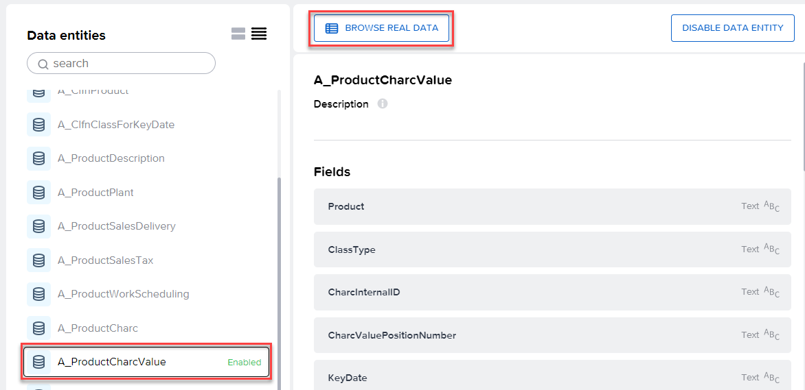
    
    i) Select **Search by Product** in the list next to the search field. Enter the product name which you classified in the backend (for the mock server scenario use MAT003) and press **Enter** on your keyboard. Scroll the result list on the right until the **CharcInternalID** column will come up. Make a note of the internal ID value - you will need it in the next steps.
    
    


### Task 3: Create a data variable

1. Create data variable

    a) Choose a switch page button in the top left corner of the screen.

    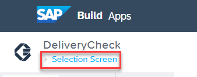
    
    b) Select the tile with the page **Selection Screen**.

    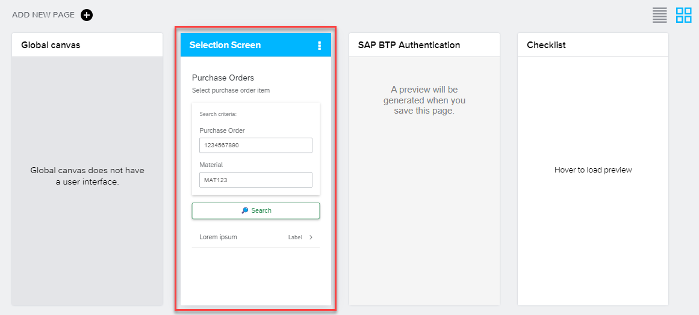
    
    c) This is a layout of the first page of the application.

    
    
    d) Select a switch **View/variables** to go to the variables section.

    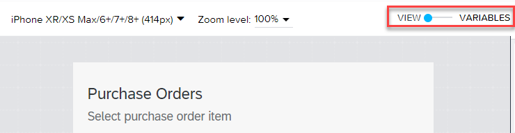

    e) Choose **Data Variables** on the left and select **Add Data Variable** button.

    
    
    f) In the popup menu select **PurchaseOrderItem** entity as a reference for the new variable.
    
    
    
    g) A new data variable is always created with the default logic which read the data from the backend every 5 seconds. We don't need this behavior. To delete it select the new variable and choose **Add Logic** button on the bottom of the screen.
    
    
    
    h) Select all three logic blocks and click **Delete** button on your keyboard.
    
    
    
    i) Switch back to the layout view.
    
    


### Task 4: Add search button logic

1. Add logic to read the data based on search criteria

    a) Select **Search** button on the page layout and choose **Show logic for SEARCHBUTTON** button.

    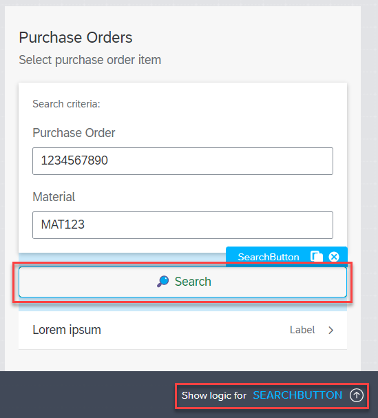

    b) Drag **Get record collection** logic block to the marked place in the logic builder.

    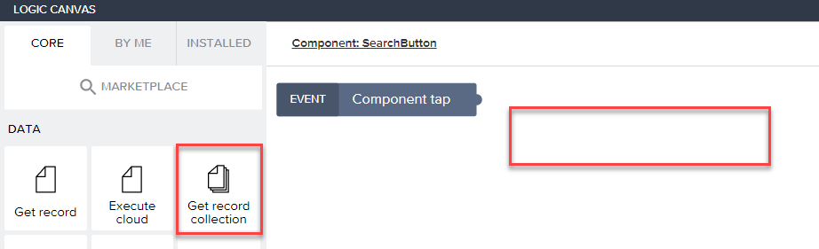
    
    c) On the *Properties* panel set the resource name to **PurchaseOrderItem**. Choose **Filter conditions** button and select **Object with properties** binding option.
    
    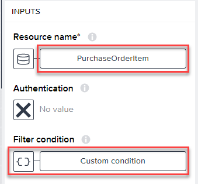
    
    d) Select **PurchaseOrder** in the **Property** list. Then choose **Compared value** field and navigate to **Data and Variables** &rarr; **Page Variables**. Then select **PurchaseOrder** page variable. Choose **Add condition** button and add another condition for **Material** property and **Material** page variable.

    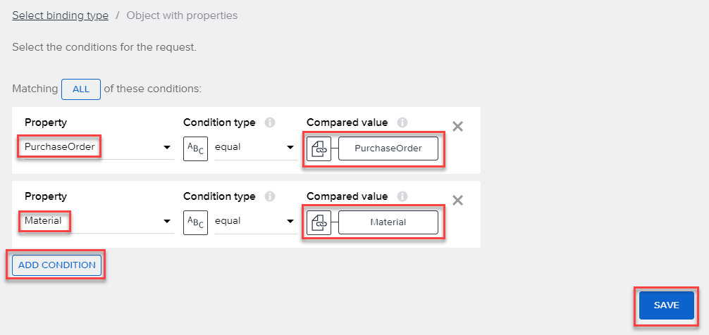
    
    e) If you leave this filter as it is, the user has to fill both selection fields on the screen to get the result. But the standard search experience is to ignore the search fields if they are not filled. Let's do this trick. 
    For property *PurchaseOrder*, choose button **ABC** &rarr; **Formula** and copy the following formula:
    
    ```js
    IF(IS_EMPTY(pageVars.PurchaseOrder),"minimum","equal")
    ```

    
    
    f) Repeat the same for the second condition. Use the following formula there:

    ```js
    IF(IS_EMPTY(pageVars.Material),"minimum","equal")
    ```

    g) Your final filter condition should look like the one on the screenshot below. Exit by choosing **Save** button.
    
    
    
    h) Connect the logic block with the **Component tap** event.
    
    

2. Save the result in the data variable

    a) Drag **Set data variable** logic block to the marked place in the logic builder.

    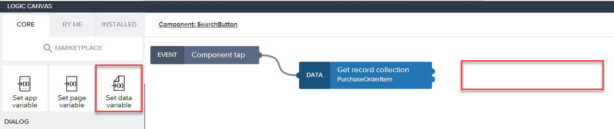
    
    b) Connect the logic block input with the top output of the previous block.
    
    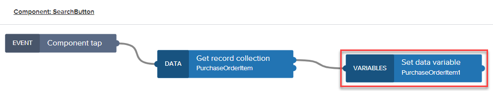
    
    c) On the *Properties* panel set the data variable name to **PurchaseOrderItem1**. Choose **Record collection** button and go back to **Select Binding Type**, select **Output value of another node** binding option.
    
    
    
    d) Choose **Get record collection** in the *Select logic node* field. Choose **Collection of records** in the *Select node output* field. Select **Save** button afterwards.

    


### Task 5: Add results list

1. Prepare results list

    a) Select the list item at the bottom of the page layout and click the button in the **Repeat with** field on the *Properties* panel.

    
    
    b) Assign data variable **PurchaseOrderItem1** as the binding for the **Repeat with** property. 
    
    c) Choose **Primary label** field and choose **Formula**. Use the following formula:

    ```js
    repeated.current.PurchaseOrderItemText + " (" + repeated.current.Material + ")"
    ```
    
    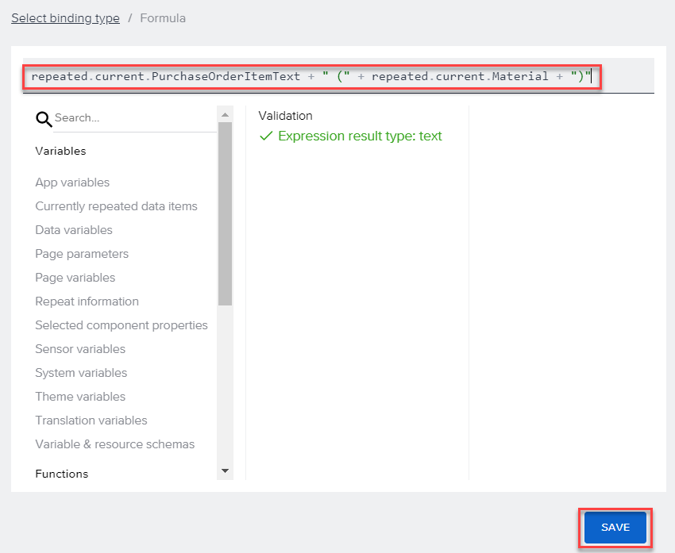
    
    d) Assign formula binding to the **Secondary label**. Use the following formula:

    ```js
    repeated.current.PurchaseOrder + " / " + repeated.current.PurchaseOrderItem
    ```
    
    

    e) *Properties* tab should look now like the following:

    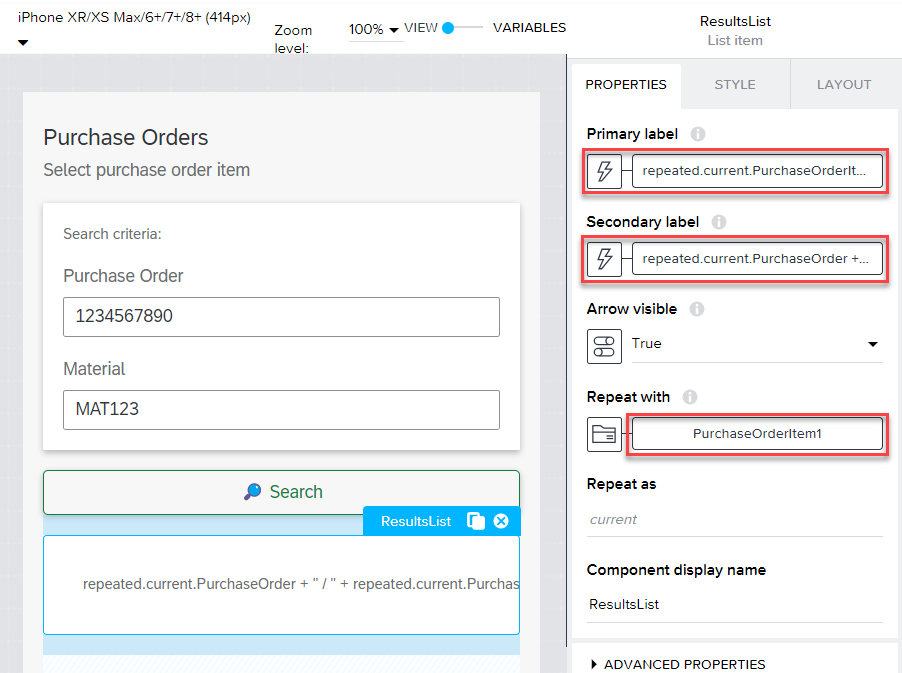

2. Test the search functionality

    a) Now it's time to test how the search works. Select **Launch** button.

    

    b) On the next screen choose **Open Preview Portal** button.

    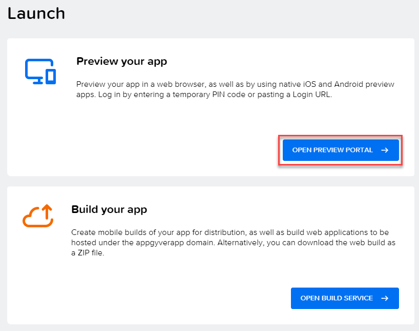
    
    c) Select **Open Web Preview** button.
    
    
    
    d) You should get the following page:
    
    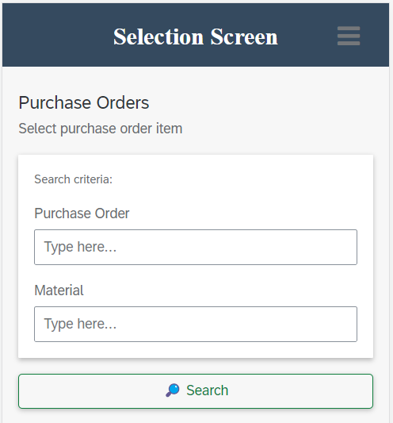
    
    e) You can enter some search criteria or leave all the fields empty. Select **Search** button. The results list will be filled based on your criteria. You can try to select any result item - there will be no effect. This functionality will be added in the next step.
    
    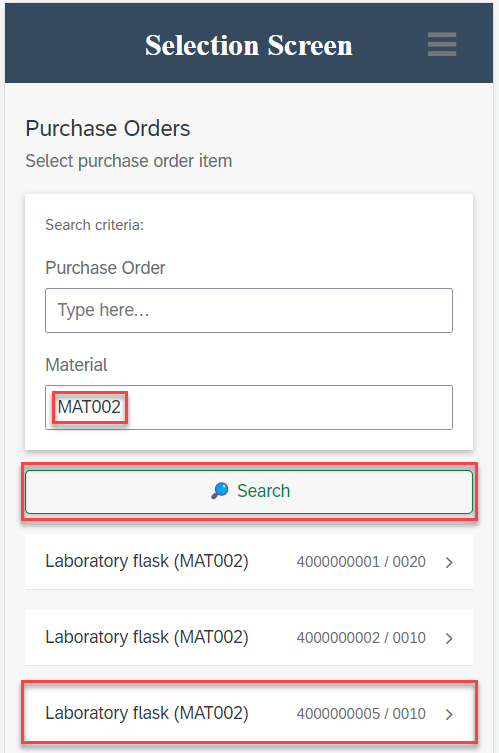

    f) You can leave the preview tab open. All your updates during the design time will immediately reload the preview.


### Task 6: Add navigation logic

1. Add custom business object check

    a) Before going to the next page we want to know whether all the checks were done for this purchase order item. For this we will try to read the corresponding custom business object instance and navigate only if nothing were found. Select the result list item component and choose **Add logic to RESULTSLIST** button.

    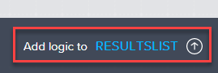
    
    b) Drag **Get record collection** logic block to the marked place in the logic builder.
    
    
    
    c) On the *Properties* panel set the resource name to **YY1_GRCHECK_\<YOUR_ID\>**. Choose **Filter collection** button and select **Object with properties** binding option.
    
    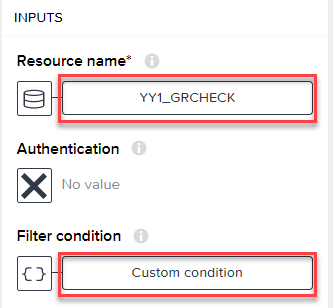
    
    d) Select **PurchaseOrder** in the **Property** field. Assign **Data item in repeat** binding option to the field **Compared value** and select **PurchaseOrder** field. Add another filter item with the **Add condition** button and select **PurchaseOrderItem** as the **Property** and **PurchaseOrderItem** repeated field as the **Compared value**. Exit with **Save** button.

    
    
    e) Connect the logic block to the **Component tap** event.
    
    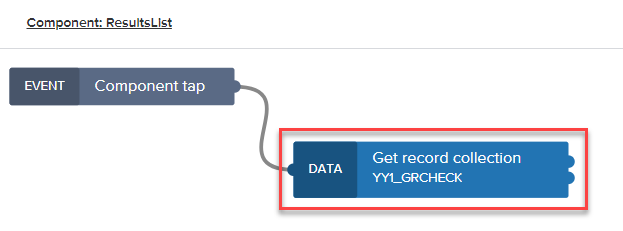
  
2. Add condition block
  
    a) Drag **If condition** logic block to the marked place in the logic builder.

    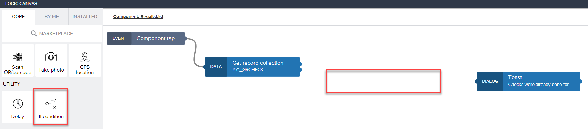
    
    b) Connect it to other blocks like shown on the screenshot below:
    
    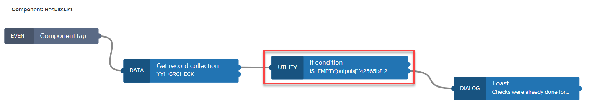
    
    c) On the *Properties* panel choose **Condition** button and select formula binding option.
    
    
    
    d) Use the following formula and then choose **Save** button.
    
    ```js
    IS_EMPTY(outputs["Get record collection"].records)
    ```

    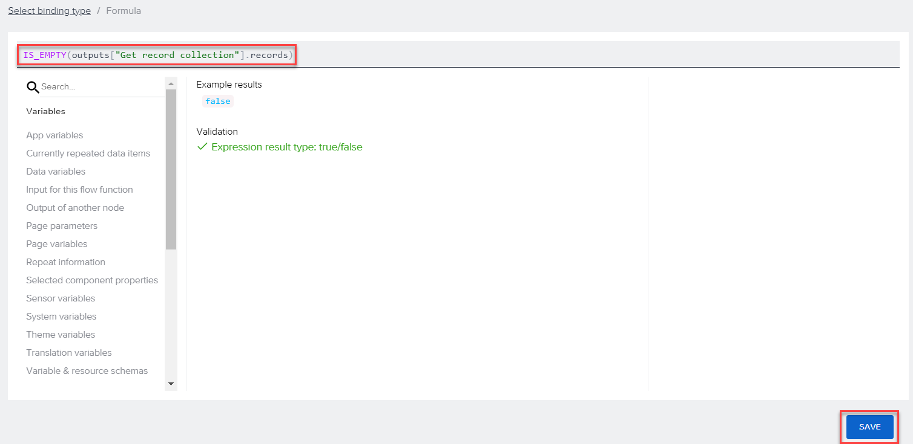

3. Add navigation

    a) Drag **Open page** logic block to the marked place in the logic builder.

    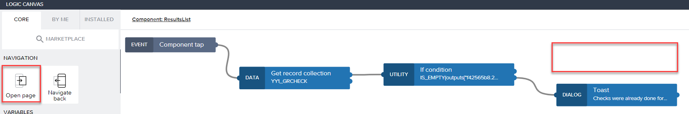
    
    b) On the *Properties* panel fill the following data:

      - Set **Checklist** to the field **Page**
      - Assign **Data item in repeat** binding option to the field **Product** and select **Material** field.
      - Assign **Data item in repeat** binding option to the field **PurchaseOrder** and select **PurchaseOrder** field.
      - Assign **Data item in repeat** binding option to the field **PurchaseOrderItem** and select **PurchaseOrderItem** field.
      - Assign **Data item in repeat** binding option to the field **PurchaseOrderItemDescription** and select **PurchaseOrderItemText** field.

    
    
    c) Connect the block to the **If condition** block like shown on the screenshot below:
    
    

4. Test the navigation

Now the navigation can be tested. If you click at any result list item you should navigate to the next page. But the page containers will be empty. We will fix it in the next step.

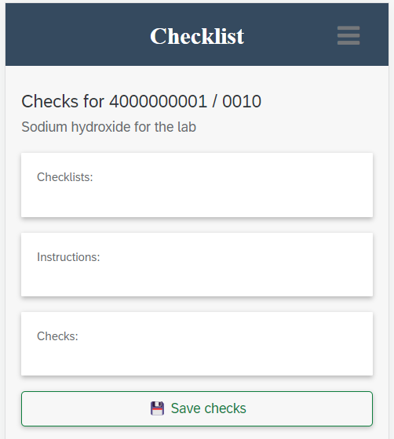


### Task 7: Add checklists page logic

1. Get all checklists

    a) Select the page switch button in the top left corner of the screen.

    

    b) Select the tile with the **Checklist** page.

    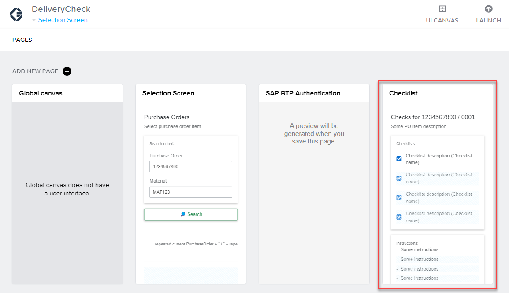

    c) Make sure that no component is selected on the screen. Only then you are able to access the page logic choosing the button **Show logic for CHECKLIST**.

    

    d) Drag **Get records collection** logic block to the marked place in the logic builder.

    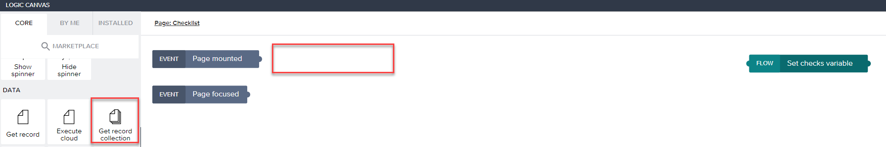
    
    e) On the *Properties* panel set the resource name to **YY1_CHECKLIST_\<YOUR_ID\>**. Set the block name to **Get all checklists** in the *Advanced* section of the *Properties* tab.

    
    
    f) Connect the logic block to the **Page mounted** event.

    

2. Get product classification data
    
    a) Drag **Get records collection** logic block to the marked place in the logic builder.
    
    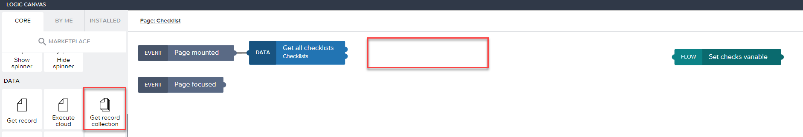
    
    b) On the *Properties* panel set the resource name to **A_ProductCharcValue**. Assign **Object with properties** binding option to the **Filter condition** field.

    
    
    c) Set the following conditions and exit choosing **Save** button.

      - Select **ClassType** in the **Property** field. Enter **001** in the **Compared value** field. 
      - Select **Product** in the **Property** field. Assign page parameter **Product** to the **Compared value** field. 
      - Select **CharcInternalID** in the **Property** field. Enter the value noted in the task 2, step 3(i) in the **Compared value** field (use **777** for the mock server scenario). 
    
    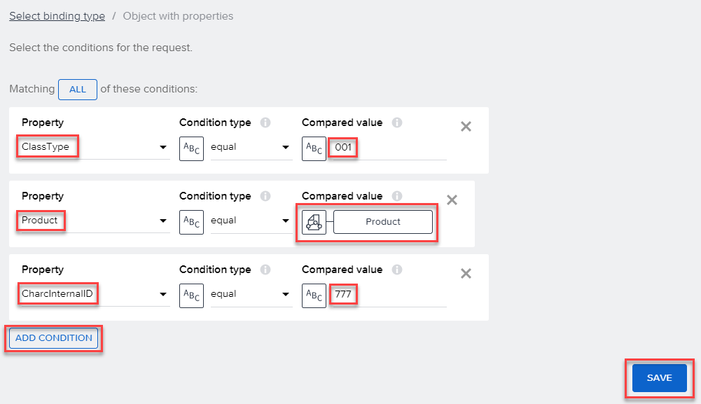
    
    d) Set the block name to **Get product classification** in the *Advanced* section of the *Properties* tab.
    
    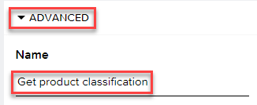
    
    e) Connect the logic block input to the top output of the **Get all checklists** node.
    
    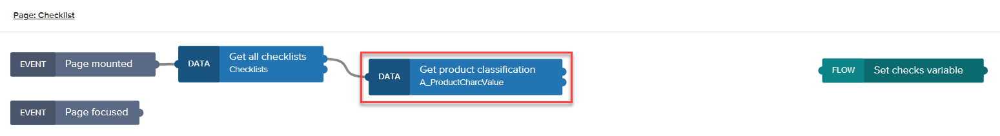

3. Match product classification to the checklists

    a) Drag **Set page variable** logic block to the marked place in the logic builder.

    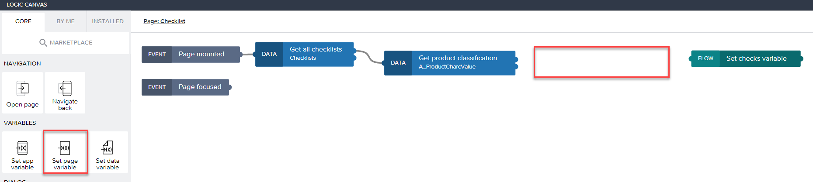
    
    b) Connect the logic block to other nodes as shown on the screenshot below.
    
    
    
    c) On the *Properties* panel set the variable name to **Checklists**. Assign **Formula** binding option to the **Assigned value** field.
    
    
    
    d) Use the following formula and then exit by choosing **Save** button.
    
    ```js
    MAP(outputs["Get all checklists"].records, { name: item.Name, default: item.IsDefault, description: item.Description, instructions: item.Instructions, checks: MAP(item.to_CHECKLIST_ITEM, item.CheckText), checked: item.IsDefault || IS_IN_ARRAY_BY_KEY(outputs["Get product classification"].records, "CharcValue", item.Name) })
    ```

    

4. Test the checklist page layout

    a) You can preview the result again. Select the search button on the first screen and then select any item in the result list. You will get the next screen with all the fields set based on your classification and checklists details.
    
    

    b) If you select **Save checks** button - nothing will happen. This logic will be added in the next step. 


### Task 8: Add save button logic 

1. Save defect data

    a) Go back to the page layout designer. Select **Save checks** button and choose **Show logic for SAVEBUTTON** button.

    
    
    b) Drag **Create record** logic block to the marked place in the logic builder.
    
    
    
    c) On the *Properties* panel set the resource name to **Defect**. Assign **Formula** binding option to the **Record** field.
    
    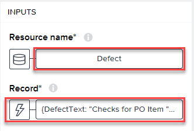
    
    d) Use the following formula and then exit by choosing **Save** button.

    ```js
    {DefectText: "Checks for PO Item " + params.PurchaseOrder + "/" + params.PurchaseOrderItem, DefectCodeGroup: "DEF-PACK", DefectCode: "0001", "_DefectDetailedDescription": [{ LongTextInternalNumber: 1, Language: "EN", DefectLongText: "Failed checks:" + REDUCE_INIT(pageVars.Checks,"",IF(NOT(item.status),accumulator+"\n- "+item.name+" ("+item.result+")",accumulator)) }] }
    ```

    
    
    e) Connect the logic block to other nodes as shown on the screenshot below.

    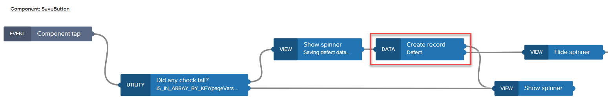

2. Save custom object data

    a) Drag **Create record** logic block to the marked place in the logic builder.

    
    
    b) On the *Properties* panel set the resource name to **YY1_GRCHECK_\<YOUR_ID\>**. Assign **Formula** binding option to the **Record** field.
    
    
    
    c) Use the following formula and then exit by choosing **Save** button.
    
    ```js
    { "PurchaseOrder": params.PurchaseOrder, "PurchaseOrderItem": params.PurchaseOrderItem, "to_GRCHECKITEM": MAP(pageVars.Checks, {"CheckName": item.name, "CheckResult": item.result, "CheckStatus": IF(item.status,"X","")}) }
    ```

    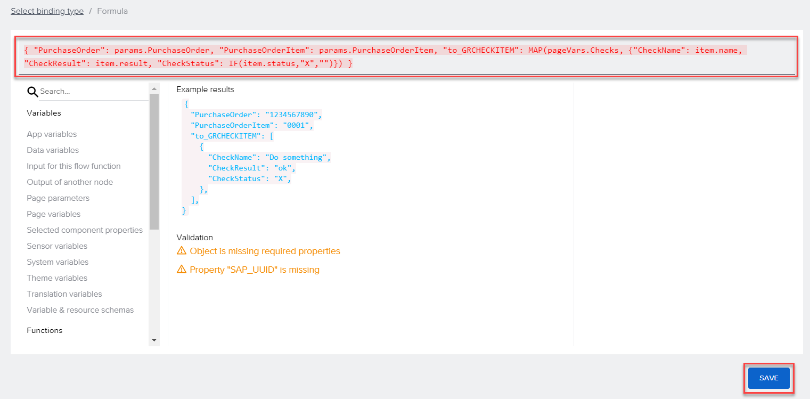
    
    d) Connect the logic block to other nodes as shown on the screenshot below.
    
    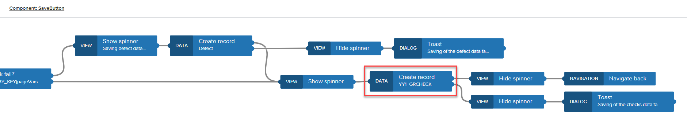


### Task 9: Test the application 

1. Test the application

    a) Now the application is ready. You can search using your own criteria. Afterwards you can select the result item and do the checks based on the checklist data. You can even assign other checklists in the app. Try to play with different components of the second screen to understand how it works. After you select **Save checks** button the corresponding data will be saved to the backend (in case of the mock server scenario there will be only a save simulation).

    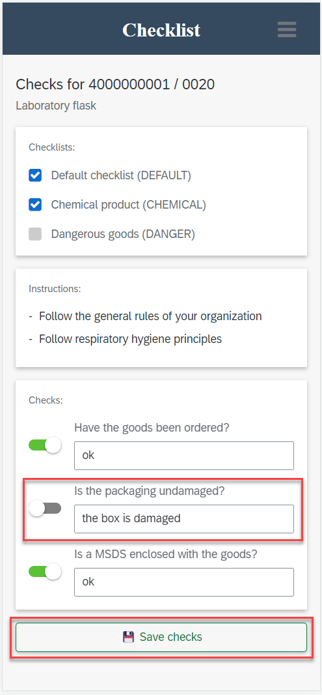

    b) If you try to select the same purchase order item again (after the successful save), you should get the following popup:

    

2. Check the save result for defect

    a) If you are connected to the real SAP System (not a mock server) you can check the save result of your application. You have to save checks for any purchase order item. Make sure that some of the checks failed, like shown on the screenshot of the step 1(a).

    b) Go to the **Process Defects** app.

    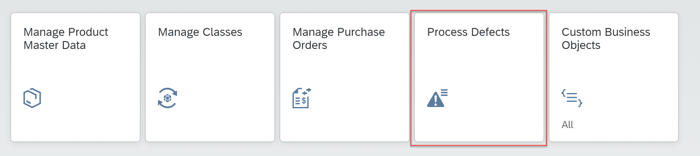

    c) Set **Today** in the **Created on** filter field. Choose **Go** button to search.

    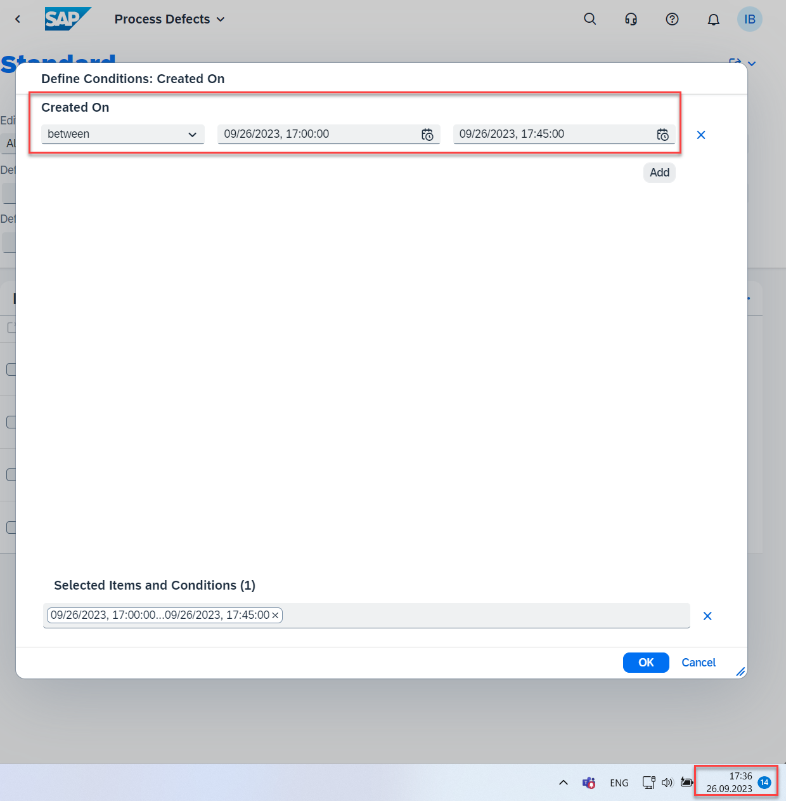

    d) Find your defect based on its description in the results list. Select the corresponding line.

    

    e) Check that the **Defect Detailed Description** field is filled only with the checks that have been failed.
    
    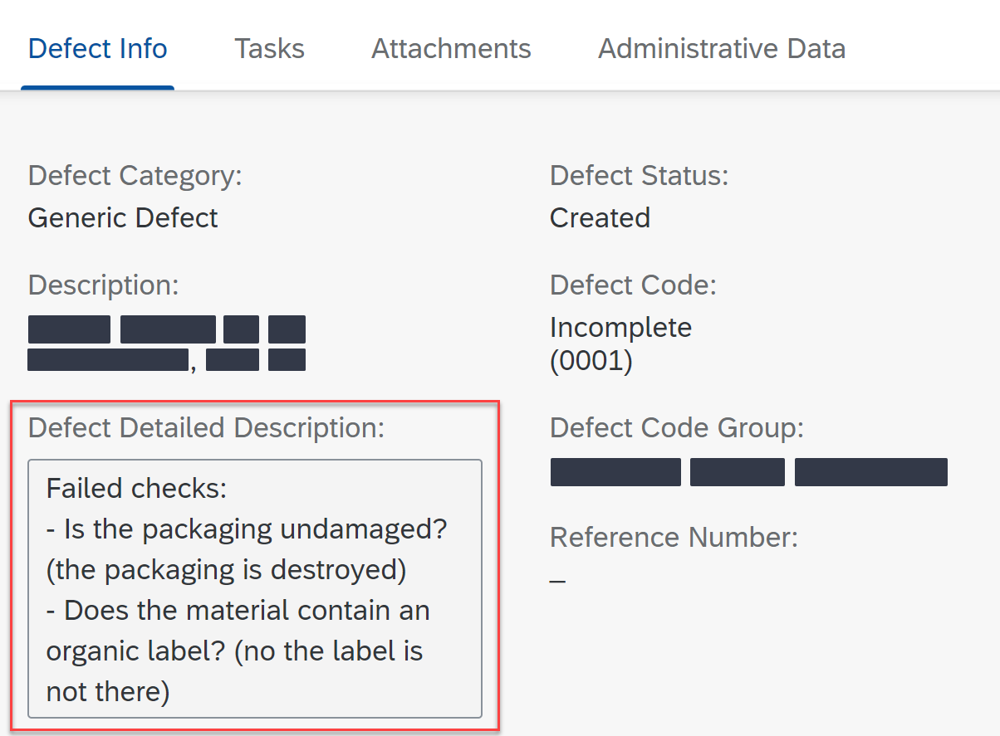   

3. Check the save result for custom object

    a) Go to the **Custom Business Objects** app.

    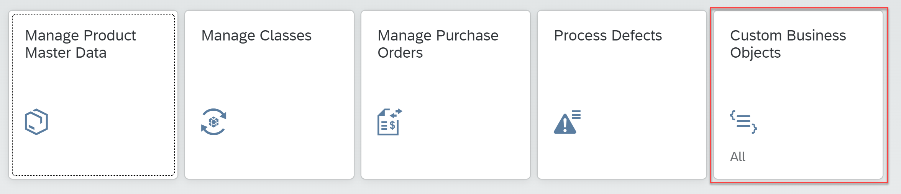

    b) Select **YY1_GRCHECK_\<YOUR_ID\>** object.

    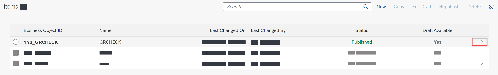

    c) Select **Go To Generated UI** button.

    

    d) Select **Go** button in the search and find your object based on **Purchase Order** and **Purchase Order Item** fields. 

    

    e) Make sure that all the checks results are available in the **GRCHECKITEMs** section.

    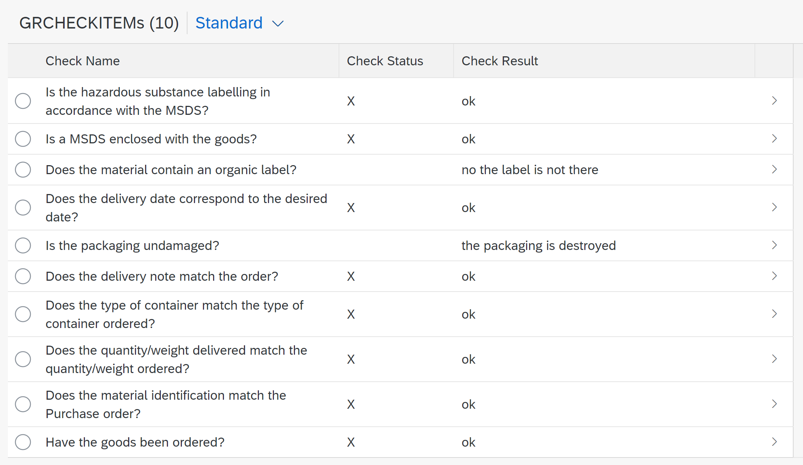

## Result
You have created and tested the frontend application with the SAP Build Apps. It is recommended that you check and examine all the components and logic blocks used in the template, because not all of them were covered with this tutorial.

## Further reading / Reference Links (recommended)
Example:
- [SAP Fiori @ SAP](https://help.sap.com/viewer/product/SAP_FIORI_OVERVIEW/LATEST/en-US)
- [SAP Fiori Foundations](https://training.sap.com/course/ux100)
