# Building a Custom Business Object for Checklist Data in SAP S/4HANA Cloud

## Usage scenario / Introduction 

To store the data of checklists used in material classification we can create another custom object. It will provide a simple UI for key users to fill-in the data of checklists like the name, description, checks information, instructions and precautions data.

## Task Flow 

In this exercise, you will perform the following tasks:

1. Create a custom business object using the **Custom Business Object** application.
2. Assign a business catalog to the custom business object.
3. Fill in the test data

## Content

### Task 1: Create the Custom Business Object 
1. Create a new custom business object
    
     a) Access the **Custom Business Objects** application.
     
     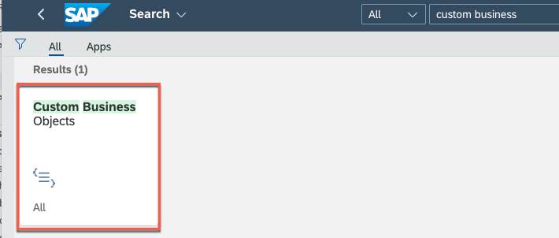

     b) Choose **New** 

     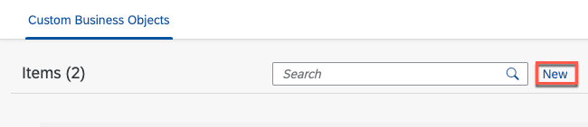

     c) Enter as name **CHECKLIST_\<YOUR_ID\>** 

     d) Choose the **Standard** scenario

     e) Press **Create**

     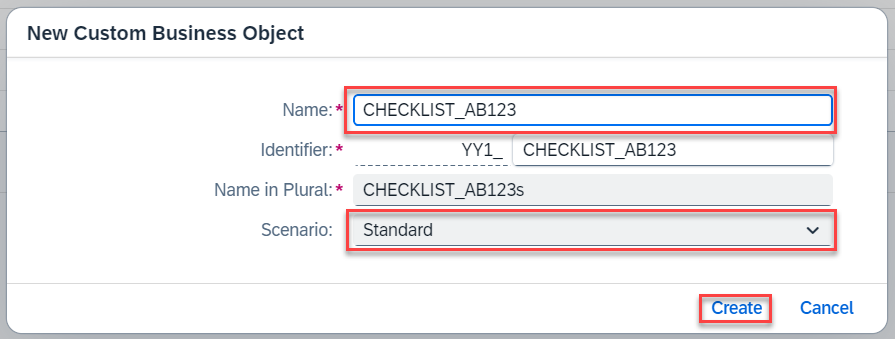

2. Create the business object nodes and fields
   
   a) Select the **General Information** tab and check the following features:
      
      * Determination and Validation
      * User Interface  
      * Back End Service
      * System Administrative Data
     
      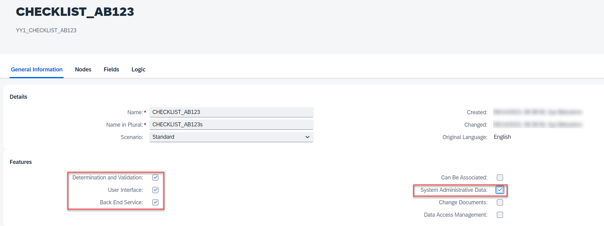
   
   b) Select the **Nodes** tab and select CHECKLIST_\<YOUR_ID\> line and choose **New** button to add a new subnode CHECKLIST_ITEM.
      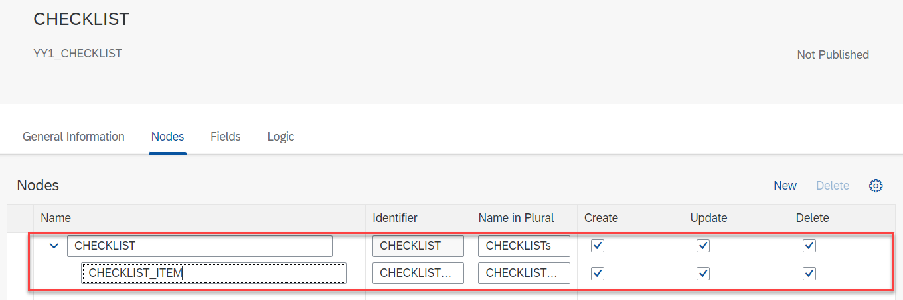

   c) At the **Fields** tab select the CHECKLIST_\<YOUR_ID\> node. In addition to the autogenerated fields, choose **New** and add the following fields :
      	
      | Label | Identifier | Type | Length | Key|
      | ----- | -----------| ---- | ------ | --- |
      | Name | Name | Text | 10 | x |
      | Is Default | IsDefault | Checkbox |  |  |
      | Description | Description | Text | 500 |  |
      | Instructions | Instructions | Text | 500 |  |

      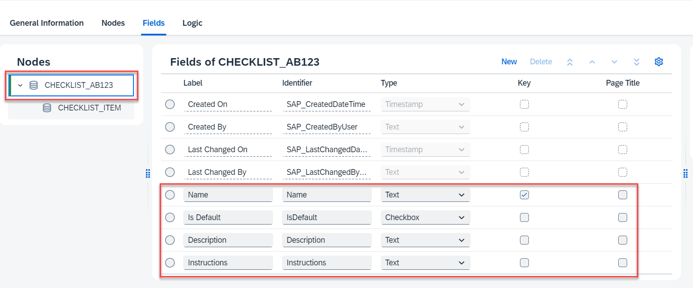
   
   d) Select the CHECKLIST_ITEM node. Choose **New** and add the following fields:

      | Label | Identifier | Type | Length |
      | ----- | -----------| ---- | ------ |
      | Check Text | CheckText | Text | 500 |

      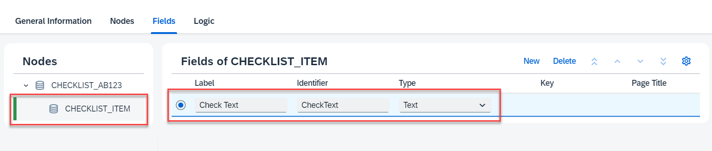

3. Publish the custom business object
   
   a) Save your configuration and select **Publish**. This process will take some time
   
    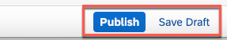

   b) When the publishing was successful you will see the green **Published** tag at the business object.

### Task 2: Assign a Business Catalog to the Business Object

To access the Checklist API in a secure manner with user propagation we need to assign a business catalog to it.
For our scenario we use the **Material Management - Purchase Order** catalog, as this is also required to access the Purchase Order API we use in a later exercise.

   
   1. Maintain catalogs
      
      a) Go back to the **Custom Business Objects** application and choose the CHECKLIST_\<YOUR_ID\> business object.
      
         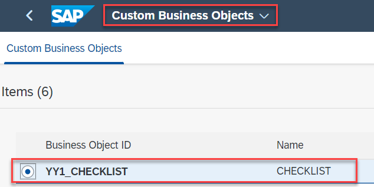

      b) In the **General Information** tab select **Maintain Catalogs**

         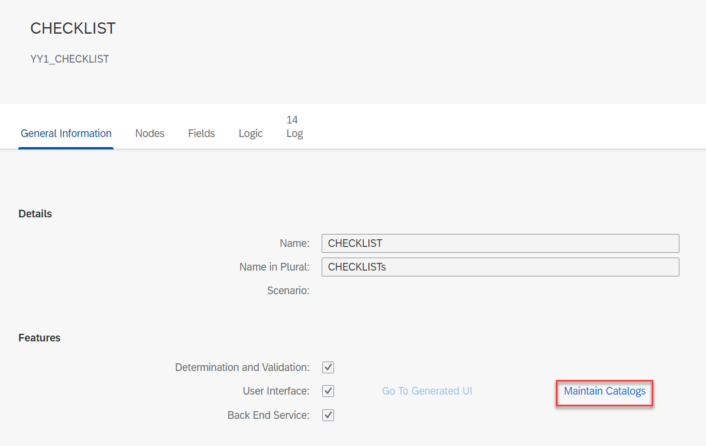

      c) The **Custom Catalog Extension** application is starting. 
      
   2. Assign Business Catalog for **YY1_CHECKLIST_\<YOUR_ID\>_SCBO**
      
      a) Select **YY1_CHECKLIST_\<YOUR_ID\>_SCBO** using the filter field **Search** at the **Custom Catalog Extension** table

         
      
      b) In the **Used in Business Catalog** window select **Add**.

         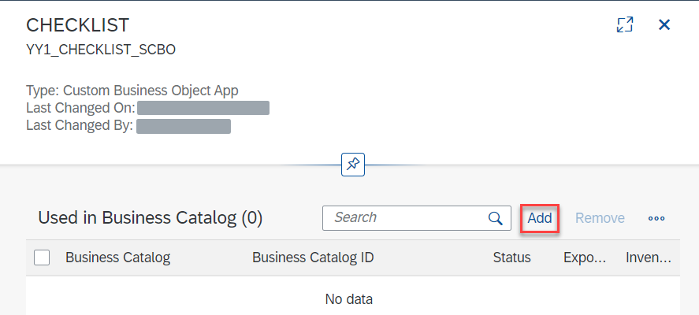

      c) In the **Add Business Catalog** popup search for **Material Management - Purchase Orders** catalog and select it. Press **OK**.

         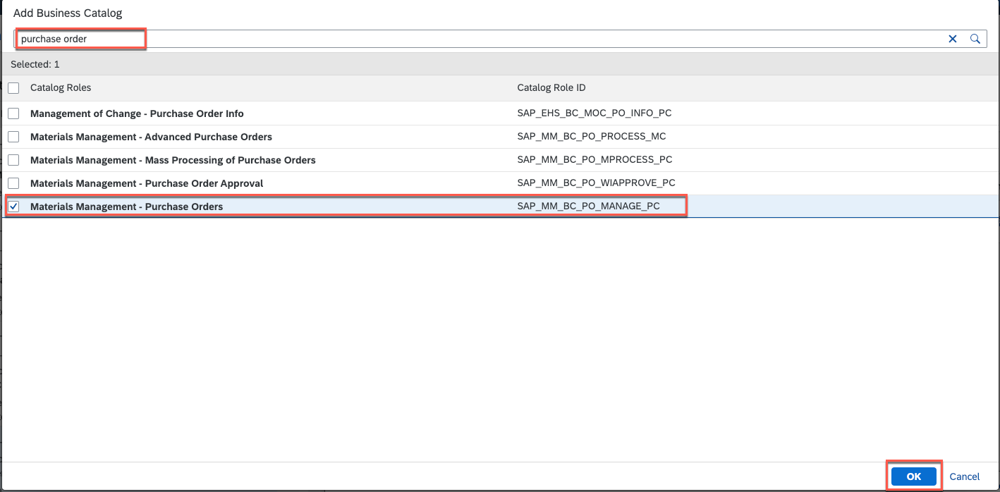
      
      d) In the **Used in Business Catalog** window select the **Material Management - Purchase Orders** catalog and press **Publish**.

         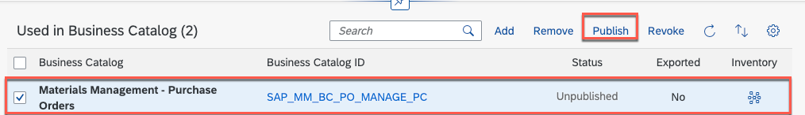

  

   3. Assign Business Catalog for **YY1_CHECKLIST_\<YOUR_ID\>_CDS_IBS**
      
      a) Select **YY1_CHECKLIST_\<YOUR_ID\>_CDS_IBS** at the **Custom Catalog Extension** table

         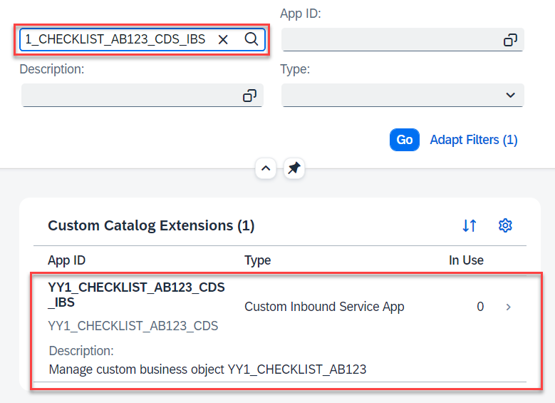
      
      b) Repeat step b) to d) from section 2.

### Task 3: Fill in the initial data

   1. Open generated UI

      a) Go back to the **Custom Business Objects** application and choose the CHECKLIST_\<YOUR_ID\> business object.
            
         

      b) In the **General Information** tab select **Go To Generated UI**
         
         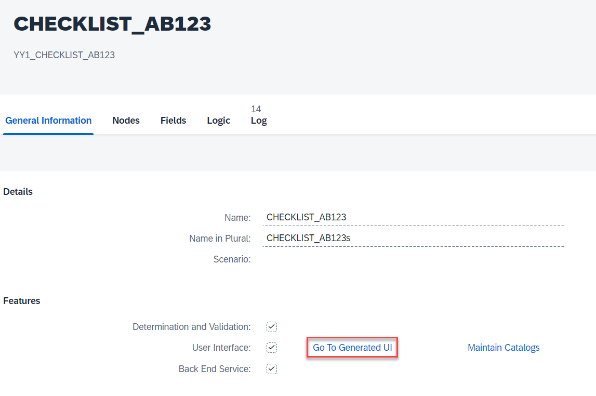

   2. Create header data

      a) At the new screen select **Create** button.
         
         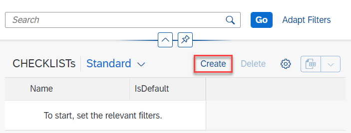

      b) Fill in the following data and then select **Create** button:

      - **Name**: *DEFAULT*
      - **Is Default**: *Checked*
      - **Description**: *Default checklist*
      - **Instructions**: *Follow the general rules of your organization*

         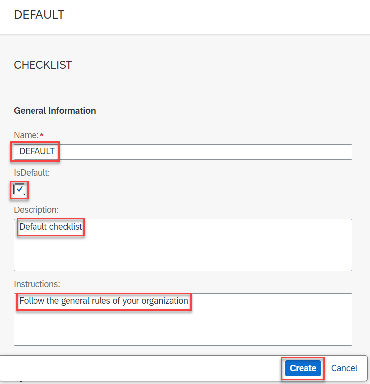

   3. Create item data

      a) Select **Create** button in the *CHECKLIST_ITEMs* section.
         
         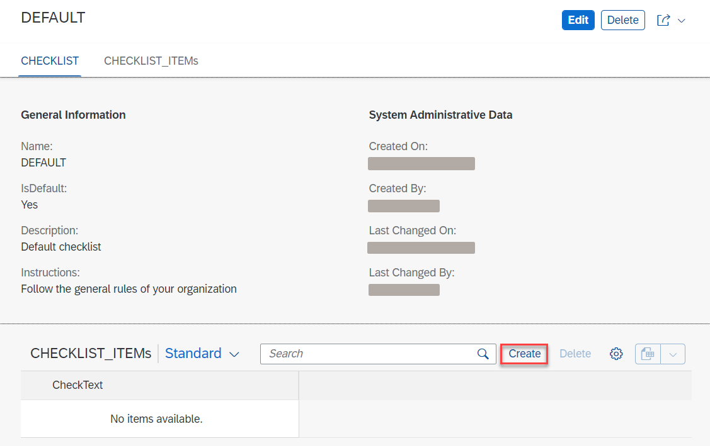

      b) Enter **Have the goods been ordered?** in the **Check Text** field and the select **Create** button.
        
         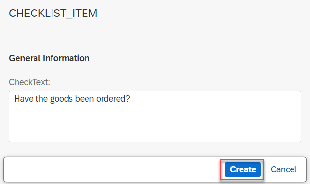

      c) Go back to the checklist by selecting it's name on the top. Then create a new item with the text **Is the packaging undamaged?**.
         
         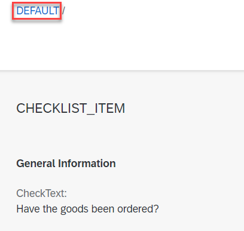

   4. Repeat the previous steps two more times for the following checklists:

      Checklist 2:
      - **Name**: *DANGER*
      - **Default**: *False*
      - **Description**: *Dangerous goods*
      - **Instructions**: *Use safety gloves*
      - **Checklist item**:
        - *Is the UN number recognizable?*

      Checklist 3:
      - **Name**: *CHEMICAL*
      - **Default**: *False*
      - **Description**: *Chemical product*
      - **Instructions**: *Follow respiratory hygiene principles*
      - **Checklist item**:
        - *Is a MSDS enclosed with the goods?*

## Result

You have created a custom business object to store the checklists data, defined a communication system so the data could be exposed and added a business catalog for secure access.

In the next exercise you will define the communication systems and communication arrangements for external access to the necessary APIs.

## Further reading / Reference Links

- [SAP Help: Custom Business Objects](https://help.sap.com/docs/SAP_S4HANA_CLOUD/0f69f8fb28ac4bf48d2b57b9637e81fa/b45696ca0d9143cba040797e9c71aa44.html?locale=en-US&version=2208.500)
