# Create Classifications and Purchase Order in SAP S/4HANA Cloud

## Usage scenario / Introduction 

In this exercise you learn how you can use classifications in SAP S/4HANA to map specific goods delivery check lists to a product category. 

## Task Flow
In this exercise, you will perform the following tasks:

1. Create a new classification object.
2. Map the classification to a product.
3. Create a new purchase order for this product.

## Prerequisites

* You have an SAP S/4HANA Cloud system.
* You must be assigned to the following roles. They are provided as example roles from SAP. You can use these as a template to create your own role.

   Business Role | Business Role ID as Delivered by SAP
   ------------- | ------------------------------------- 
   Purchaser | BR_PURCHASER
   Configuration Expert - Business Process Configuration | BR_BPC_EXPERT1
   Master Data Specialist - Product Data | BR_PRODMASTER_SPECIALIST

## Content

### Create a new classification
1. Open the **Manage Classes** application

   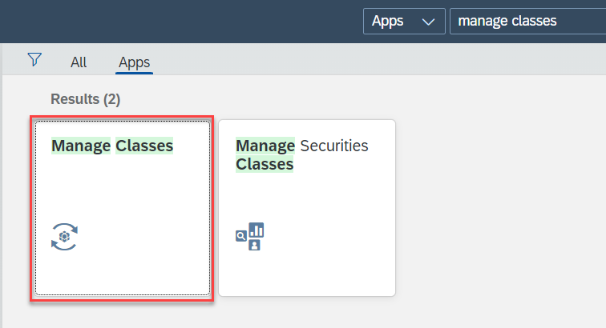
2. Create a new Class
     
    * a) In the **Class** field, enter **ZCHECKS**
      
      b) In the **Class type** field, enter **001** (Material Class)
      
      c) Choose the **Create** tile.

      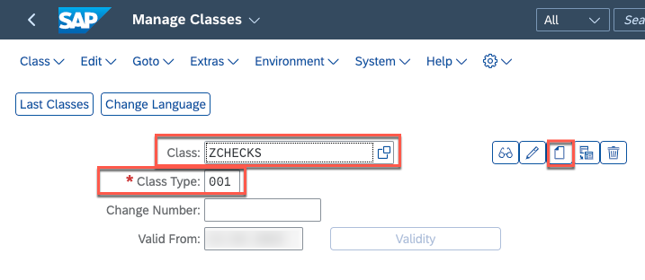

      d) Basic data section enter **Goods Delivery Checks** as description.
      
      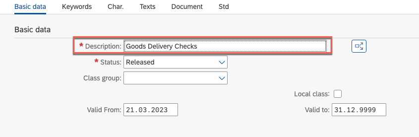 

3. Add **Characteristics**
     
     a) Go to Characteristics tab, enter **ZCHECKLIST** as the name of characteristic in the table and choose Enter. 
     
     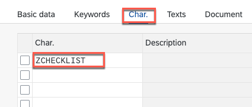

     b) In the popup confirm creation of the new characteristic with the **Yes** button:
4.  Enter the following data in the **Basic Data** tab
    
    a) In the Description field, enter **Checklist**
    
    b) In the **Data Type** field, enter **Character Format**
    
    c) In the **Number of Chars** field, enter **10**
    
    d) In the **Value Assignment** area, select **Multiple Values**

    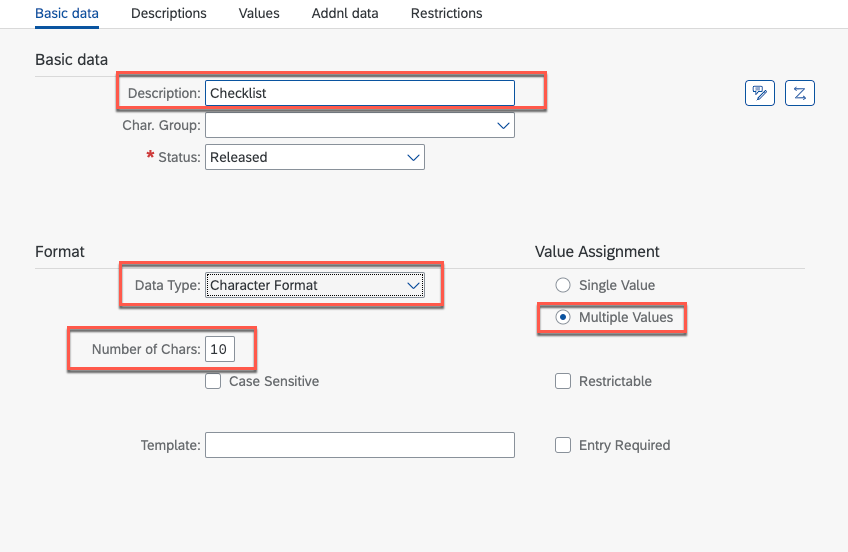
    
5. Go to **Values** tab, 
   
   a) Fill-in the following sample data:
    
    **Char. Value** |  **Description**
    --------------- | ----------------- 
    DEFAULT | Default checklist
    CHEMICAL | Chemical product
    DANGER | Dangerous goods

    b) Choose **Save**

   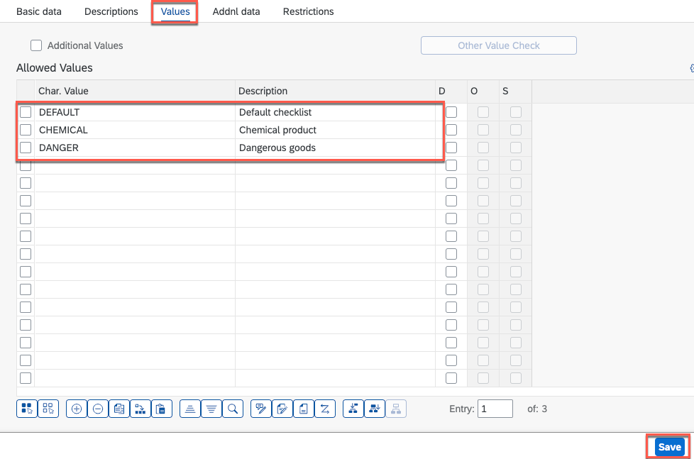

 6. Go one step back and choose **Save** for the class itself.
  
    Now you are good to proceed with the assignment of this class to any material. 

### Map the classification to a product

1. Open the **Manage Product Master Data** application.

2. Select any product enabled for purchasing. In this guide we will use standard product **RM13**. 

3. Assign the class to the product

    a) Choose the selected product to proceed.

    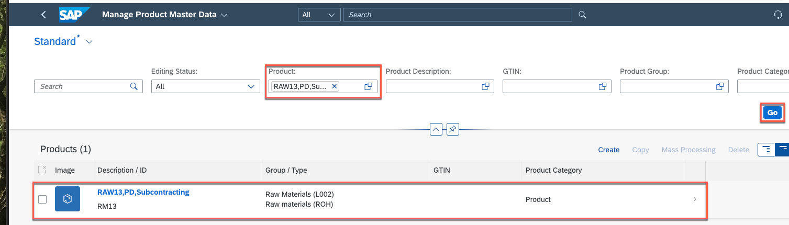

    b) Choose **Edit**  

    c) Go to the **Classification** tab.
    
    d) Select **Click here to assign a class**
     
    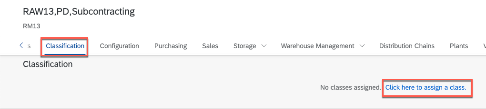

4. In the popup choose the line with the new class ZCHECKS
   
    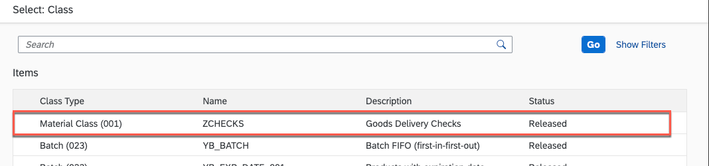

5. Now you can evaluate the product with your characteristic values. 
   
   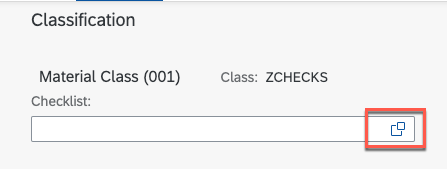

6. This product requires all the default checks + checks relevant for chemical products. Select **Default checklist** and **Chemical goods** and choose **Select**.

   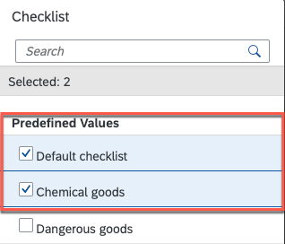

7. Choose **Save** in the product view

Now the product is evaluated with the new characteristic class and you can proceed with [creating of a new purchase order]. You can also evaluate other products in the same way and use them later in purchase orders.

## Create a purchase order

1. Open the **Manage Purchase Order** application and choose **Create**.
  
  

2. Enter the relevant data in the **General Information** section.
   
   * a) Purchasing Doc. Type
     
     b) Supplier

     c) Currency

     d) Purchasing Group

     e) Purchasing Organisation

     d) Company Code

   
     

3. Create a new purchase order Item
   
   a) Go to the **Items** section

   b) Choose **Create**

   

4. The **Purchase Order Item** application opens. In the 
   a) Select the **Material** which you have classified in task 2.
   
   b) Select a **Plant**
   
   c) Set the **Order Quantity** and **Unit**
   
   d) Set the **Net Order Price**
   
   e) Set the **Price Unit**
   
   f) In the **Delivery Address** section the field should be prefilled. You can change them to your needs.
   
   g) Select the **Apply** button.

   
5. Back in the Purchase Order application choose **Order**
   

If auto approval is set the purchase order will be created.

## Result

You have created a new classification list and mapped it to a product. With this classification you can assign specific goods delivery checks for each product category. With the creation of a purchase order you are now ready to test the **Goods Delivery Check** application.

## Further reading / Reference Links
- [Classification Reuse UI Component ](https://help.sap.com/docs/SAP_S4HANA_ON-PREMISE/f48e215134d542109811123fe95a66af/c52fb722478b4d888f0e36c11a9ad1a7.html)
- [SAP Fiori Manage Purchase Orders](https://fioriappslibrary.hana.ondemand.com/sap/fix/externalViewer/index.html#/detail/Apps('F0842A')/S25OP)
