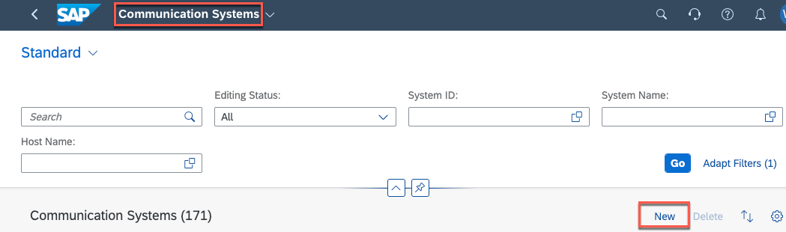
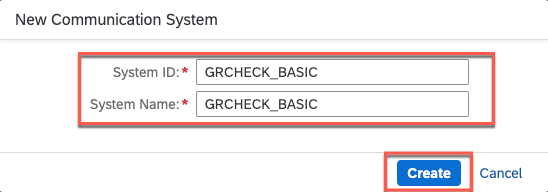
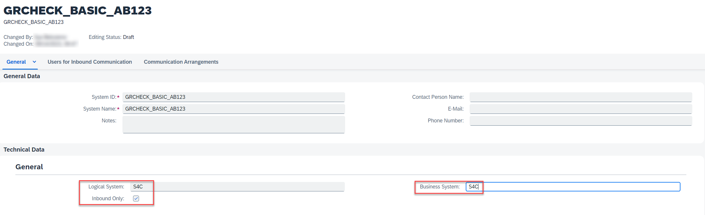
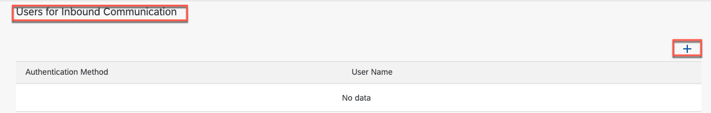
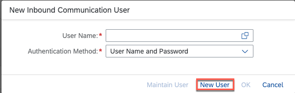
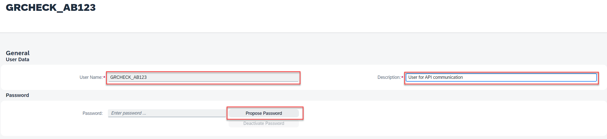
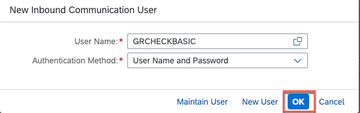
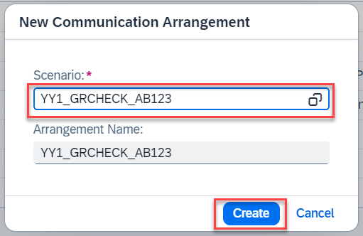
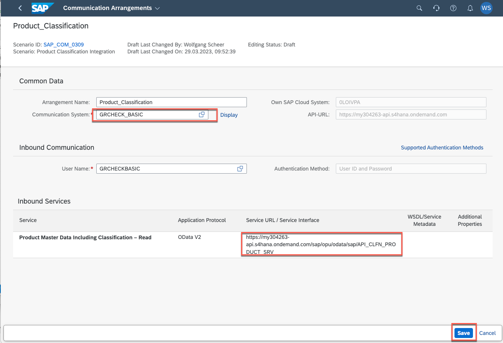

# Setting up Communication Systems and Arrangements in SAP S/4HANA Cloud

## Usage scenario / Introduction 
To allow inbound communication with the SAP S/4HANA tenant, you need to explicitly allow the API's to be accessible from external systems like SAP BTP.

## Task Flow  
In this exercise, you will perform the following tasks:

* Create a communication system and arrangement for basic authentication

## Content

### Task 1: Create a Communication System and Arrangement for Basic Authentication

1.  Create a Communication System in SAP S/4HANA Cloud
    
    a) Logon to your SAP S/4HANA Cloud System.
    
    b) Search for and open the **Communication Systems** application
   
    c) Choose **New**

     

    d) Set *GRCHECK_BASIC_\<YOUR_ID\>* as **System ID** using your ID from the previous exercise e.g. AB123

    e) Choose **Create**
    
      

2. Define the Communication System and create a Communication User
    
    a) In the Technical Data part check the **Inbound Only** box.

    a) Set a Logical System and a Business System ID. (3 character ID e.g S4H)

      
 
    c) Add a user for **Inbound Communication**  
     
     

    d) In the **New Inbound Communication User** popup select **New User**     

     
   
    e) At the **Create Communication User** pane set *GRCHECK_\<YOUR_ID\>* as the **User Name** and *User for API communication* as **Description**

    f) Propose a Password - and copy it to a secret store. You will need it in the next exercise.

      
   
   g) Choose **Create** to save the **Communication User**. In the popup choose **OK** to add it to the **Communication System**

      

   h) Save the **Communication System**

3. Create a **Communication Arrangement** for the custom business objects:
      
   a) Open the **Communication Arrangements** application and select **New**

   b) Select the **YY1_GRCHECK_\<YOUR_ID\>** scenario and add an **Arrangement Name**. Press **Create**
   
           
   
   c) In the Communication Arrangement panel select the **Communication System** that you have created in the last section. The **Communication User** is added automatically

   d) Copy both **Service URL**s. You will need them in the next exercise. Select **Save**.

      

 
## Result

You have created a communication system and an arrangement to expose the relevant data for our scenario. In the next exercise we setup the communication part on the SAP BTP side. 

## Further reading / Reference Links

- [Communication Management in SAP S/4HANA Cloud ](https://help.sap.com/docs/SAP_S4HANA_CLOUD/0f69f8fb28ac4bf48d2b57b9637e81fa/2e84a10c430645a88bdbfaaa23ac9ff7.html?locale=en-US&q=communication%20system)
