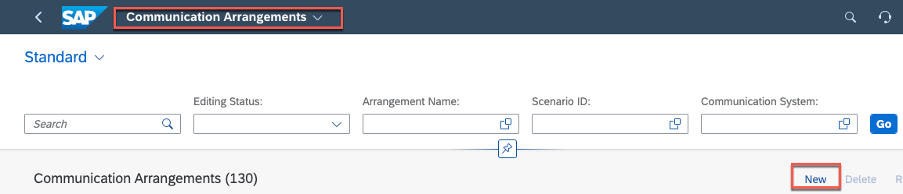
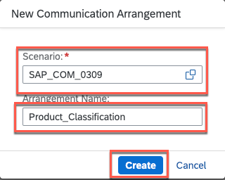

# Setting up Communication Systems and Arrangements in SAP S/4HANA Cloud

## Usage scenario / Introduction 
To allow inbound communication with the SAP S/4HANA tenant, you need to explicitly allow the API's to be accessible from external systems like SAP BTP.

## Prerequisites

* In S/4HANA Cloud your user must have the Business Catalog for Communication Management **SAP_CORE_BC_COM**
* In the SAP BTP subaccount your user needs the **Destination Administrator** role collection.

## Content

### Create a Communication System and Arrangement for Basic Authentication

For simplification reason we use basic authentication to connect to the SAP S/4HANA Cloud system. For SSO connections see [Configuring the Extension Application's Connectivity to SAP S/4HANA Cloud](https://help.sap.com/docs/btp/sap-business-technology-platform/configuring-extension-application-s-connectivity-to-sap-s-4hana-cloud)

1.  Create a Communication System in SAP S/4HANA Cloud
    
    a) Logon to your SAP S/4HANA Cloud System.
    
    b) Search for and open the **Communication Systems** application
   
    c) Choose **New**

     

    d) Set a unique **System ID** and **System Name**

    e) Choose **Create**
    
      

2. Define the Communication System and create a Communication User
    a) In the Technical Data part set a Logical System and a Business System ID.

    b) Check the **Inbound Only** box.

      
 
    c) Add a user for **Inbound Communication**  
     
     

    d) In the **New Inbound Communication User** popup select **New User**     

     
   
    e) At the **Create Communication User** pane set the **User Name** and **Description**

    f) Propose a Password - and copy it to a secrete store. You will need it in the next exercise.

      
   
   g) Choose **Create** to save the **Communication User**. In the popup choose **OK** to add it to the **Communication System**

      

   h) Save the **Communication System**

3. Create a **Communication Arrangement** for the Product Classification API
      
   a) Open the **Communication Arrangements** application and select **New**

      
   
   b) Select the **SAP_COM_0309** scenarion and add an **Arrangement Name**. Press **Create**
   
      
   
   c) In the Communication Arrangement panel select the **Communication System** that you have created in the last section. The **Communication User** is added automatically

   d) Copy the **Service URL**. You will need it in the next exercise. Select **Save**.

      

4. Repeat step 3. for the following APIs:
   
   API   | Communication Scenario
   ------ | ---------------------
   Purchase Order | SAP_COM_0053
   Defect | SAP_COM_0153 
   Custom Business Object for GR Checks | YY1_GRCHECK
   Custom Business Object for Checklists | YY1_CHECKLIST
 
## Result

You have created the communication systems to expose the relevant data for our scenario. In the next exercise we setup the communication part on the SAP BTP side. 

## Further reading / Reference Links

- [Communication Management in SAP S/4HANA Cloud ](https://help.sap.com/docs/SAP_S4HANA_CLOUD/0f69f8fb28ac4bf48d2b57b9637e81fa/2e84a10c430645a88bdbfaaa23ac9ff7.html?locale=en-US&q=communication%20system)
