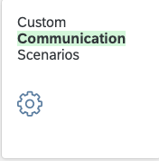
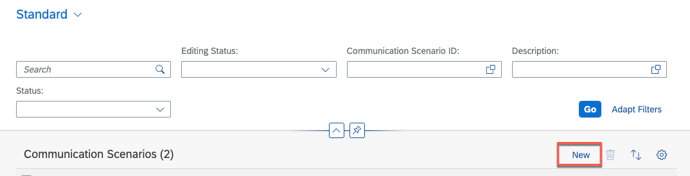
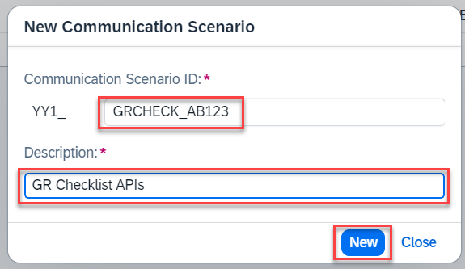
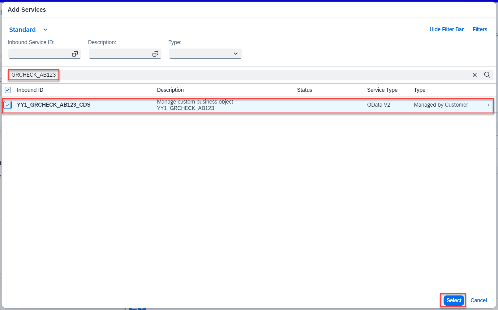
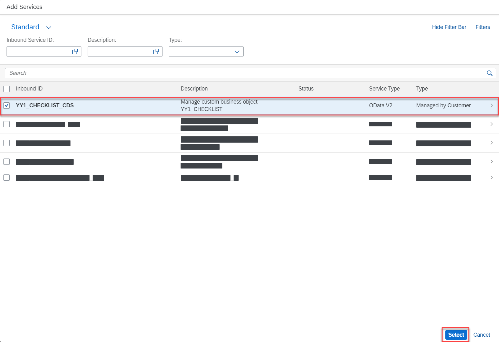
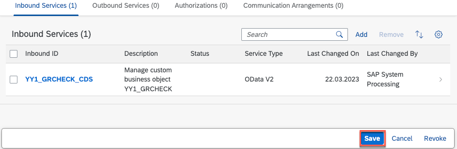
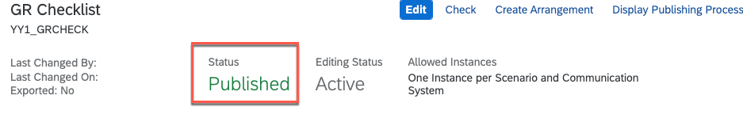

# Setting up Custom Communication Scenario in SAP S/4HANA Cloud

## Usage scenario / Introduction 

Since all the communication settings in S/4HANA Cloud are based on communication scenarios, you need to create a custom communication scenario which includes the services provided by the custom business objects.

## Task Flow  

In this exercise, you will perform the following tasks:

* Create and publish a custom communication scenario

## Content

### Task 1: Create a Custom Communication Scenario

   1. To expose the Custom Business object we have to create a custom communication scenario.
      
      a) Open the Custom Communication Scenarios application

         

      b) Select **New**

         

      c) Add the scenarion name **GRCHECK_\<YOUR_ID\>** and a description e.g. **GR Checklist APIs**. Select **New**

         

   2. Select the custom business object
     
      a) Select the Inbound Services tab and press **Add**
       
         
     
      b) Choose the **YY1_GRCHECK_\<YOUR_ID\>_CDS** (you can use filter field for that) and press **Select** 

         

      c) Repeat it with the **YY1_CHECKLIST_\<YOUR_ID\>_CDS** custom business object

         

### Task 2: Publish the Custom Communication Scenario

   1. Publish the communication scenario
      
      a) **Save** your changes and then press **Publish**

         

      b) After a while the status of the communication scenario switch to **Published**

         

> **Note**
> 
> It can be that the publishing process fails because of several simultaneous publishing actions from different users. Just repeat the publishing again afterwards in this case.

## Further reading / Reference Links

- [Communication Management in SAP S/4HANA Cloud ](https://help.sap.com/docs/SAP_S4HANA_CLOUD/0f69f8fb28ac4bf48d2b57b9637e81fa/2e84a10c430645a88bdbfaaa23ac9ff7.html?locale=en-US&q=communication%20system)
