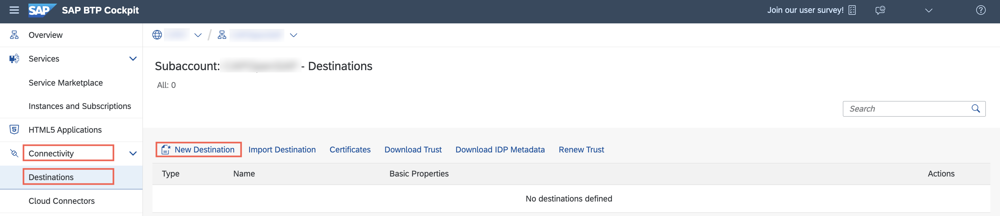
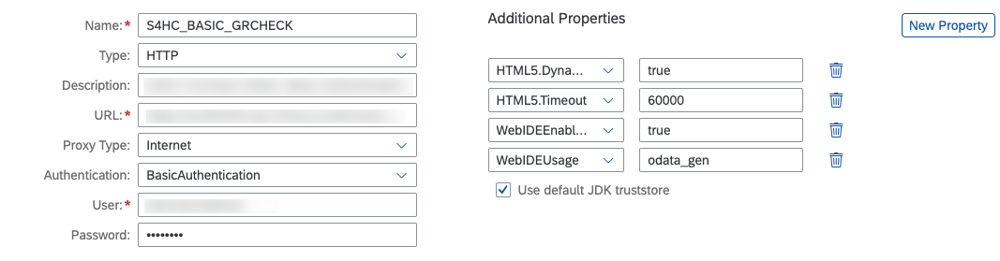

# Configuring End-to-End Communication from SAP BTP to SAP S/4HANA Cloud

## Introduction 
In this section, you wil configure the end-to-end communication between the SAP S/4HANA Cloud system and the SAP BTP subaccount so that your application running in the SAP BTP subaccount can consume an OData service running on the SAP S/4HANA system.

## Task Flow  
In this exercise, you will perform the following tasks:

1. Define a destination for API **GRCHECK_\<YOUR_ID\>**
2. Define a destination for API **CHECKLIST_\<YOUR_ID\>**

## Content

### Option 1: Create destinations for SAP S/4HANA Cloud

1. In **SAP BTP Cockpit**, navigate to your subaccount.

2. From your left-side subaccount menu, navigate to **Connectivity** &rarr; **Destinations**.

   

3. To add new destinations, you will need your SAP S/4HANA system URL. Take the first part of the API URL you copied in the previous exercise. For example use https://myXXXXX-api.s4hana.ondemand.com/ for the destinations configuration.

4. Add destination for YY1_GRCHECK_\<YOUR_ID\>
   * a) Configure Destination for SAP S/4HANA Cloud System. The user is the communication user you have created in the last exercise

        Name| Value | 
        -------- | -------- | 
        Name  | S4HC_GRCHECK_\<YOUR_ID\>  |
        Type   | HTTP  | 
        URL for SAP S/4HANA  | https://myXXXXX-api.s4hana.ondemand.com/sap/opu/odata/sap/YY1_GRCHECK_<YOUR_ID\>_CDS `<change to your URL>`| 
        Proxy Type   | Internet  | 
        Authentication  (only needed for SAP S/4HANA)   | BasicAuthentication  | 
        User   | your communication user name  | 
        Password   | your communication user password  | 

    * b) Add properties

        Properties| Value | 
        -------- | -------- | 
        HTML5.DynamicDestination   | true | 
        HTML5.Timeout | 60000 |
        WebIDEEnabled   | true | 
        WebIDEUsage   | odata_gen  | 
        Use default JDK truststore  | Check Checkmark| 

    * c) Choose **Save**

       
    

5. Add destination for YY1_CHECKLIST_\<YOUR_ID\>
   * a) Configure Destination for SAP S/4HANA Cloud System. The user is the communication user you have created in the last exercise

        Name| Value | 
        -------- | -------- | 
        Name  | S4HC_CHECKLIST_\<YOUR_ID\>  |
        Type   | HTTP  | 
        URL for SAP S/4HANA  | https://myXXXXX-api.s4hana.ondemand.com/sap/opu/odata/sap/YY1_CHECKLIST_<YOUR_ID\>_CDS `<change to your URL>`| 
        Proxy Type   | Internet  | 
        Authentication  (only needed for SAP S/4HANA)   | BasicAuthentication  | 
        User   | your communication user name  | 
        Password   | your communication user password  | 

    * b) Add properties

        Properties| Value | 
        -------- | -------- | 
        HTML5.DynamicDestination   | true | 
        HTML5.Timeout | 60000 |
        WebIDEEnabled   | true | 
        WebIDEUsage   | odata_gen  | 
        Use default JDK truststore  | Check Checkmark| 

    * c) Choose **Save**

       
    

## Result

Now you have created all the destinations, that are required to send the data across BTP and SAP S/4HANA Cloud.
