# Configuring End-to-End Communication from SAP BTP to SAP S/4HANA Cloud

## Introduction 
In this section, you wil configure the end-to-end communication between the SAP S/4HANA Cloud system and the SAP BTP subaccount so that your application running in the SAP BTP subaccount can consume an OData service running on the SAP S/4HANA system. As an alternative you can use the provided Mock Server.

## Prerequisites

* You have successfully created the [Communication Arrangements](./communication_arrangement_BYOD.md).

## Content

### Option 1: Create destinations for SAP S/4HANA Cloud

1. In **SAP BTP Cockpit**, navigate to your subaccount.

2. From your left-side subaccount menu, navigate to **Connectivity** &rarr; **Destinations**.

   

3. To add new destinations, you will need your SAP S/4HANA system URL. Take the first part of the API URL you copied in the previous exercise. For example use https://myXXXXX-api.s4hana.ondemand.com/ for the destinations configuration.

4. For SAML assertion audience setting you will need the following URL. You can find it in your SAP S/4HANA Cloud system by selecting your user icon → **Settings** → **User Account** → **Server** name.

   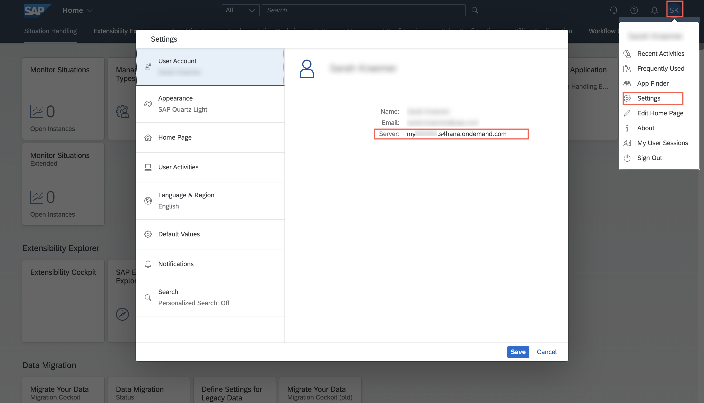

5. In this exercise you will need to connect your account to different APIs. Therefore you create four different destinations that define the outbound communication to the SAP S/4 HANA Cloud system. Choose **New Destination**

6. Add destination for API_CLFN_PRODUCT_SRV
   * a) Configure Destination for SAP S/4HANA Cloud System

        Name| Value | 
        -------- | -------- | 
        Name  | S4HC_BASIC_PCLFN  |
        Type   | HTTP  | 
        URL for SAP S/4HANA  | https://myXXXXX-api.s4hana.ondemand.com/sap/opu/odata/sap/API_CLFN_PRODUCT_SRV  `<change to your URL>`| 
        Proxy Type   | Internet  | 
        Authentication  (only needed for SAP S/4HANA)   | BasicAuthentication  | 
        User   | communication user name  | 
        Password   | communication user password  | 

    * b) Add properties

        Properties| Value | 
        -------- | -------- | 
        HTML5.DynamicDestination   | true | 
        WebIDEEnabled   | true | 
        WebIDEUsage   | odata_gen  | 
        Use default JDK truststore  | Check Checkmark| 

    * c) Choose **Save**

       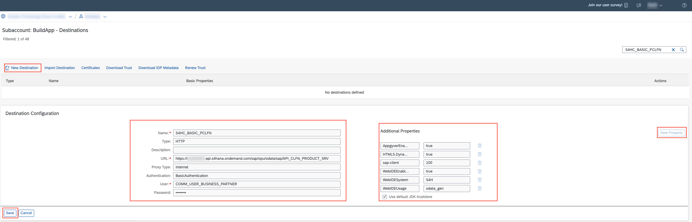
    
    > Hint: If you're testing your setup with basic authentication, repeat this step for the other APIs: Purchase Order, Defect,   Custom Business Object for GR Checks and Custom Business Object for Checklists - you can then skip the next steps of this exercise

7. Select the destination S4HC_BASIC_PCLFN you have just created  and choose clone
    
    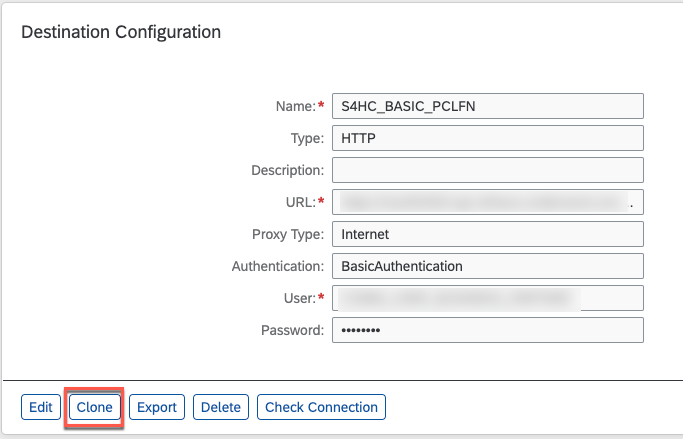
    
   

   * a) Change the name to S4HC_BASIC_DEFECT, change the URL and enter the Password, all other settings could be kept.

        Name| Value | 
        -------- | -------- | 
        Name  | S4HC_BASIC_DEFECT  |
        Type   | HTTP  | 
        URL for SAP S/4HANA | https://myXXXXX-api.s4hana.ondemand.com/sap/opu/odata4/sap/api_defect/srvd_a2x/sap/defect/0001/  `<change to your URL>` | 
        Proxy Type   | Internet  | 
        Authentication  (only needed for SAP S/4HANA)   | BasicAuthentication  | 
        User   | communication user name  | 
        Password   | communication user password  | 

    * b) Add properties

        Properties| Value | 
        -------- | -------- | 
        HTML5.DynamicDestination   | true | 
        WebIDEEnabled   | true | 
        WebIDEUsage   | odata_gen  | 
        Use default JDK truststore  | Check Checkmark| 

    * c) Choose **Save**

        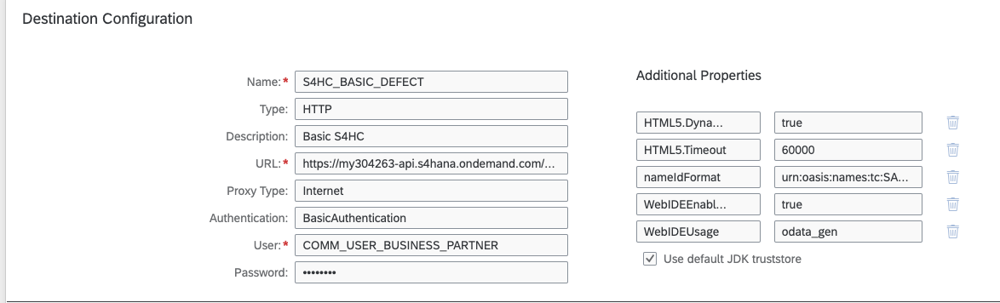

8. Create Destination for YY1_GRCHECK_CDS

   * a) Again clone the previous Destination. Change the name to S4HC_BASIC_GRCHECK, change the URL and enter the Password, all other settings could be kept.

        Name| Value | 
        -------- | -------- | 
        Name  | S4HC_BASIC_GRCHECK  |
        Type   | HTTP  | 
        URL  | https://myXXXXX-api.s4hana.ondemand.com/sap/opu/odata/sap/YY1_GRCHECK_CDS  `<change to your URL>` | 
        Proxy Type   | Internet  | 
        Authentication  (only needed for SAP S/4HANA)   | BasicAuthentication  | 
        User   | communication user name  | 
        Password   | communication user password  | 

    * b) Add properties

        Properties| Value | 
        -------- | -------- | 
        HTML5.DynamicDestination   | true | 
        WebIDEEnabled   | true | 
        WebIDEUsage   | odata_gen  | 
        Use default JDK truststore  | Check Checkmark| 

    * c) Choose **Save**
    
        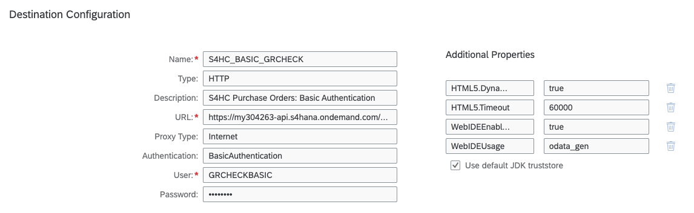

9. Create destination for Purchase Order

     * a) Again clone the previous Destination. Change the name to S4HC_BASIC_PO, change the URL and enter the Password, all other settings could be kept.

        Name| Value | 
        -------- | -------- | 
        Name  | S4HC_BASIC_PO  |
        Type   | HTTP  | 
        URL  | https://myXXXXX-api.s4hana.ondemand.com/sap/opu/odata4/sap/api_purchaseorder_2/srvd_a2x/sap/purchaseorder/0001/  `<change to your URL>`| 
        Proxy Type   | Internet  | 
        Authentication  (only needed for SAP S/4HANA)   | BasicAuthentication  | 
        User   | communication user name  | 
        Password   | communication user password  | 

     * b) Add properties

        Properties| Value | 
        -------- | -------- | 
        HTML5.DynamicDestination   | true | 
        WebIDEEnabled   | true | 
        WebIDEUsage   | odata_gen  | 
        Use default JDK truststore  | Check Checkmark| 

     * c) Choose **Save**

        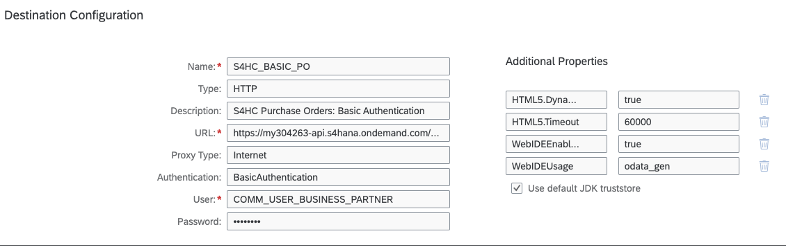

10. Configure Destination for Checklists:

    * a) Again clone the previous Destination. Change the name to S4HC_BASIC_CHECKLIST, change the URL and enter the Password, all other settings could be kept.

        Name| Value | 
        -------- | -------- | 
        Name  | S4HC_BASIC_CHECKLIST  |
        Type   | HTTP  | 
        URL  | https://myXXXXX-api.s4hana.ondemand.com/sap/opu/odata/sap/YY1_CHECKLIST_CDS  `<change to your URL>` | 
        Proxy Type   | Internet  | 
        Authentication  (only needed for SAP S/4HANA)   | BasicAuthentication  | 
        User   | communication user name  | 
        Password   | communication user password  | 

    * b) Add properties

        Properties| Value | 
        -------- | -------- | 
        HTML5.DynamicDestination   | true | 
        WebIDEEnabled   | true | 
        WebIDEUsage   | odata_gen  | 
        Use default JDK truststore  | Check Checkmark| 

    * c) Choose **Save**
    
        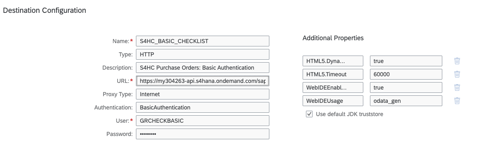

### Option 2: Create destinations for Mock Server

1. In **SAP BTP Cockpit**, navigate to your subaccount.

2. From your left-side subaccount menu, navigate to **Connectivity** &rarr; **Destinations**.

   

3. In this exercise you will need to connect your account to different APIs. Therefore you create four different destinations that define the outbound communication to the mock server. Choose **New Destination**

5. Add destination for API_CLFN_PRODUCT_SRV

   * a) Configure Destination for Mock Server 

        Name| Value | 
        -------- | -------- | 
        Name  | MOCK_PRODUCT_CLASSIFICATION  |
        Type   | HTTP  | 
        URL for Mock Server  | https://mh-prod-zone-app410-mock-srv.cfapps.eu10-004.hana.ondemand.com/product-classification | 
        Proxy Type   | Internet  | 

    * b) Add properties

        Properties| Value | 
        -------- | -------- | 
        HTML5.DynamicDestination   | true | 
        WebIDEEnabled   | true | 
        WebIDEUsage   | odata_gen  | 
        Use default JDK truststore  | Check Checkmark | 

    * c) Choose **Save**

       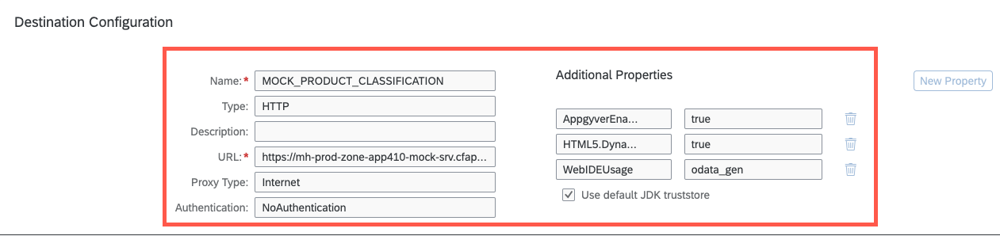

6.  Destination for Defect.

    * a) Clone the previsious destination and change name to MOCK_DEFECT and change the URL.

        Name| Value | 
        -------- | -------- | 
        Name  | MOCK_DEFECT  |
        Type   | HTTP  |  
        URL for Mock Server  | https://mh-prod-zone-app410-mock-srv.cfapps.eu10-004.hana.ondemand.com/defect | 
        Proxy Type   | Internet  | 

    * b) Add properties

        Properties| Value | 
        -------- | -------- | 
        AppgyverEnabled  | true  |
        HTML5.DynamicDestination   | true | 
        WebIDEEnabled   | true | 
        WebIDEUsage   | odata_gen  | 
        Use default JDK truststore  | Check Checkmark | 

    * c) Choose **Save**

      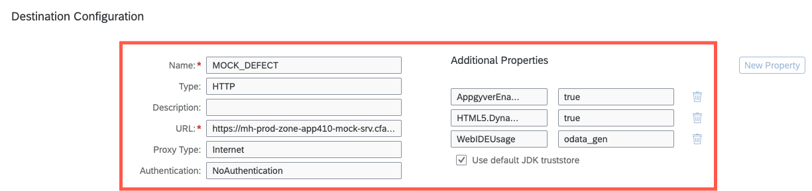

7. Destinataion for GRCHECK

    * a) Clone the previsious destination and change name to MOCK_GRCHECK and change the URL.

        Name| Value | 
        -------- | -------- | 
        Name  | MOCK_GRCHECK  |
        Type   | HTTP  | 
        URL for Mock Server  | https://mh-prod-zone-app410-mock-srv.cfapps.eu10-004.hana.ondemand.com/custom-object |
        Proxy Type   | Internet  | 

    * b) Add properties

        Properties| Value | 
        -------- | -------- | 
        HTML5.DynamicDestination   | true | 
        WebIDEEnabled   | true | 
        WebIDEUsage   | odata_gen  | 
        Use default JDK truststore  | Check Checkmark | 

    * c) Choose **Save**

       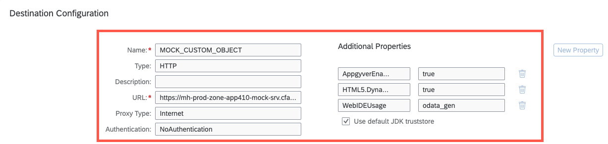
    
8. Add destination for Purchase Order

       * a) Clone the previsious destination and change name to MOCK_PURCHASE_ORDER and change the URL.

        Name| Value | 
        -------- | -------- | 
        Name  | MOCK_PURCHASE_ORDER  |
        Type   | HTTP  | 
        URL for Mock Server  | https://mh-prod-zone-app410-mock-srv.cfapps.eu10-004.hana.ondemand.com/purchase-order |
        Proxy Type   | Internet  | 

    * b) Add properties

        Properties| Value | 
        -------- | -------- | 
        HTML5.DynamicDestination   | true | 
        WebIDEEnabled   | true | 
        WebIDEUsage   | odata_gen  | 
        Use default JDK truststore  | Check Checkmark | 

    * c) Choose **Save**

       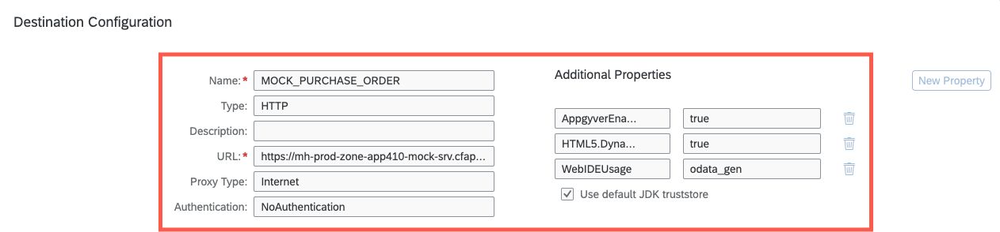

9. Add destination for checklists:

    * a) Clone the previsious destination and change name to MOCK_CHECKLIST and change the URL.

        Name| Value | 
        -------- | -------- | 
        Name  | MOCK_CHECKLIST |
        Type   | HTTP  | 
        URL for Mock Server  | https://mh-prod-zone-app410-mock-srv.cfapps.eu10-004.hana.ondemand.com/checklist |
        Proxy Type   | Internet  | 

    * b) Add properties

        Properties| Value | 
        -------- | -------- | 
        HTML5.DynamicDestination   | true | 
        WebIDEEnabled   | true | 
        WebIDEUsage   | odata_gen  | 
        Use default JDK truststore  | Check Checkmark | 

    * c) Choose **Save**

       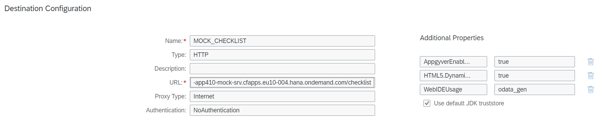

## Result

Now you have created all the destinations, that are required to send the data across BTP and SAP S/4HANA Cloud.
