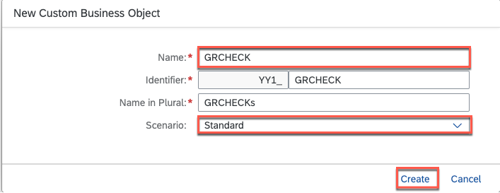
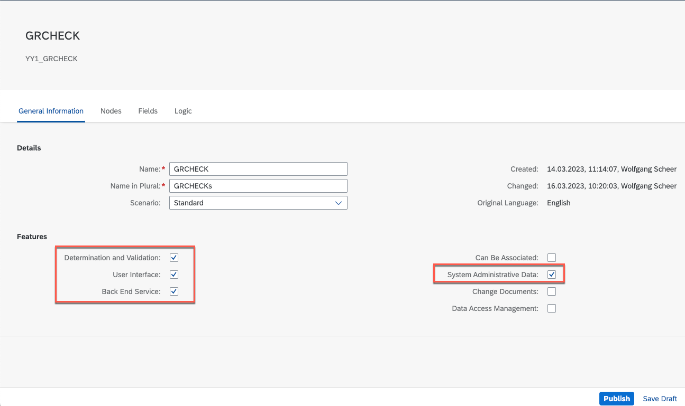
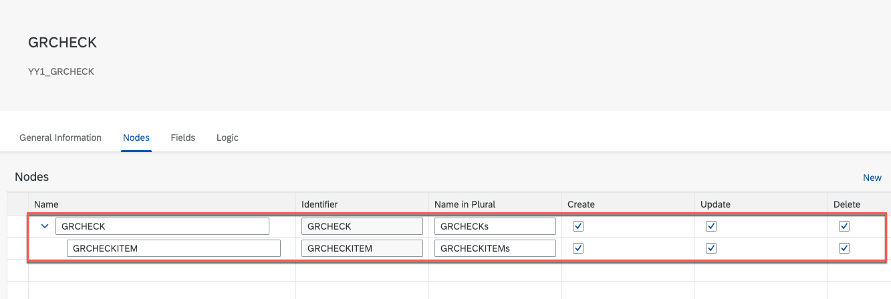
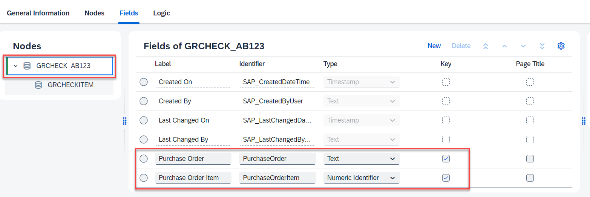
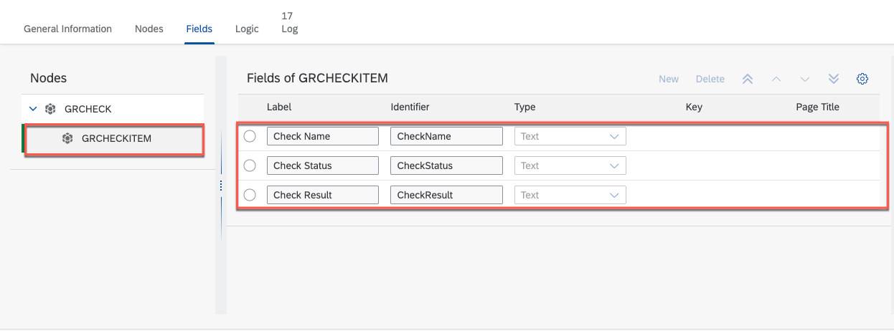
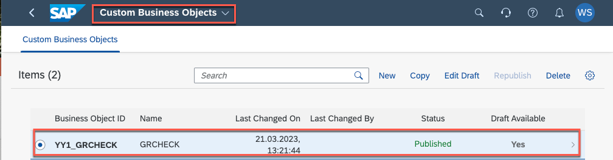
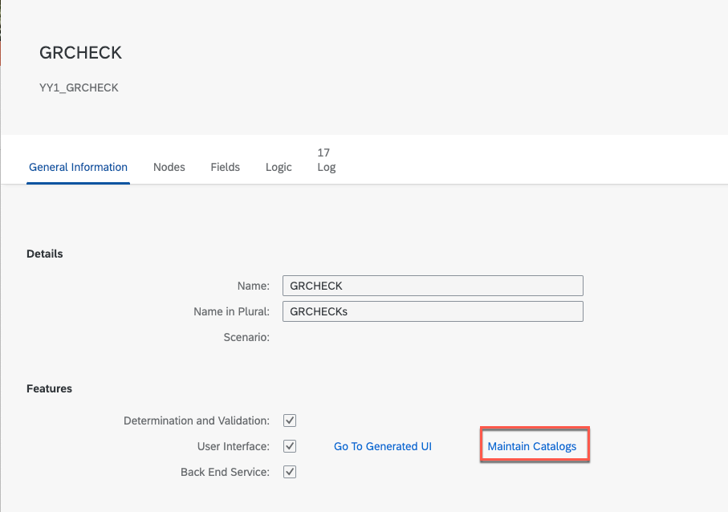
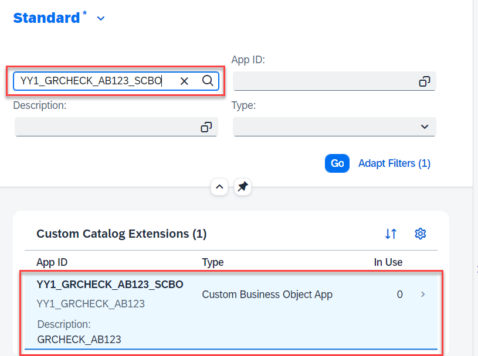
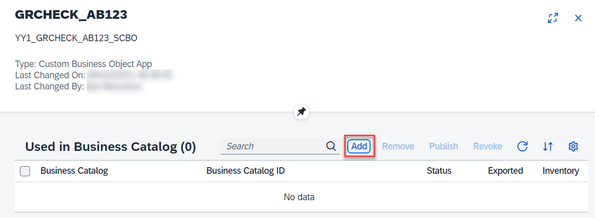
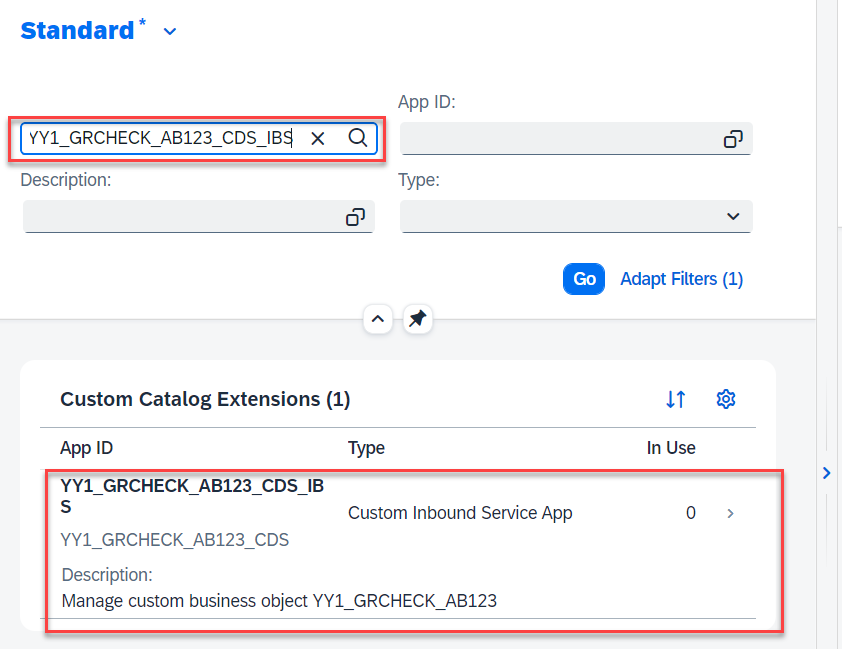

# Building a Custom Business Object for Goods Receipt Check in SAP S/4HANA Cloud

## Usage scenario / Introduction 

For further validation and to historicise the results of the goods receipt checks you can store them in your SAP S/4HANA system. A way to do this without any coding is to create a custom business object. 

## Task Flow 

In this exercise, you will perform the following tasks:

1. Create a custom business object using the **Custom Business Object** application.
2. Assign a business catalog to the custom business object.

## Prerequisites

* You have an SAP S/4HANA Cloud system.
* The Key User Extensibility (1N9) scope item must be active. You can check this in the Manage Your Solution app
under View Solution Scope. If the scope item is not active, please request the activation through BCP – Ticket Component: XX-S4C-OPRSRV.
* You must be assigned to one of the following roles. They are provided as example roles from SAP. You can use
these as a template to create your own role.

   Business Role | Business Role ID as Delivered by SAP
   ------------- | ------------------------------------- 
   Administrator | SAP_BR_ADMINISTRATOR
   Configuration Expert | SAP_BR_BPC_EXPERT
   Analytics Specialist | SAP_BR_ANALYTICS_SPECIALIST 
   

## Content

### Task 1: Create the Custom Business Object 
1. Create a new custom business object
    
     a) Access the **Custom Business Objects** application.
     
     

     b) Choose **New** 

     

     c) Set the name for the custom business object.
              
     > As the name of the business object must be unique and to distinguish the object for all participants in the workshop use the following naming convention: Add your initials plus a 3 digit number to the custom business object **GRCHECK_YOUR_ID**, for example **GRCHECK_AB123**.
      
     d) Choose the **Standard** scenario

     e) Press **Create**

     

2. Create the business object nodes and fields
   
   a) Select the **General Information** tabulator and check the following features:
      
      * Determination and Validation
      * User Interface  
      * Back End Service
      * System Administrative Data
     
      
   
   b) Select the **Nodes** tabulator and select GRCHECK_YOUR_ID line and choose **New** button to add a new subnode GRCHECKITEM.
      

   c) At the **Fields** tabulator select the GRCHECK node. In addition to the autogenerated fields, choose **New** and add the following fields :
      	
      |Label | Identifier | Type | Length | Key|
      |----- | -----------| ---- | ------ | --- |
      |Purchase Order | PurchaseOrder | Text | 10 | x |
      |Purchase Order Item | PurchaseOrderItem | Numeric Identifier | 4 | x |

      
   
   d) Select the GRCHECKITEM node. Choose **New** and add the following fields:

      |Label | Identifier | Type | Length |
      |----- | -----------| ---- | ------ |
      |Check Name | CheckName | Text | 100 |
      |Check Status | CheckStatus | Text | 1 |
      |Check Result | CheckResult | Text | 500 |

      

3. Publish the custom business object
   
   a) Save your configuration and select **Publish**. This process will take some time
   
    

   b) When the publishing was successful you will see the green **Published** tag at the business object.

### Task 2: Assign a Business Catalog to the Business Object

To access the GRCHECK API in a secure manner with user propagation we need to assign a business catalog to it.
For our scenario we use the **Material Management - Purchase Order** catalog, as this is also required to access the Purchase Order API we use in a later exercise.

   
   1. Maintain catalogs
      
      a) Go back to the **Custom Business Objects** application and choose the GRCHECK business object.
      
         

      b) In the **General Information** tabulator select **Maintain Catalogs**

         

      c) The **Custom Catalog Extension** application is starting. 
      
   2. Assign Business Catalog for **YY1_GRCHECK_YOUR_ID_SCBO**
      
      a) Select **YY1_GRCHECK_YOUR_ID_SCBO** at the **Custom Catalog Extension** table

         
      
      b) In the **Used in Business Catalog** window select **Add**.

         

      c) In the **Add Business Catalog** popup search for **Material Management - Purchase Orders** catalog and select it. Press **OK**.

         
      
      d) In the **Used in Business Catalog** window select the **Material Management - Purchase Orders** catalog and press **Publish**.

         

  

   3. Assign Business Catalog for **YY1_GRCHECK_YOUR_ID_CDS_IBS**
      
      a) Select **YY1_GRCHECK_YOUR_ID_CDS_IBS** at the **Custom Catalog Extension** table

         
      
      b) Repeat step b) to d) from section 2.

## Result

You have created a custom business object to store the results of a goods receipt check, defined a communication system so the data could be exposed and added a business catalog for secure access.

In the next exercise you will create another custom business object to store the data of checklists.

## Further reading / Reference Links

- [SAP Help: Custom Business Objects](https://help.sap.com/docs/SAP_S4HANA_CLOUD/0f69f8fb28ac4bf48d2b57b9637e81fa/b45696ca0d9143cba040797e9c71aa44.html?locale=en-US&version=2208.500)
