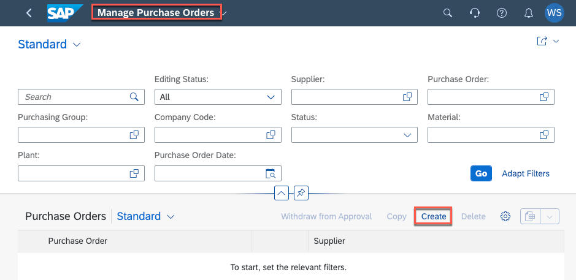
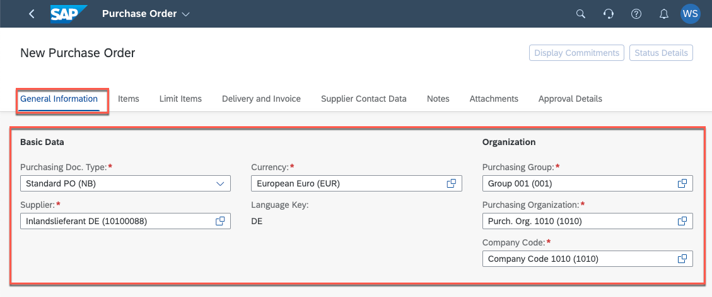
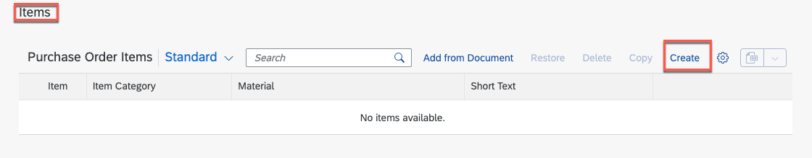
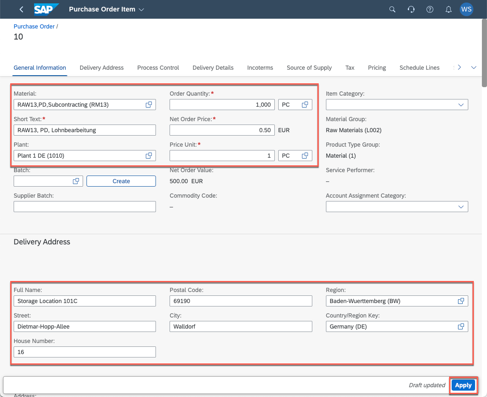
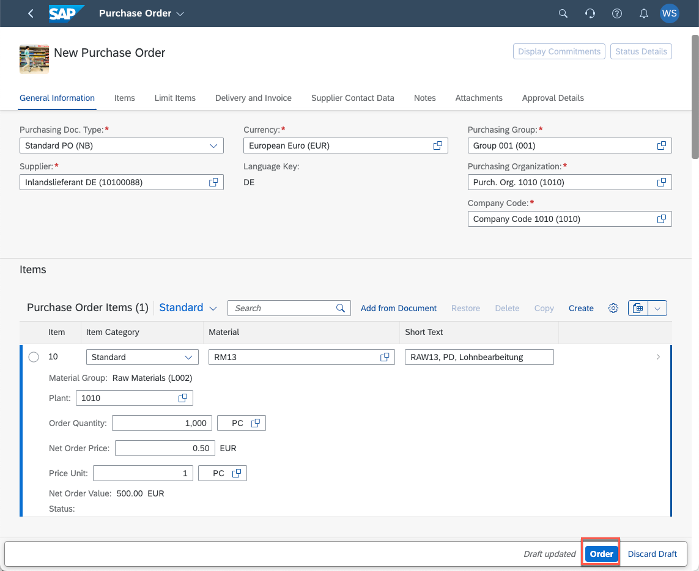

 You can also evaluate other products in the same way and use them later in purchase orders.

## Create a purchase order

1. Open the **Manage Purchase Order** application and choose **Create**.
  
  

2. Enter the relevant data in the **General Information** section. 

> TODO define the necessary values for the workshop
   
   * a) Purchasing Doc. Type
     
     b) Supplier - 

     c) Currency

     d) Purchasing Group

     e) Purchasing Organisation

     d) Company Code

   
     

3. Create a new purchase order Item
   
   a) Go to the **Items** section

   b) Choose **Create**

   

4. The **Purchase Order Item** application opens. In the 
   a) Select the **Material** which you have classified in task 2.
   
   b) Select a **Plant**
   
   c) Set the **Order Quantity** and **Unit**
   
   d) Set the **Net Order Price**
   
   e) Set the **Price Unit**
   
   f) In the **Delivery Address** section the field should be prefilled. You can change them to your needs.
   
   g) Select the **Apply** button.

   
5. Back in the Purchase Order application choose **Order**
   

If auto approval is set the purchase order will be created.

## Result

You have created a new classification list and mapped it to a product. With this classification you can assign specific goods delivery checks for each product category. With the creation of a purchase order you are now ready to test the **Goods Delivery Check** application.

## Further reading / Reference Links
- [Classification Reuse UI Component ](https://help.sap.com/docs/SAP_S4HANA_ON-PREMISE/f48e215134d542109811123fe95a66af/c52fb722478b4d888f0e36c11a9ad1a7.html)
- [SAP Fiori Manage Purchase Orders](https://fioriappslibrary.hana.ondemand.com/sap/fix/externalViewer/index.html#/detail/Apps('F0842A')/S25OP)