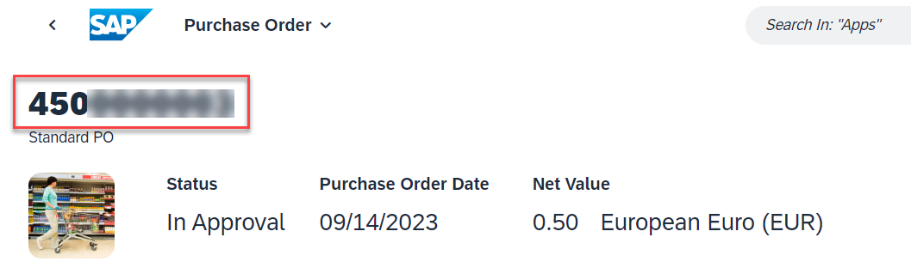

## Create a purchase order

1. Open the **Manage Purchase Order** application and choose **Create**.
  
  

2. Enter the relevant data in the **General Information** section. 

   a) **Purchasing Doc. Type**: *Standard PO (NB)*
     
   b) **Supplier**: *10300001* 

   c) **Currency**: *EUR*

   d) **Purchasing Group**: *001*

   e) **Purchasing Organisation**: *1010*

   d) **Company Code**: *1010*

   

3. Create a new purchase order Item
   
   a) Go to the **Items** section

   b) Choose **Create**

   

4. The **Purchase Order Item** application opens. In the 
   
   a) **Material**: *WORKSHOP*
   
   b) **Plant**: *1010*
   
   c) **Order Quantity**: *1 PC*
   
   d) **Net Order Price**: *0.5*
   
   e) **Price Unit**: *1 PC*
   
   f) In the **Delivery Address** section the field should be prefilled. You can change them to your needs.
   
   g) Select the **Apply** button.

   

5. Back in the Purchase Order application choose **Order**
   
   

6. If auto approval is set the purchase order will be created. Note the order number somewhere to use later in the Build Apps

   

## Result

You have created a new purchase order with the material which has checklist classification. With the creation of the purchase order you are now ready to create the **Goods Delivery Check** application.

## Further reading / Reference Links
- [Classification Reuse UI Component ](https://help.sap.com/docs/SAP_S4HANA_ON-PREMISE/f48e215134d542109811123fe95a66af/c52fb722478b4d888f0e36c11a9ad1a7.html)
- [SAP Fiori Manage Purchase Orders](https://fioriappslibrary.hana.ondemand.com/sap/fix/externalViewer/index.html#/detail/Apps('F0842A')/S25OP)
