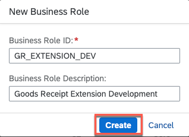
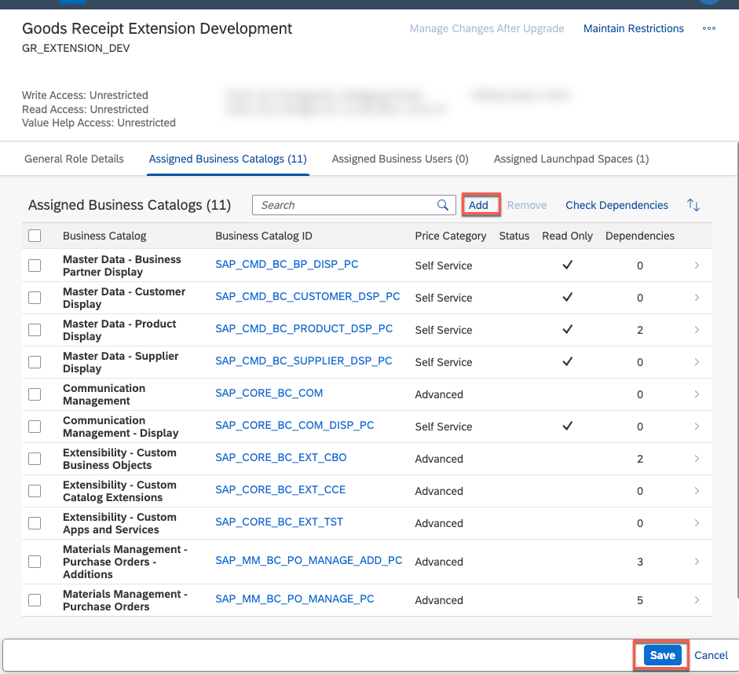
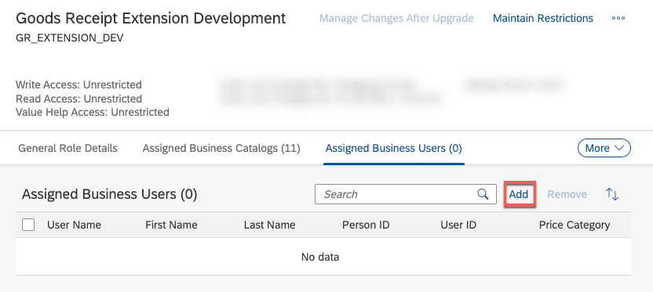

# Settings for SAP S/4HANA Cloud User

## Usage scenario / Introduction 
For running this extension scenario you have to create a specific business role and assign the users to it.
## Task Flow  

### Create a new Business Role 

1. Open the **Maintain Business Roles** application press the **NEW** button and create a new business role e.g. GR_EXTENSION_DEV
   
   

2. In the **Assigned Business Catalogs** section add the following business catalogs:
   
 

Business Catalog | Business Catalog ID
----------------- | -------------------
Communication Management | SAP_CORE_BC_COM
Communication Management - Display | SAP_CORE_BC_COM_DISP_PC	
Extensibility - Custom Business Objects | SAP_CORE_BC_EXT_CBO	
Extensibility - Custom Catalog Extensions | SAP_CORE_BC_EXT_CCE	
Extensibility - Custom Apps and Services | SAP_CORE_BC_EXT_TST	
Materials Management - Purchase Orders - Additions |SAP_MM_BC_PO_MANAGE_ADD_PC	
Materials Management - Purchase Orders | SAP_MM_BC_PO_MANAGE_PC	
Master Data - Business Partner Display | SAP_CMD_BC_BP_DISP_PC	
Master Data - Customer Display | SAP_CMD_BC_CUSTOMER_DSP_PC
Master Data - Product Display | SAP_CMD_BC_PRODUCT_DSP_PC
Master Data - Supplier Display | SAP_CMD_BC_SUPPLIER_DSP_PC |

  

3. In the **Assigned Business Users** add the users for this exercise.

  

4. Save your settings