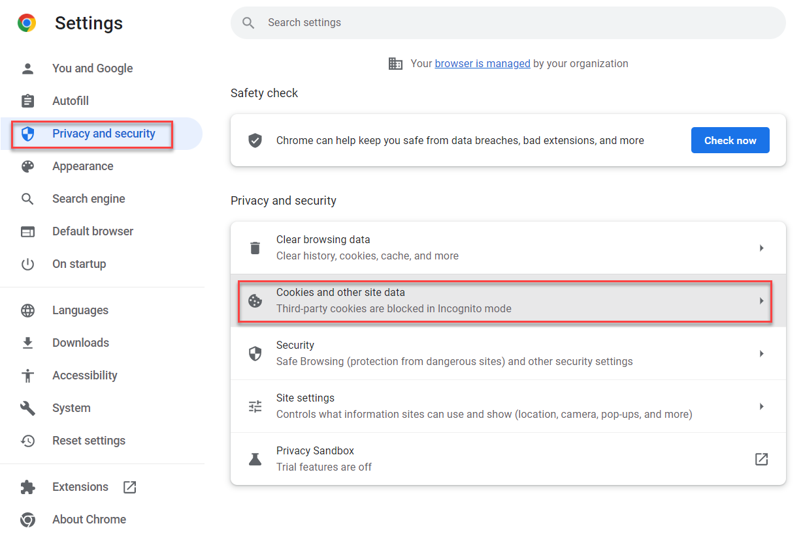
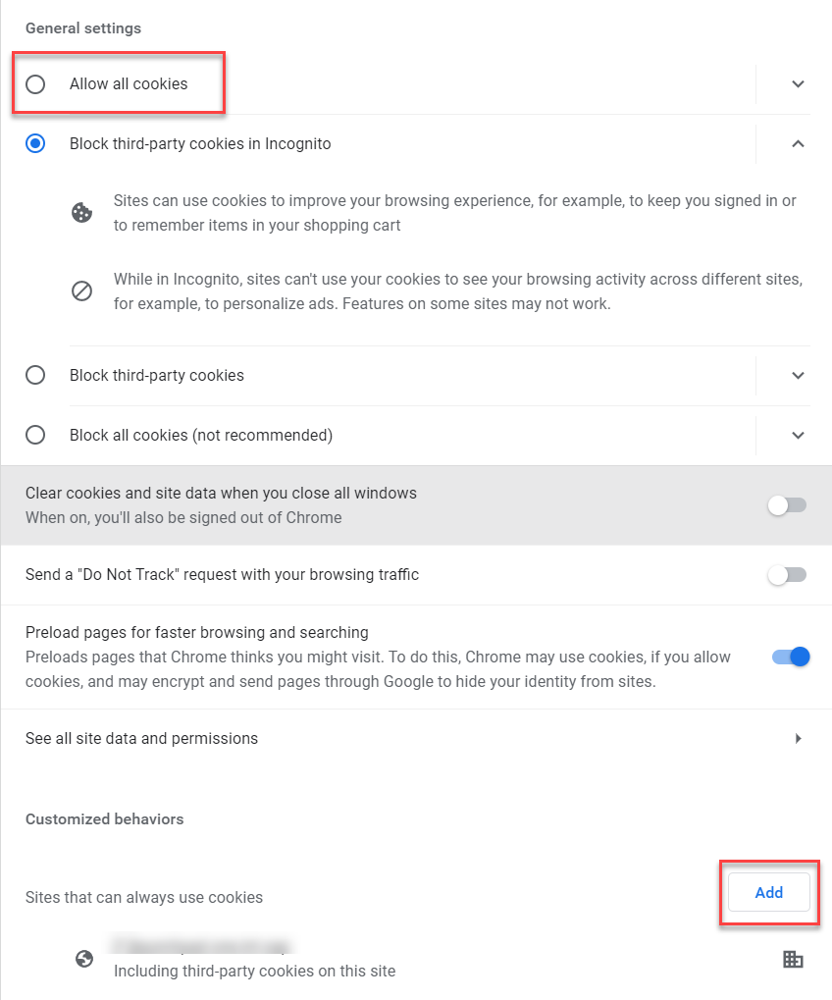
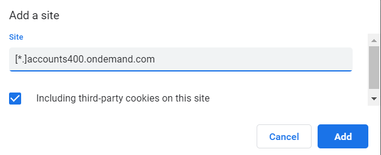

# Known Issues

## Logon problems

If you are stuck with logon even though you are sure that the credentials are correct (for example, getting the "Your Domain is not trusted" message) then your probably doesn't allow third-party cookies during the SAML process triggered on logon. Try to enable the cookies. This is an example for Chrome:

  1. Go to the browser settings and select **Privacy and security** section. Select **Cookies and other site data** afterwards.

  

  2. Select **Allow all cookies**. If you don't want (or you are not allowed) to do it, you can make more precise settings. Select **Add** in the **Customized behaviors** section.

  

  3. Add the following sites (do not forget to select **Including third-party cookies on this site** option):
   
    - [*.]accounts400.ondemand.com
    - [*.]accounts.ondemand.com
    - [*.]lab.s4hana.cloud.sap

  

## Buttons or links in S/4HANA are not enabled

Sometimes a button or a link which you are supposed to click are not enabled. For example, if you have added catalogs for your custom objects you can go to the generated UI afterwards. But the link is not clickable sometimes. It happens because of the caching in the browser. To solve the issue close the browser and then logon again. The button/link should be accessible afterwards.