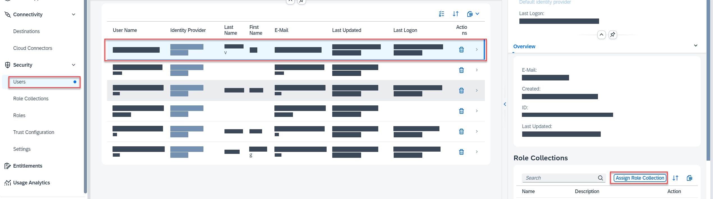
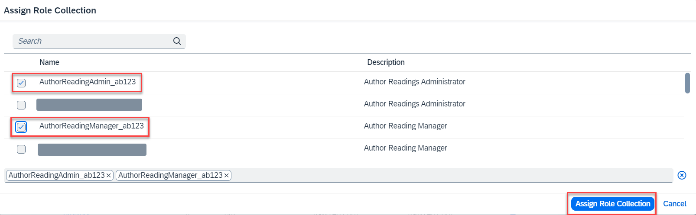

# Manage authorization

## Introduction 

In this section, you will assign the roles needed for the application access to your user in SAP BTP.

## Prerequisites

The [deploy](./deploy.md) exercise should be successfully finished.

## Content

The role collections defined in *xs-security.json* file are available in SAP BTP subaccount after the application deployment. To access the application you have to assign them to your user.

1. In **SAP BTP Cockpit**, navigate to your subaccount.

2. From your left-side subaccount menu, navigate to **Security** &rarr; **Users**.

3. Find your user in the list and select it.

4. Select **Assign Role Collection** button in the right part of the screen.

 

5. Select both role collections with {YOUR_ID} (you can use search for it). Choose **Assign Role Collection** afterwards.

> Two roles collections are created to present the flexibility of [authorization concept](https://github.com/SAP-samples/sme-partner-reference-application/blob/main/Tutorials/02-Develop-Core-Application.md#add-authentication-and-role-based-authorization) in the CAP application. But as it is not the focus of the workshop it is better to have both options assigned to your user.

## Result

You have all the necessary roles assigned to your user. Your application is fully accessible now.

[Next Tutorial: Explore the features of the application](./explore.md)

## Further reading / Reference Links

- [Roles and Role Collections](https://help.sap.com/docs/btp/sap-business-technology-platform/roles-and-role-collections?version=Cloud)
