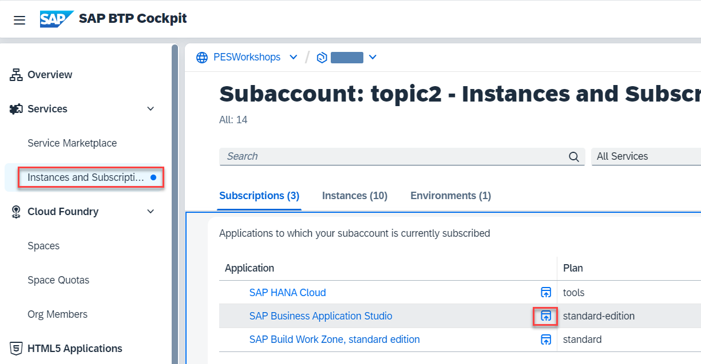
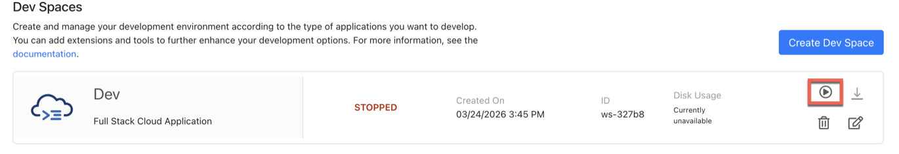
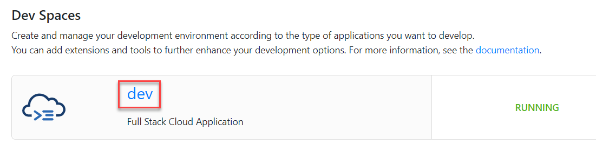
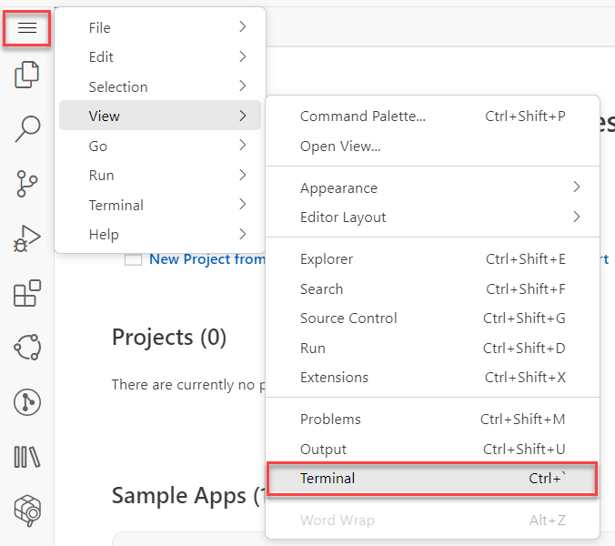
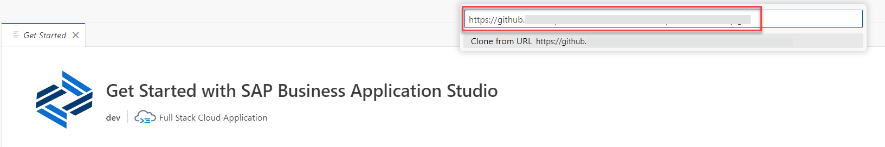
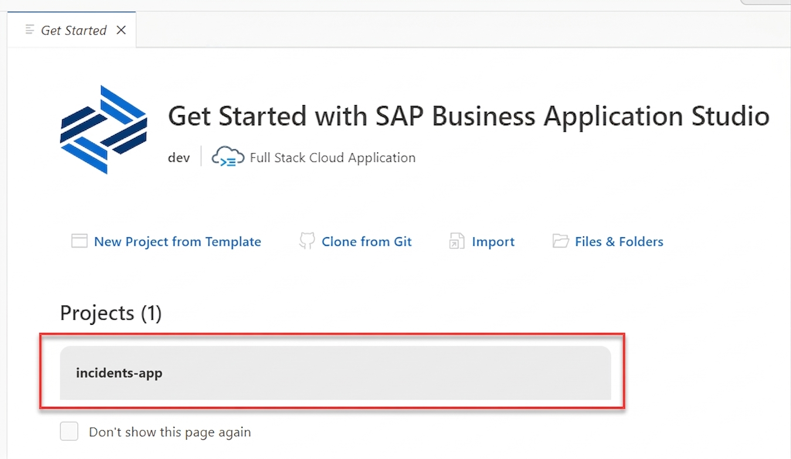
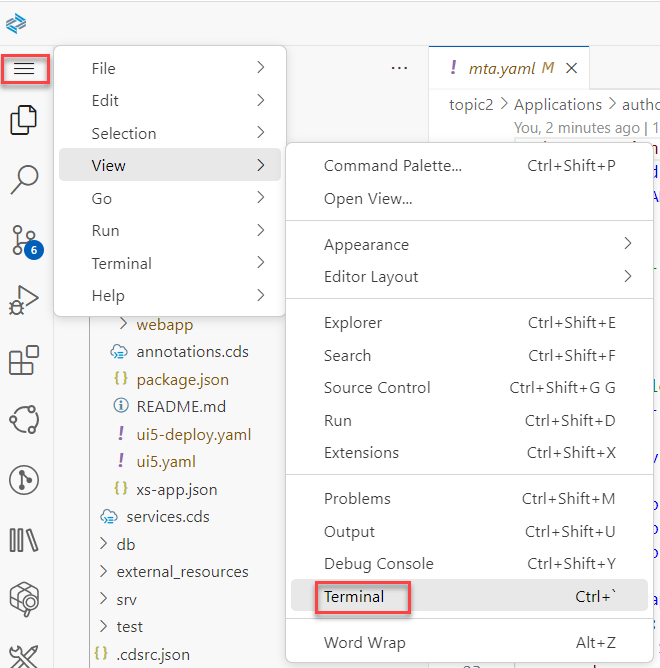
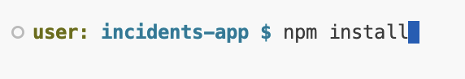

# Codebase Preparation

## Introduction 

In this section, you will prepare a workspace in SAP Business Application Studio and clone the workshop repository there. Then you will prepare the code to be deployed.

## Task Flow  

In this exercise, you will perform the following tasks:

1. Open development space
2. Clone repository
3. Prepare the codebase

## Content

### Task 1: Create development space

1. In **[SAP BTP Cockpit](https://emea.cockpit.btp.cloud.sap/cockpit/?idp=pesworkshops.accounts.ondemand.com#/globalaccount/a9030b2a-ed51-438e-9166-241ce6c0291d/subaccount/7fa8a0c6-7202-4fc9-91cd-79b6a52b9acc/subaccountoverview)**, navigate to your subaccount.

2. From your left-side subaccount menu, navigate to **Services** &rarr; **Instances and Subscriptions**.

3. Select **Go To Application** button for **SAP Business Application Studio**.

   

4. Select **Run** button to start the dev space.

   


> It may take several minutes. Please be patient.

6. After the space status has been changed to **RUNNING** select the space name to navigate into.
 
   

### Task 2: Clone repository

1. On the initial screen choose the "burger" button and then select *View* &rarr; *Terminal* option in the popup menu.

   

2. Switch to the projects folder with the following command:

~~~cli
cd projects
~~~

3. Clone the repository with the following command:

  ```url
  git clone https://github.com/sap-samples/incidents-app
  ```

   

4. After the cloning has been finished you will see a new project **incident-management** in the **Get Started** window. Just select it to open.

   

### Task 3: Prepare the codebase

1. Select the "burger" button to call the main menu and select *View* &rarr; *Terminal* option.

   


2. In the terminal install the packages with the command:

  ```cli
  npm install
  ```

  

## Result

You have now the codebase Setup in the Business Application Studio.

[Next Tutorial: Understand the application structure](../../cap-app-with-agent/document/understand-application.md)

