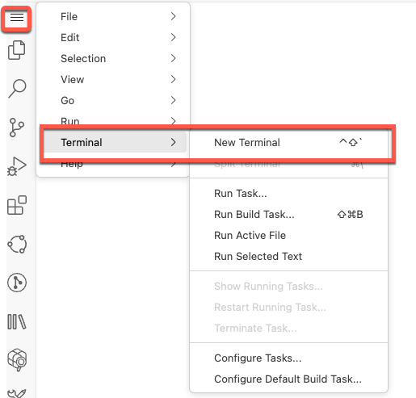
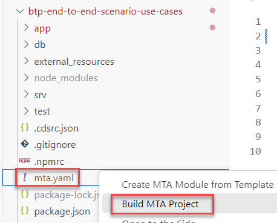
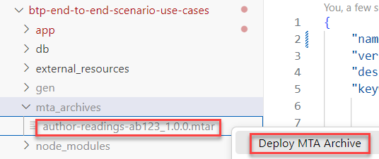

# Deploy

## Introduction 

In this exercise, you will deploy the application in Cloud Foundry space.

## Content

### Login to the SAP BTP Account

1. Open a terminal. In the menu select *Terminal* &rarr; *New Terminal*.

  

2. Set the the link to the Cloud Foundry environment
 
  ```bash
     cf api https://api.cf.eu10-004.hana.ondemand.com    
  ```
  Result:
  
  ```
    Setting API endpoint to https://api.cf.eu10-004.hana.ondemand.com...
    OK

    API endpoint:   https://api.cf.eu10-004.hana.ondemand.com
    API version:    3.149.0

    Not logged in. Use 'cf login' or 'cf login --sso' to log in.
  ```
  
  

3. Log in with your email user with the origin to the workshop IAS and enter your password:

  ```
    cf login -u <your user> --origin pesworkshops-platform
  ```
  You should get an Authentication OK message.


### Build and Deploy
1. Go to File Explorer and call the popup menu for file **mta.yaml** in the application folder. Select **Build MTA Project** option.

> It may take several minutes. Please be patient.

   

2. After the build is done you will have an mtar-archive in the **mta_archives** folder. Call the popup menu for the file **author-readings-{YOUR_ID}_1.0.0.mtar** and select **Deploy MTA Archive** option.

   


> It may take several minutes. But you shouldn't wait until it's done and proceed to the following exercise.

5. The deployment is finished when you get a similar message:

~~~log
Application "author-readings-srv-{your id}" started and available at "{subaccount}-dev-author-readings-srv-ab123.cfapps.eu10-004.hana.ondemand.com"
~~~

## Result

The application has been deployed. You can now check the applications and services created for the app in the Cloud Foundry space.

[Next Tutorial: Scenario implementation overview](./overview.md)

