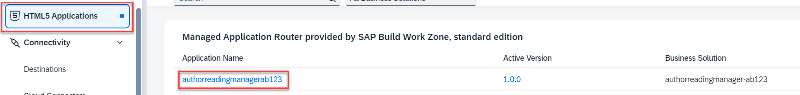
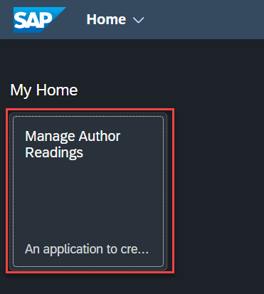
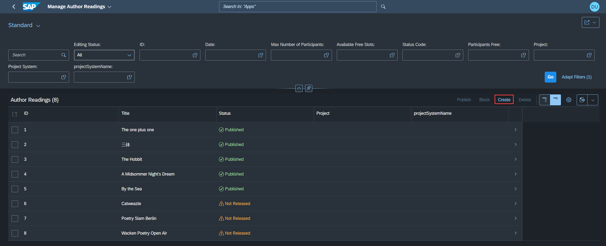
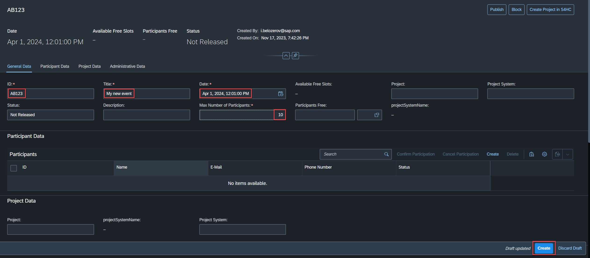
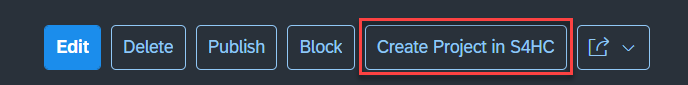
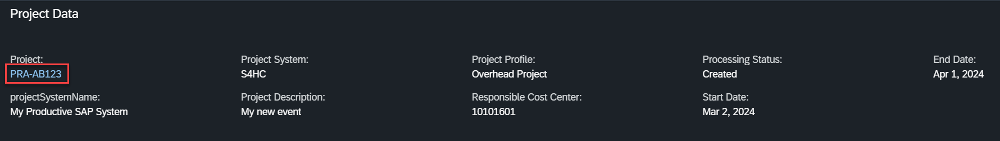
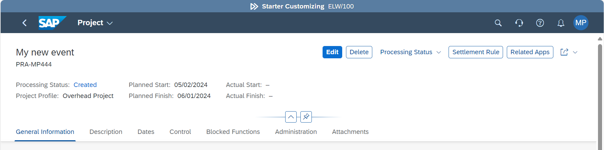

# Explore Application Features

## Introduction 

In this exercise you will explorer the features of the deployed application and create your first project in S/4HANA Cloud.

## Content

1. In **SAP BTP Cockpit**, navigate to your subaccount.

2. From your left-side subaccount menu, navigate to **HTML5 Applications**

3. Find application with **{YOUR_ID}** at the end and choose it.

   

4. In the launchpad choose the only tile **Manage Author Readings**.

   

5. Choose **Create** button in the toolbar above the list of existing projects.

   

6. Enter the following data and then choose **Create** button:
   - **{YOUR_ID}** in the **ID** field
   - **My new event** in the **Title** field
   - Any date e.g. **April 1, 2025** in the **Date** field
   - **10** in the **Max Number of Participants** field

   

7. After the event is created choose **Create Project in S4HC** button. 

   
  
8. If the project was created successfully in the S4HANA Cloud you will get the details in the section **Project Data**.  

9. Choose the only link under the label **Project** to navigate to S4HANA Cloud.

   

10. It will open a maintenace screen of **Enterprise Projects** for your newly created project.

  

> The deployed application offers other options to handle your projects, like changing the status, adding participants and so on. You can find more details in the original [repository](https://github.com/SAP-samples/sme-partner-reference-application/blob/main/Tutorials/30-Guided-Tour.md).

## Result

You have created your first project in S/4HANA Cloud from the deployed application.

