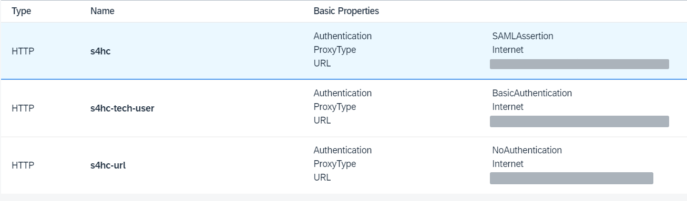

# Code Overview

## Introduction 

In this section, you will explorer the structure of the application and get the basic overview of SAP S/4HANA Cloud integration.

## Task Flow  

You will overview the following sections:

1. Project structure
2. Destinations

## Content

### Project Structure

The application you have deployed is a normal CAP app. You can create the similar one if you follow the steps described in the code repository of [Partner Reference Application](https://github.com/SAP-samples/sme-partner-reference-application/).

The application has the following structure:
```/app``` - folder with the UI (Fiori Elements) part
```/db``` - folder with the artifacts for the DB deployment (data scheme, translations and initial data loads)
```/external_resources``` - metadata of external APIs
```/test``` - folder with unit tests
```/srv``` - folder with the services with the following structure:
- ```/srv/external``` - converted to CDL API structure
- ```/srv/i18n/``` - translations for the messages
- ```/srv/connector-s4hc.js``` - code for S/4HANA Cloud integration
- ```/srv/reuse.js``` - common reusable code procedures
- ```/srv/service-auth.cds``` - authorization descriptor for the services
- ```/srv/service-implementation.js``` - service code implementation
- ```/srv/service-models.cds``` - service model description

```cdsrc.json``` - CDS descriptor with the test roles
```mta.yaml``` - multi-target application descriptor
```package.json``` - config file of NodeJS
```server.js``` - main JS file
```xs-security.json``` - XSUAA descriptor with the authorization definition

As the focus of this workshop is the integration to S/4HANA Cloud it's recommended that you explore and understand the content inside *srv* folder. Check the original repository [instructions](https://github.com/SAP-samples/sme-partner-reference-application/blob/main/Tutorials/51-S4HC-Integration.md) to get the idea what was added to the CAP application to integrate it with S/4HANA Cloud.

### Destinations

The application uses APIs described in the *package.json* files. These API's are called via destinations.

Some of the APIs are only accessible with the basic authentication. They use the *s4hc-tech-user* destination.

Destinations with principal propagation will use *s4hc* destination.

There's also a destination for the app-to-app navigation created to get the URL for S/4 HANA Cloud. It's called *s4hc-url*.

You can explore all the details of the destinations in your SAP BTP subaccount: 




## Result

You have explored the structure of the CAP application and have a basic understanding of how the S/4HANA Cloud integration works.

## Further reading / Reference Links

???