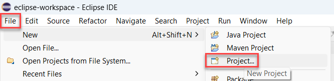
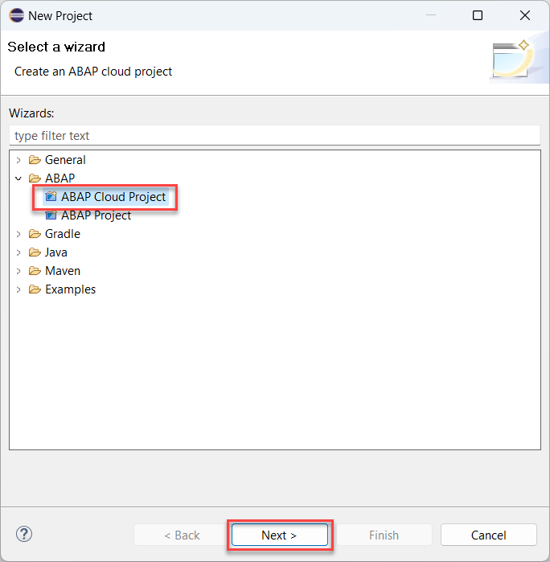
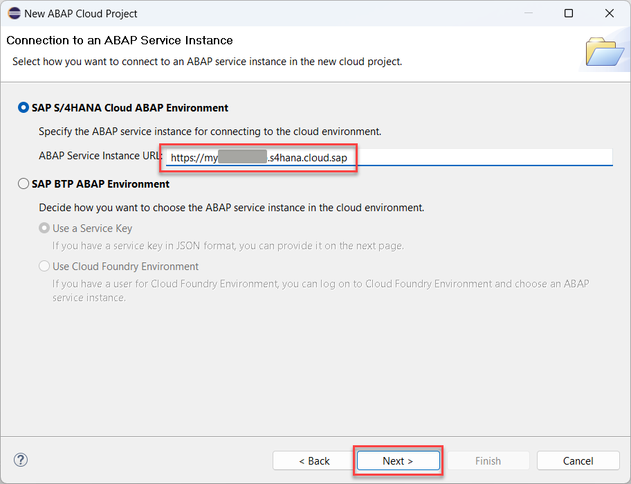
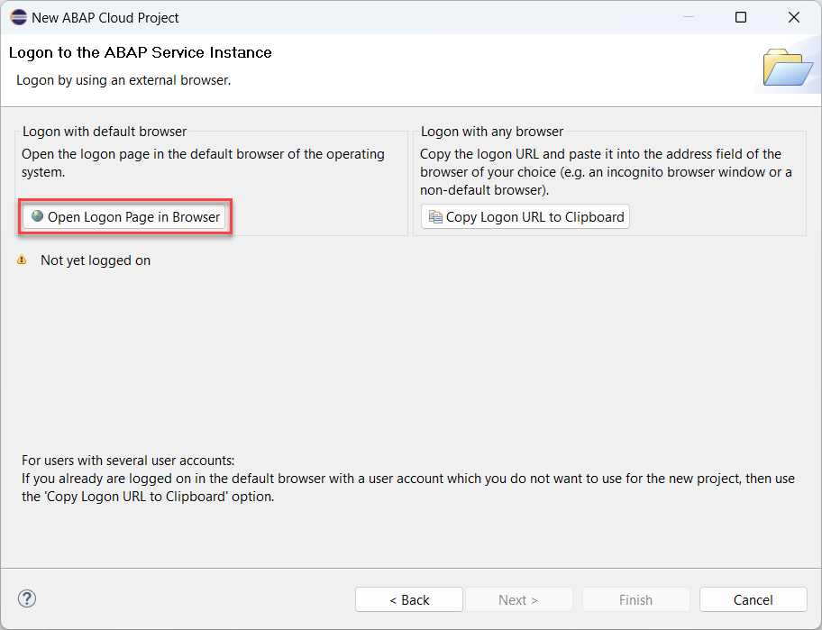
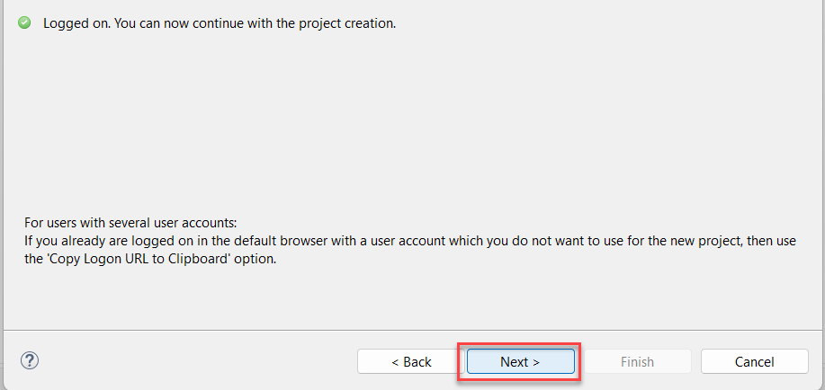
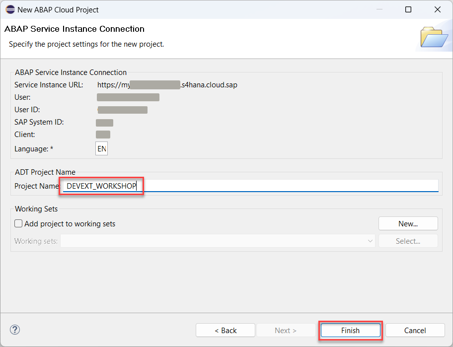
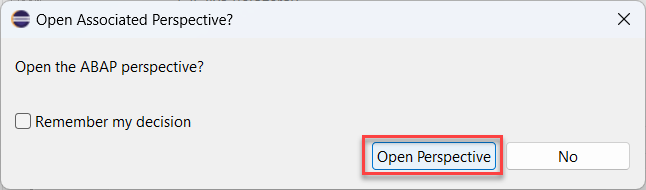

# Connect to the system

## Introduction 

In this exercise, you will connect your development environment to the S/4HANA Cloud system instance to enable Development Extensibility.

## Prerequisites

You should have [ABAP Development Tools](https://tools.eu1.hana.ondemand.com/#abap) installed.

## Content

1. Open Eclipse application and choose menu option **File** &rarr; **New** &rarr; **Project...**

   

2. Select **ABAP Cloud Project** wizard in the **ABAP** folder and choose **Next**.

   

1. Enter the URL for *S/4HC Development Tenant* in the **ABAP Service Instance URL** field and choose **Next**.

   

1. On the next screen choose **Open Logon Page in Browser** and enter your credentials in the new browser tab when prompted.

  > For users with several user accounts: If you already are logged on in the default browser with a user account which you do not want to use (for example with your corporate one), then use the "Copy Logon URL to Clipboard" option.

   

1. After log on is successful go back to Eclipse and choose **Next** to proceed.

   

6. Enter **DEVEXT_WORKSHOP** in the **ADT Project Name** field and choose **Finish**.

   

7. Confirm **Open Perspective** if you are asked to switch to the ABAP perspective.

  

## Result

You have now created the cloud project in your Eclipse IDE and can proceed exploring the Development Extensibility. 

[Next Tutorial: Create Package](./package.md)
## Further reading / Reference Links

???
