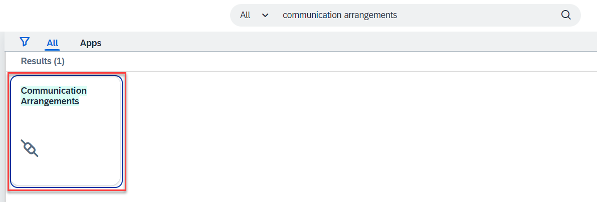
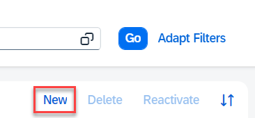
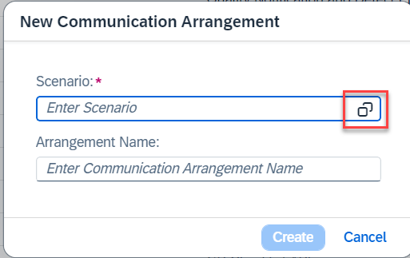
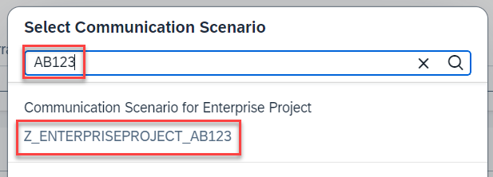
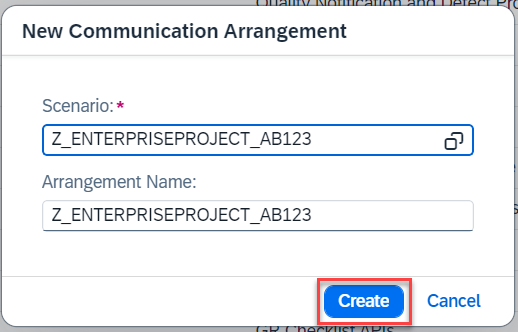
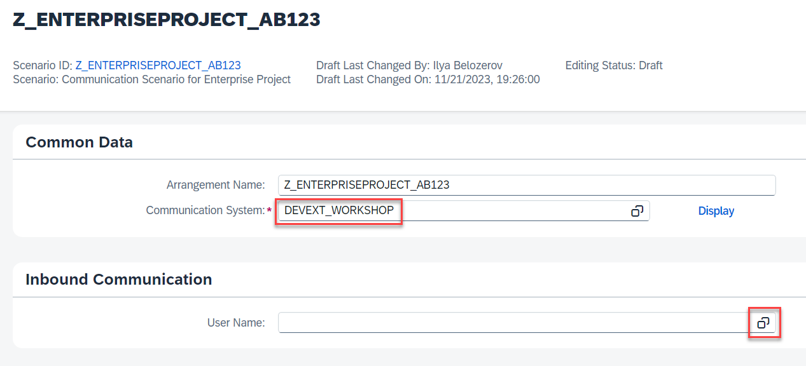
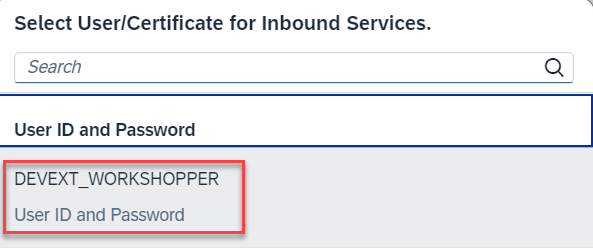
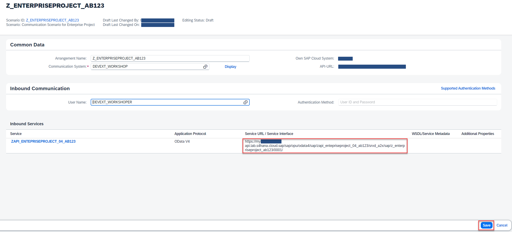

# Create Communication Arrangement

## Introduction 

In this exercise, you will create a communication arrangement which will expose the services defined in communication scenario and enable them to be accessed in the way defined in the communication system.

## Content

1. In your browser open the *SAP S/4HANA Cloud Customizing Tenant*.

2. Search for the **Communication Arrangements** application and open it.

   

3. Choose **New** button.

   
  
4. Choose scenario selection button.
  
  

5. In the search field enter **{YOUR_ID}** and then select your scenario.

   

6. Leave the arrangement name as it is and choose **Create** button.

   

7. In the **Common Data** section select communication system **DEVEXT_WORKSHOP**. 

8. Choose User Name selection button in the section **Inbound Communication**.

   

9. Select **DEVEXT_WORKSHOPPER** user.

   

10. Copy the URL for the service and choose **Save** button.

  

## Result

You have created the communication arrangement. Now your new service is fully accessible.

## Further reading / Reference Links

???
