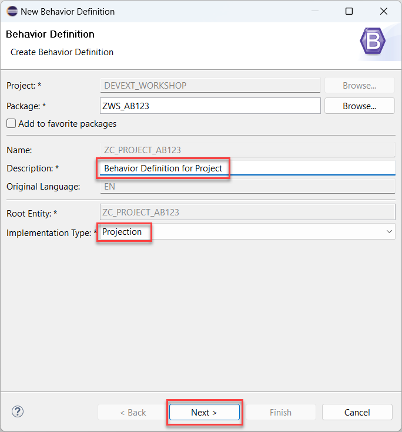
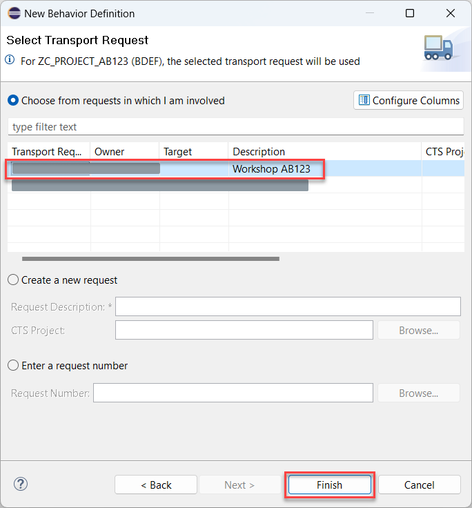
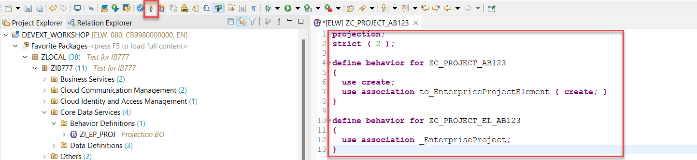

# Create Behavior Definition

## Introduction 

In this exercise, you will create a behavior definition projection which will contain only the necessary scope of the functions provided by the basic business objects.

## Content

1. Right click on your package name created in the previous exercise.
  
   

2. 

   

3. 

   

4. Replace the proposed code with the one below (considering **{YOUR_ID}** replacement) to restrict all operations except of *create*:

  ~~~abap
  projection;
  strict ( 2 );

  define behavior for ZC_PROJECT_{YOUR_ID}
  {
    use create;
    use association to_EnterpriseProjectElement { create; }
  }

  define behavior for ZC_PROJECT_EL_{YOUR_ID}
  {
    use association _EnterpriseProject;
  }
  ~~~

  

## Result

You have created the behavior definition projection. You business object projection is now ready to be exposed as a service.

[Next Tutorial: Expose an OData Service](./expose.md)

## Further reading / Reference Links

- [Behavior Definition Projection](https://help.sap.com/docs/abap-cloud/abap-rap/projection-behavior-definition)