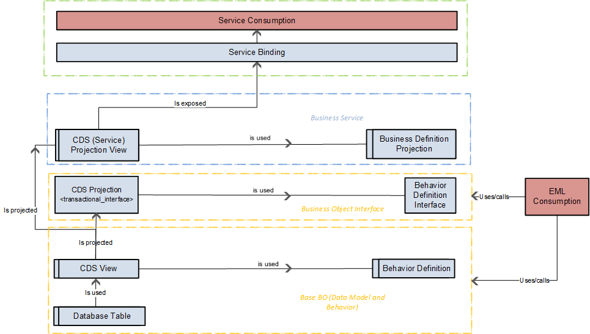
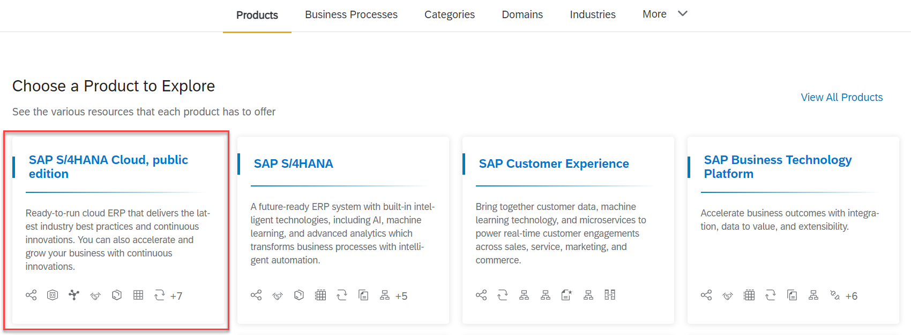
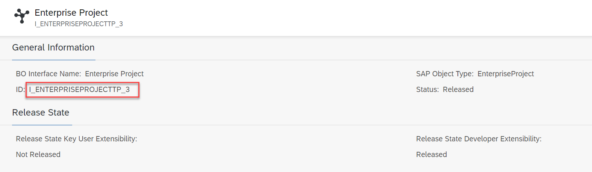

# Explore Business Object Projections

## Introduction 

You have decided to create a new API. But it makes sense to reuse as much as possible from the existing code provided by SAP. In this exercise you will learn how to build business object projections and how to find the basis for that.

## Content

1. A service projection layer is required for a flexible service consumption of one business object. The basic business object is service agnostic. That means, this BO is built independently from any OData service application. The basic BO comprises the maximum range of features that can be applicable by a service that exposes this BO. The projection layer is the first layer in the development flow of the ABAP RESTful Programming Model that is service specific. When projecting the basic BO, you define the real manifestation of a business object in an OData service. The business object projection entails that part (the subset) of the BO structure and behavior that is relevant for the respective service, including denormalization of the underlying data model. Furthermore, the projection layer contains service-specific fine-tuning which does not belong to the general data model layer, for example UI annotations, value helps, calculations or defaulting.

2. A RAP Business Object Interface is an additional abstraction layer between a RAP base BO and its business service projection layer. With RAP BO interfaces, you can technically decouple requirements for stable consumption from the behavior and data model of the underlying RAP base BO.

  

3. In this workshop we will proceed with the projection on the Business Object Interface. Let's find the correct object.

4. In your browser open **api.sap.com**.

5. Select **SAP S/4HANA Cloud, public edition** product tile.
  
   

6. Choose **Develope Extensibility** option in the top menu. The choose **Business Object Interface** option in the sub menu. Afterwards search for **Enterprise Project** and select **Enterprise Project** tile.

   
  
7. You can find the name of the interface: **I_EnterpriseProjectTP_3**.

  

## Result

You have got basic knowledge about business object projections and found the basic object for your scenario. Now it's time to get the hands dirty.

[Next Tutorial: Connect to the system](./adt.md)

## Further reading / Reference Links
- [Business Object Interface](https://help.sap.com/docs/abap-cloud/abap-rap/business-object-interface)
- [Business Object Projection](https://help.sap.com/docs/abap-cloud/abap-rap/business-object-projection)