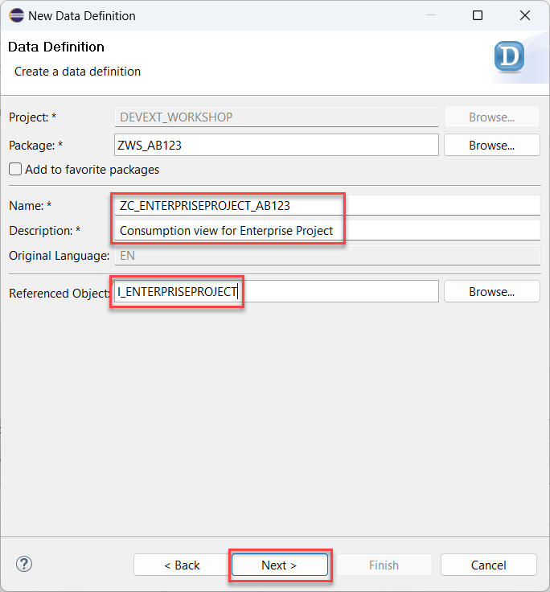
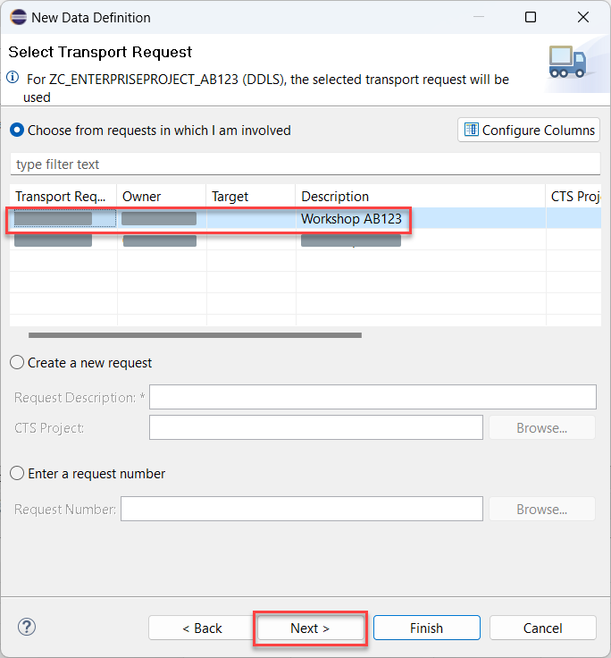
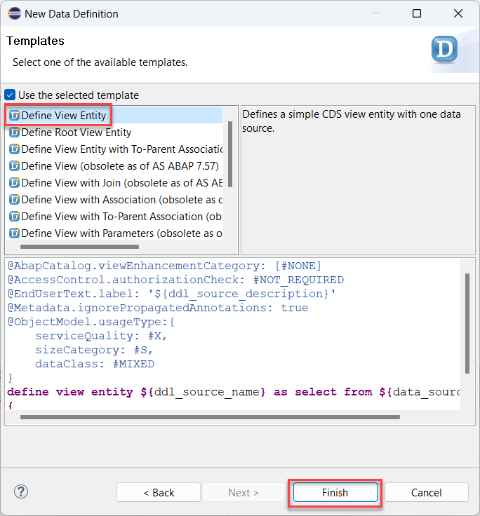
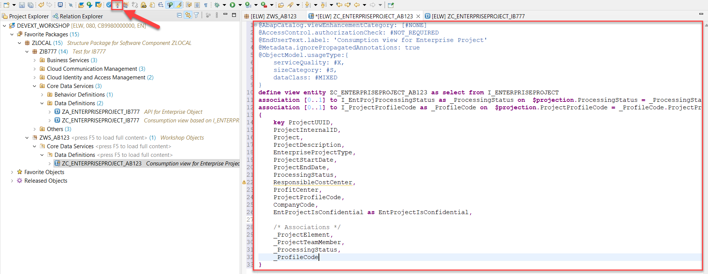

# Create Data Definition

## Introduction 

In this exercise, you will create a CDS view entity which will represent the data model of your service.

## Content

1. Right click on your package name created in the previous exercise.

2. Choose **New** &rarr; **Other ABAP Repository Object** option in the context menu.

   

3. Choose **Data Definition** in the **Core Data Services** folder and then choose **Next**.

   

4. Enter the following data and then choose **Next**:
  - **ZC_ENTERPRISEPROJECT_{YOUR_ID}** in the **Name** field
  - **Consumption view for Enterprise Project** in the **Description** field
  - **I_EnterpriseProject** in the **Referenced Object** field

   

5. On the next screen select your transport and choose **Next**.

   

6. On the next screen select the **Define View Entity** template and then choose **Finish**.

   

7. Replace the code of the view with the one below (considering **{YOUR_ID}** replacement)

~~~abap
@AbapCatalog.viewEnhancementCategory: [#NONE]
@AccessControl.authorizationCheck: #NOT_REQUIRED
@EndUserText.label: 'Consumption view for Enterprise Project'
@Metadata.ignorePropagatedAnnotations: true
@ObjectModel.usageType:{
    serviceQuality: #X,
    sizeCategory: #S,
    dataClass: #MIXED
}
define view entity ZC_ENTERPRISEPROJECT_{YOUR_ID} as select from I_EnterpriseProject
association [0..1] to I_EntProjProcessingStatus as _ProcessingStatus on  $projection.ProcessingStatus = _ProcessingStatus.ProcessingStatus
association [0..1] to I_ProjectProfileCode as _ProfileCode on  $projection.ProjectProfileCode = _ProfileCode.ProjectProfileCode
{
    key ProjectUUID,
    ProjectInternalID,
    Project,
    ProjectDescription,
    EnterpriseProjectType,
    ProjectStartDate,
    ProjectEndDate,
    ProcessingStatus,
    ResponsibleCostCenter,
    ProfitCenter,
    ProjectProfileCode,
    CompanyCode,
    EntProjectIsConfidential as EntProjectIsConfidential,

    /* Associations */
    _ProjectElement,
    _ProjectTeamMember,
    _ProcessingStatus,
    _ProfileCode
}
~~~

8. Choose **Activate** button.
   
  

## Result

You have created a data entity. This entity is now ready to be exposed as a service.

[Next Tutorial: Expose an OData Service](./expose.md)

## Further reading / Reference Links

- [Naming convention](https://help.sap.com/docs/ABAP_PLATFORM_NEW/fc4c71aa50014fd1b43721701471913d/8b8f9d8f3cb948b2841d6045a255e503.html)
- [Developing Managed Transactional Apps](https://help.sap.com/docs/ABAP_PLATFORM_NEW/fc4c71aa50014fd1b43721701471913d/b5bba99612cf4637a8b72a3fc82c22d9.html)
