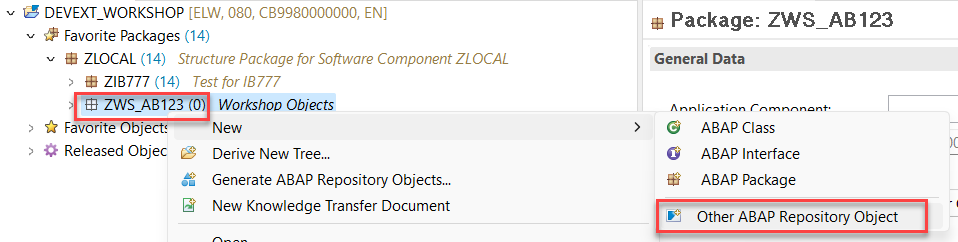
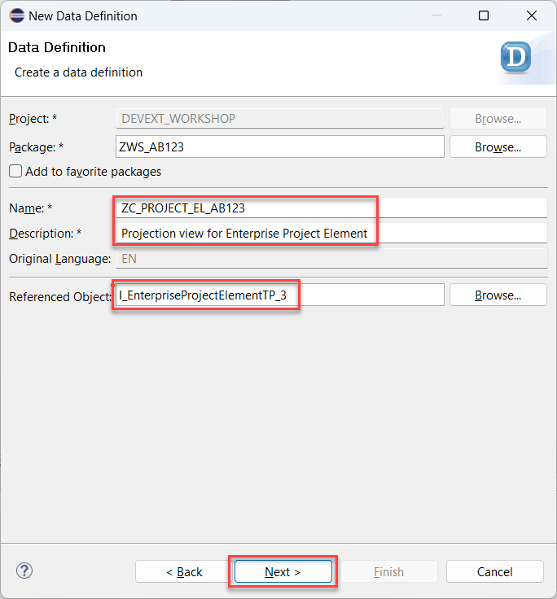
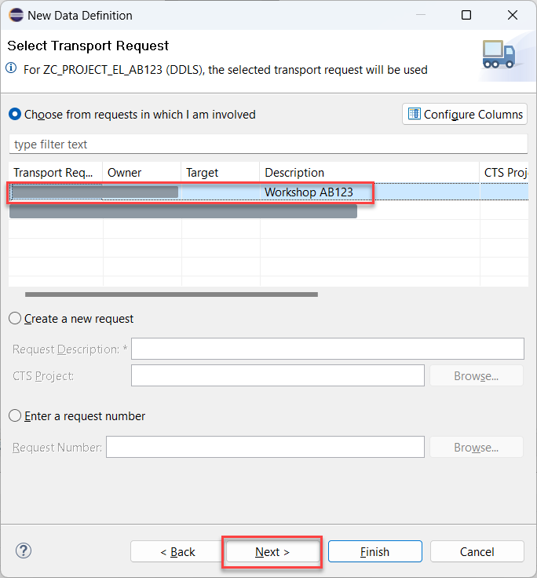
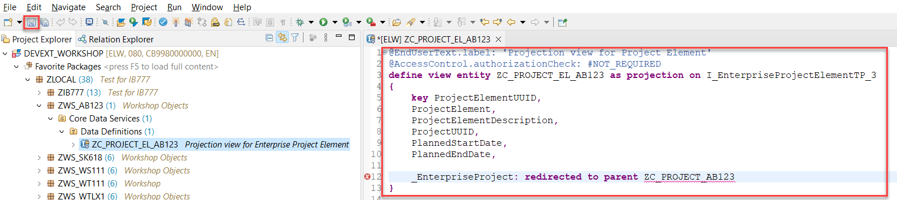
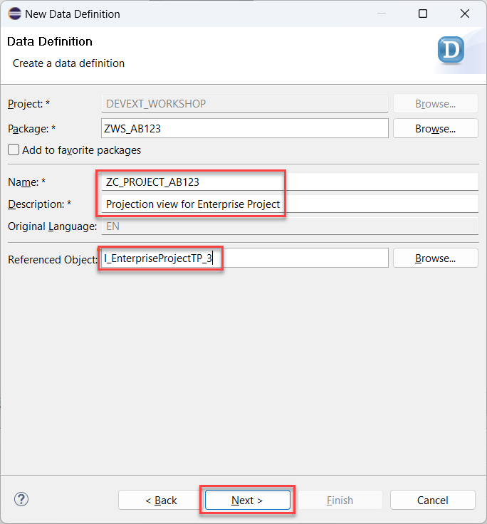
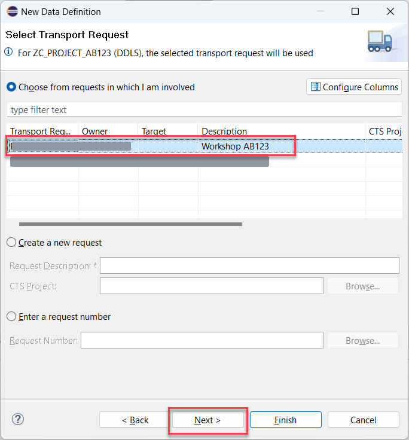
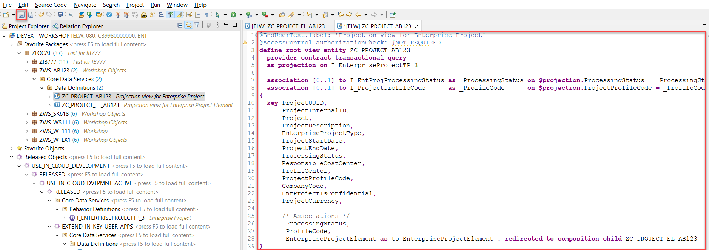
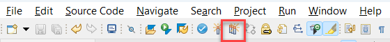
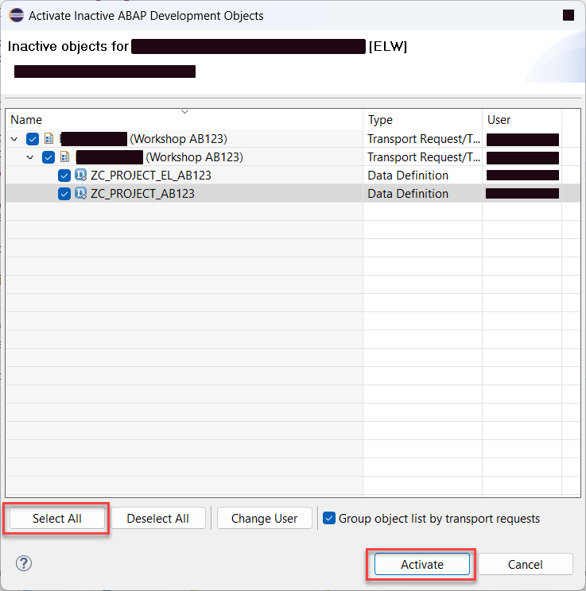

# Create Data Definition

## Introduction 

In this exercise, you will create CDS view projections which will represent the data model of your service. These projections will be based on the Business Object interface *I_EnterpriseProjectTP_3* and its child composition *I_EnterpriseProjectElementTP_3* which are released by SAP for Cloud development.

## Task Flow  

In this exercise, you will perform the following tasks:

1. Create projection for Enterprise Project Element
2. Create projection for Enterprise Project

## Content

### Task 1: Create projection for Enterprise Project Element

1. Right click on your package name created in the previous exercise.

2. Choose **New** &rarr; **Other ABAP Repository Object** option in the context menu.

   

3. Choose **Data Definition** in the **Core Data Services** folder and then choose **Next**.

   

4. Enter the following data and then choose **Next**:
  - **ZC_PROJECT_EL_{YOUR_ID}** in the **Name** field
  - **Projection view for Project Element** in the **Description** field
  - **I_EnterpriseProjectElementTP_3** in the **Referenced Object** field

  

5. On the next screen select your transport and choose **Next**.

   

6. On the next screen select the **Define Projection View** template and then choose **Finish**.

  

7. Replace the code of the view with the one below (considering **{YOUR_ID}** replacement) and then choose **Save** button.

> NOTE: You will probably notice that there's an error in the code below. That happens because we have cross-links between both objects (from parent to child and vice versa). These objects cannot be activated one by one. So we will save them both and then activate at once. So no worries about any error message in this step.

~~~abap
@EndUserText.label: 'Projection view for Project Element'
@AccessControl.authorizationCheck: #NOT_REQUIRED
define view entity ZC_PROJECT_EL_{YOUR_ID} as projection on I_EnterpriseProjectElementTP_3
{
    key ProjectElementUUID,
    ProjectElement,
    ProjectElementDescription,
    ProjectUUID,
    PlannedStartDate,
    PlannedEndDate,
    
    _EnterpriseProject: redirected to parent ZC_PROJECT_{YOUR_ID}
}
~~~

  

### Task 2: Create projection for Enterprise Project

1. Right click on your package name created in the previous exercise.

2. Choose **New** &rarr; **Other ABAP Repository Object** option in the context menu.

   

3. Choose **Data Definition** in the **Core Data Services** folder and then choose **Next**.

   

4. Enter the following data and then choose **Next**:
  - **ZC_PROJECT_{YOUR_ID}** in the **Name** field
  - **Projection view for Enterprise Project** in the **Description** field
  - **I_EnterpriseProjectTP_3** in the **Referenced Object** field

   

5. On the next screen select your transport and choose **Next**.

   

6. On the next screen select the **Define Projection View** template and then choose **Finish**.

  

7. Replace the code of the view with the one below (considering **{YOUR_ID}** replacement)

~~~abap
@EndUserText.label: 'Projection view for Enterprise Project'
@AccessControl.authorizationCheck: #NOT_REQUIRED
define root view entity ZC_PROJECT_{YOUR_ID}
  provider contract transactional_query
  as projection on I_EnterpriseProjectTP_3

  association [0..1] to I_EntProjProcessingStatus as _ProcessingStatus on $projection.ProcessingStatus = _ProcessingStatus.ProcessingStatus
  association [0..1] to I_ProjectProfileCode      as _ProfileCode      on $projection.ProjectProfileCode = _ProfileCode.ProjectProfileCode
{
  key ProjectUUID,
      ProjectInternalID,
      Project,
      ProjectDescription,
      EnterpriseProjectType,
      ProjectStartDate,
      ProjectEndDate,
      ProcessingStatus,
      ResponsibleCostCenter,
      ProfitCenter,
      ProjectProfileCode,
      CompanyCode,
      EntProjectIsConfidential,
      ProjectCurrency,

      /* Associations */
      _ProcessingStatus,
      _ProfileCode,
      _EnterpriseProjectElement as to_EnterpriseProjectElement : redirected to composition child ZC_PROJECT_EL_{YOUR_ID}
}
~~~

  

8. Choose **Activate inactive ABAP development objects** button.
   
  

9. Choose **Select All** button and then choose **Activate** button.

  

## Result

You have created CDS view projections. These projections can be used now as a base to create behavior definition projection.

[Next Tutorial: Create behavior definition](./behavior-definition.md)

## Further reading / Reference Links

- [Naming convention](https://help.sap.com/docs/ABAP_PLATFORM_NEW/fc4c71aa50014fd1b43721701471913d/8b8f9d8f3cb948b2841d6045a255e503.html)
- [SAP Help: CDS Projection](https://help.sap.com/docs/abap-cloud/abap-rap/cds-projection-view)
- [CDS Projection Views in ABAP CDS: What’s Your Flavor](https://blogs.sap.com/2022/07/04/cds-projection-views-in-abap-cds-whats-your-flavor/)
- [ABAP Documentation: CDS Projection Views - Transactional Queries](https://help.sap.com/doc/abapdocu_latest_index_htm/latest/en-US/index.htm?file=abencds_pv_transactional_query.htm)
