# Expose Service

## Introduction 

In this exercise, you will create objects needed to expose your data model as an OData service.

## Task Flow  

In this exercise, you will perform the following tasks:

1. Create service definition
2. Create service binding
3. Clean up authorization details

## Content

### Task 1: Create service definition

1. Right click on the root projection view **ZC_PROJECT_{YOUR_ID}**.

2. Select **New Service Definition** in the popup menu.

  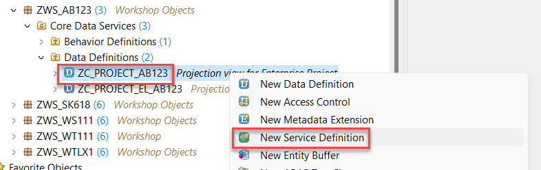 

3. Enter the following details and choose **Next**:
  - **Z_PROJECT_{YOUR_ID}** in the **Name** field
  - **Service Definition for Project** in the **Description** field

  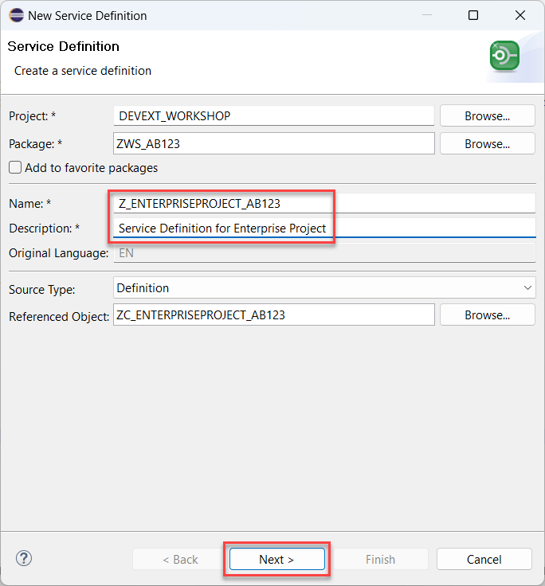

4. On the next screen select your transport and then choose **Finish** button.

   

5. Assign aliases to your Business Object projection entities and expose local associations as shown in the code below (considering **{YOUR_ID}** replacement):

  ~~~abap
  @EndUserText.label: 'Service Definition for Project'
  define service Z_PROJECT_{YOUR_ID} {
    expose ZC_PROJECT_{YOUR_ID}          as A_EnterpriseProject;
    expose ZC_PROJECT_EL_{YOUR_ID}       as A_EnterpriseProjectElement;
    expose I_EntProjProcessingStatus as A_EntProjProcessingStatus;
    expose I_ProjectProfileCode      as A_ProjectProfileCode;
  }
  ~~~

6. Select **Activate** button.

  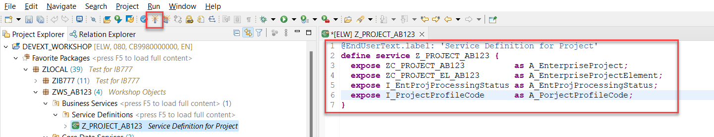 

### Task 2: Create service binding

1. Right click on your service definition.

2. Select **New Service Binding** option in the popup menu.

  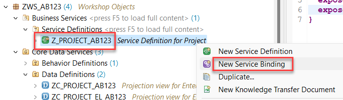 

3. Enter the following details and then choose **Next** button:
  - **ZAPI_PROJECT_{YOUR_ID}** in the **Name** field
  - **API V4 for Project** in the **Description** field
  - **OData V4 - Web API** in the **Binding Type** list box

  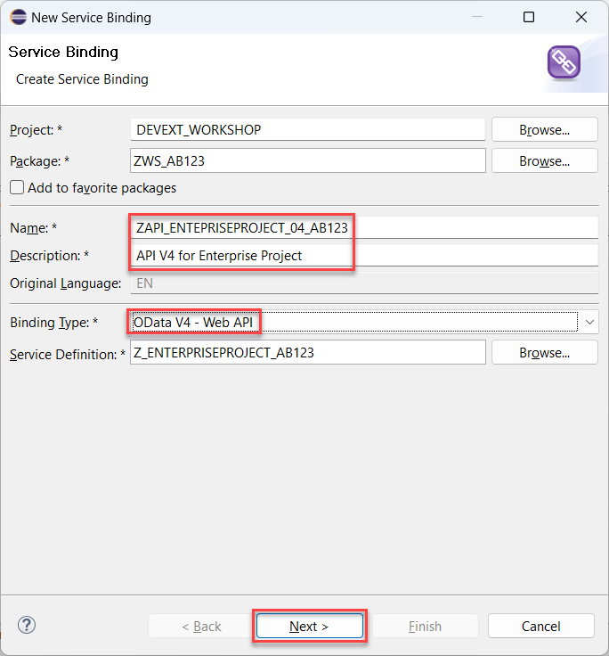 

4. On the next screen select your transport and choose **Finish** button.

  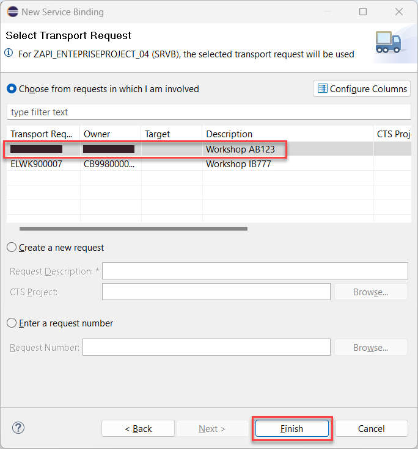 

5. Choose **Activate** button.

  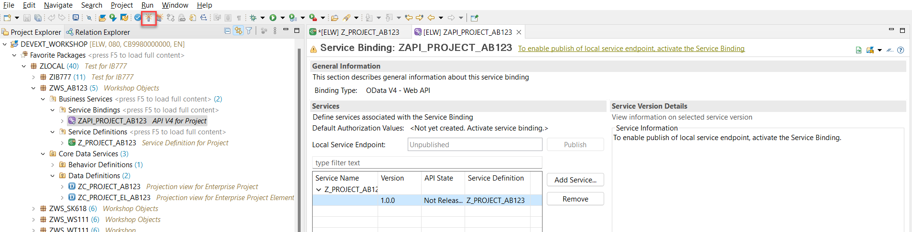

6. After the service binding was activated, choose **Publish** button.  

  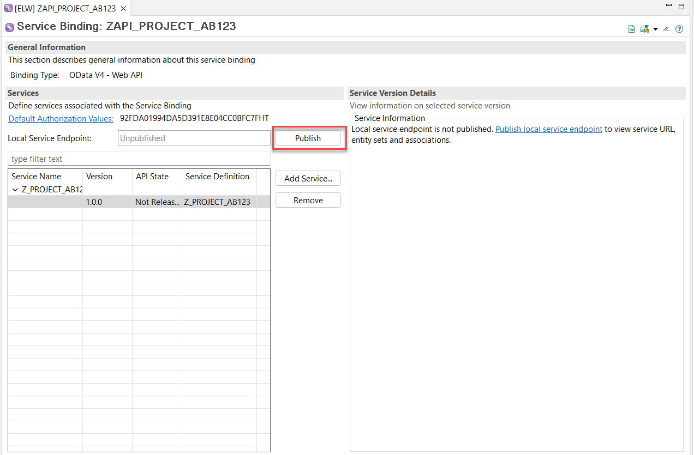

### Task 3. Clean up authorization details

> Every SAP Business Object contains its own authorization concept which is at the end defined by the list of authorization objects. After the service binding is created it generates the default values for these authorization objects. In this workshop we do not touch the authorization aspects at all. But for the further exercises these default values should be edited as they contain the objects which are not yet released for cloud development.

1. Open the generated Authorization Default Values from your new service binding.

  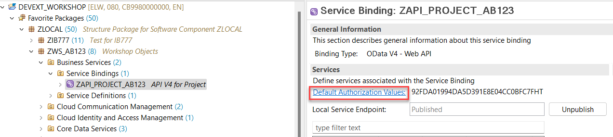 

2. Select object **C_PROJ_PRC** and choose **Delete selected item** button.

  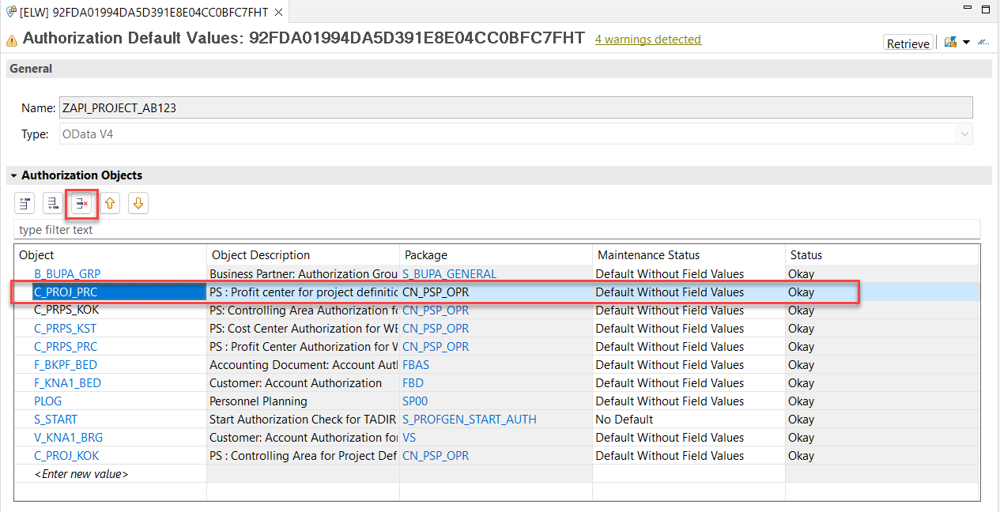 

3. Repeat the previous step with the objects **C_PRPS_KOK** and **C_PRPS_PRC**.

4. Choose **Save** button. Make sure that the list doesn't contain the objects mentioned above after save.

  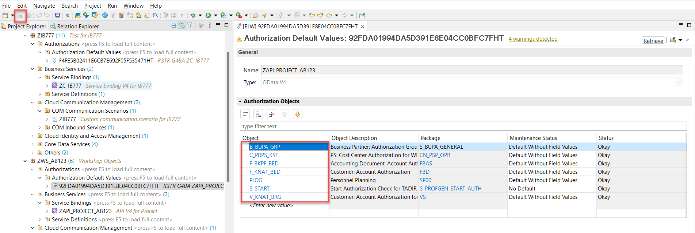

## Result

You have created a service definition and a service binding. Now your service is ready to be consumed. 

[Next tutorial: Create Communication Scenario](./scenario.md)

## Further reading / Reference Links

- [Service Definition](https://help.sap.com/docs/ABAP_PLATFORM_NEW/fc4c71aa50014fd1b43721701471913d/b09e4d53bfca4544a9f8910bcc2cd9d6.html)
- [Service Binding](https://help.sap.com/docs/ABAP_PLATFORM_NEW/fc4c71aa50014fd1b43721701471913d/b58a3c27df4e406f9335d4b346f6be04.html)
- [Editing Authorization Default Values](https://help.sap.com/docs/SAP_S4HANA_CLOUD/6aa39f1ac05441e5a23f484f31e477e7/266999e6b9244e728583e10dbbffc8bd.html)