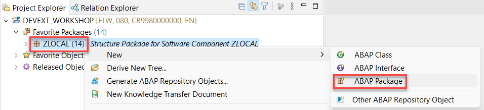
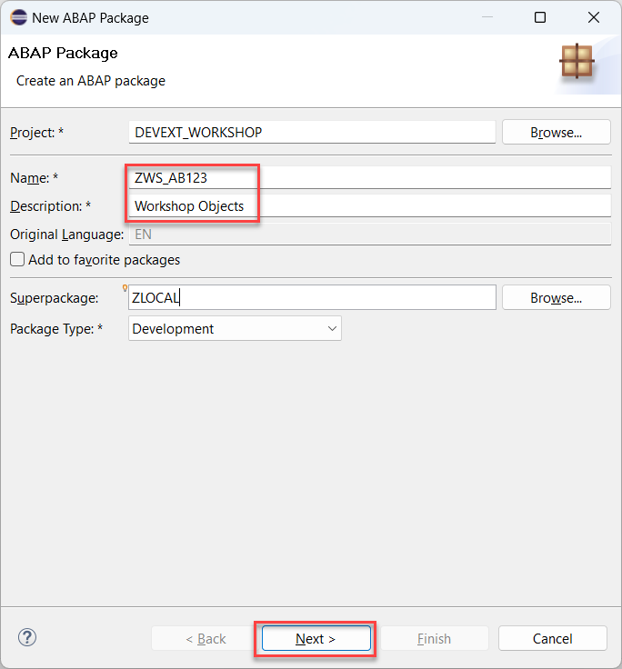
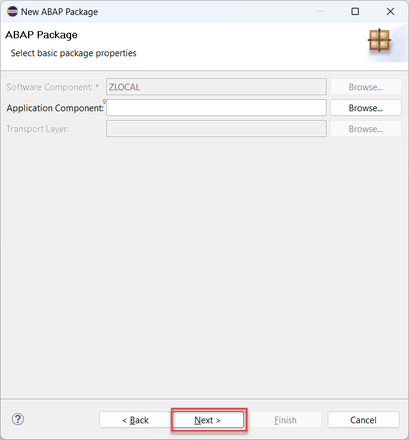
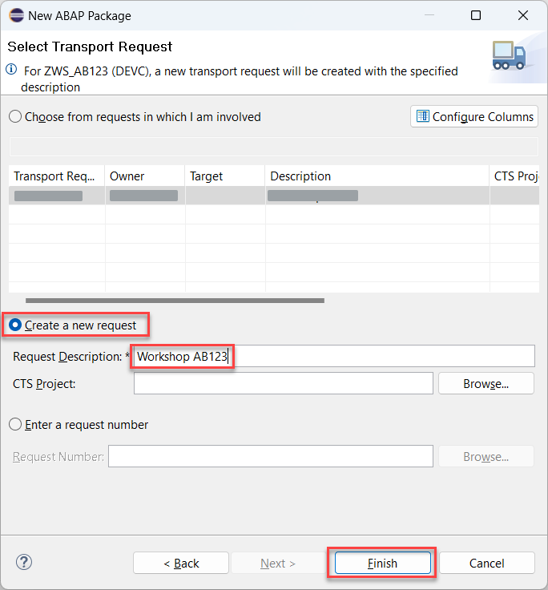

# Create package

## Introduction 

In this exercise, you will create a package for all your development artifacts in S/4HANA Cloud. 

## Content

1. Right click on the **ZLOCAL** package under the **Favorite Packages** in your **DEVEXT_WORKSHOP**.

2. Choose **New** &rarr; **ABAP Package** option.

  

3. Enter the following data and choose **Next** afterwards:
   - **ZWS_{YOUR_ID}** in the **Name** field
   - **Workshop Objects** in the **Description** field

   

4. On the next screen just choose **Next** button.

   

5. On the next screen choose the radiobutton **Create a new request**. Enter **Workshop {YOUR_ID}** in the **Request Description** field and choose **Finish**.

  

## Result

You have created the package where all your further objects will be stored.

[Next Tutorial: Create Data Definition](./data-definitions.md)

## Further reading / Reference Links

???
