# Create Communication Scenario

## Introduction 

In this exercise, you will create a communication scenario to define the services available for the consumption.

## Content

1. Right click on your package name created in one of the previous exercise.

2. Choose **New** &rarr; **Other ABAP Repository Object** option in the context menu.

   

3. Select **Communication Scenario** from the **Cloud Communication Management** folder and then choose **Next**.

  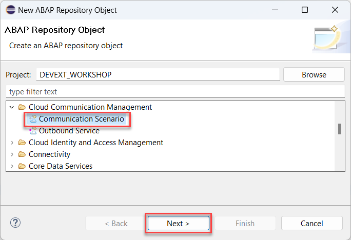 

4. Enter the following data and then choose **Next**. 
- **Z_ENTERPRISEPROJECT_{YOUR_ID}** in the **Name** field
- **Communication Scenario for Project** in the **Description** field

  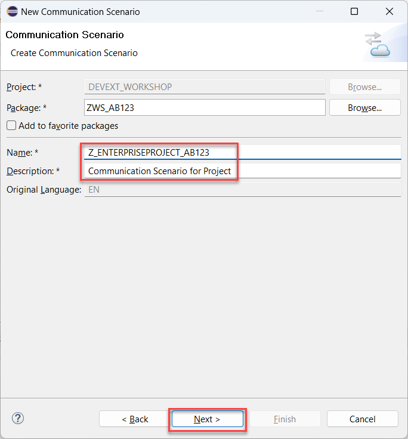

5. On the next screen choose your transport and then choose **Finish** button.

6. On the communication scenario screen select the **Inbound** tab below.

  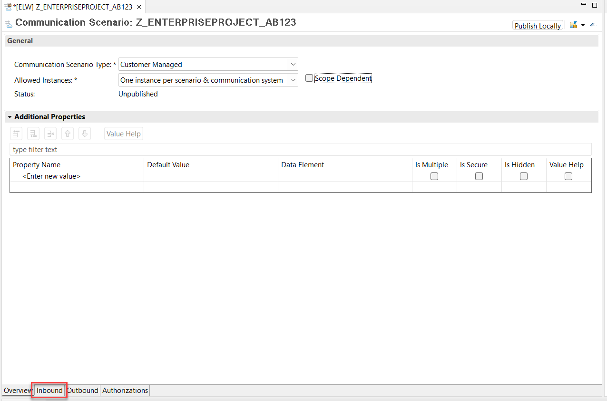 

7. Select **OAuth 2.0** checkbox in the **Inbound Settings** section.
 
  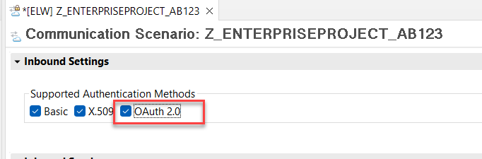

1. If the popup comes, just confirm it with the **OK** button.

  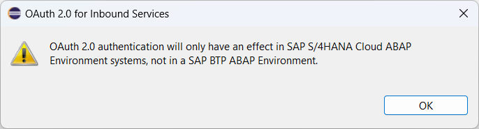 

9. Select **Add...** button in the **Inbound Services** section.

  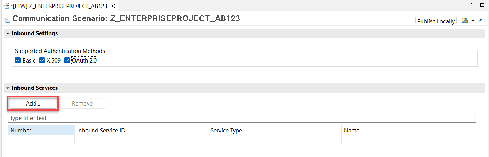 

10. On the popup screen select **Browse..** button.

  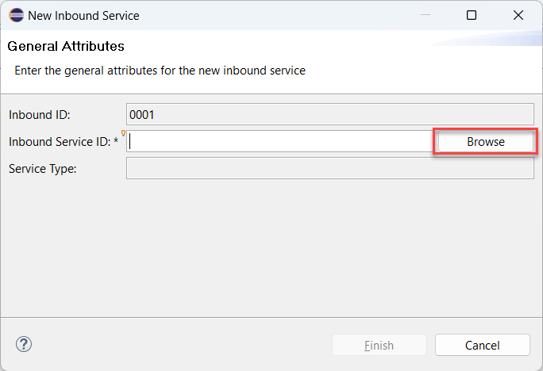

11. Enter **{YOUR_ID}** in the service selection screen and select the exposed service. Then choose **Finish** button.

  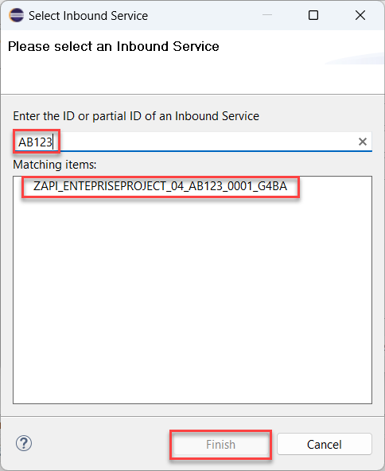 

11. On the next screen just choose **Finish** button.

  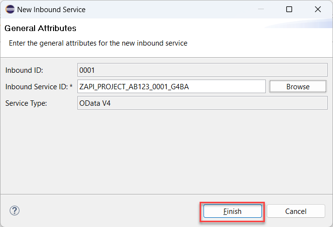

12. Choose **Publish locally** button.  

  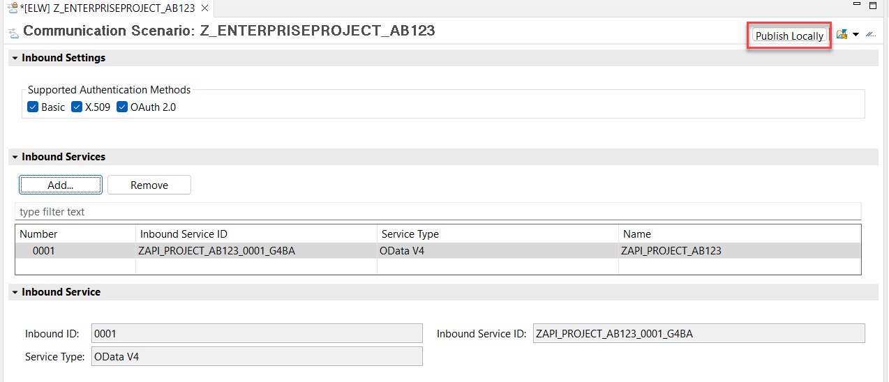

13. In the coming popup confirm the scenario saving with the **OK** button. 

  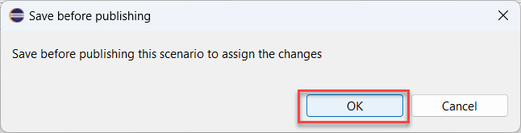

> It may take several minutes. Please be patient.

## Result

You have created the communication scenario which can be used now as a base for a communication arrangement.

[Next tutorial: Create Communication Arrangement](./arrangement.md)

## Further reading / Reference Links

- [Communication Management](https://help.sap.com/docs/SAP_S4HANA_CLOUD/0f69f8fb28ac4bf48d2b57b9637e81fa/2e84a10c430645a88bdbfaaa23ac9ff7.html)
