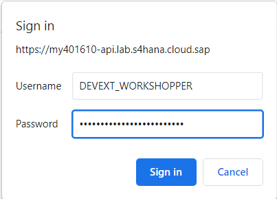
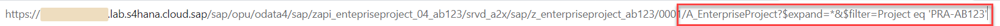
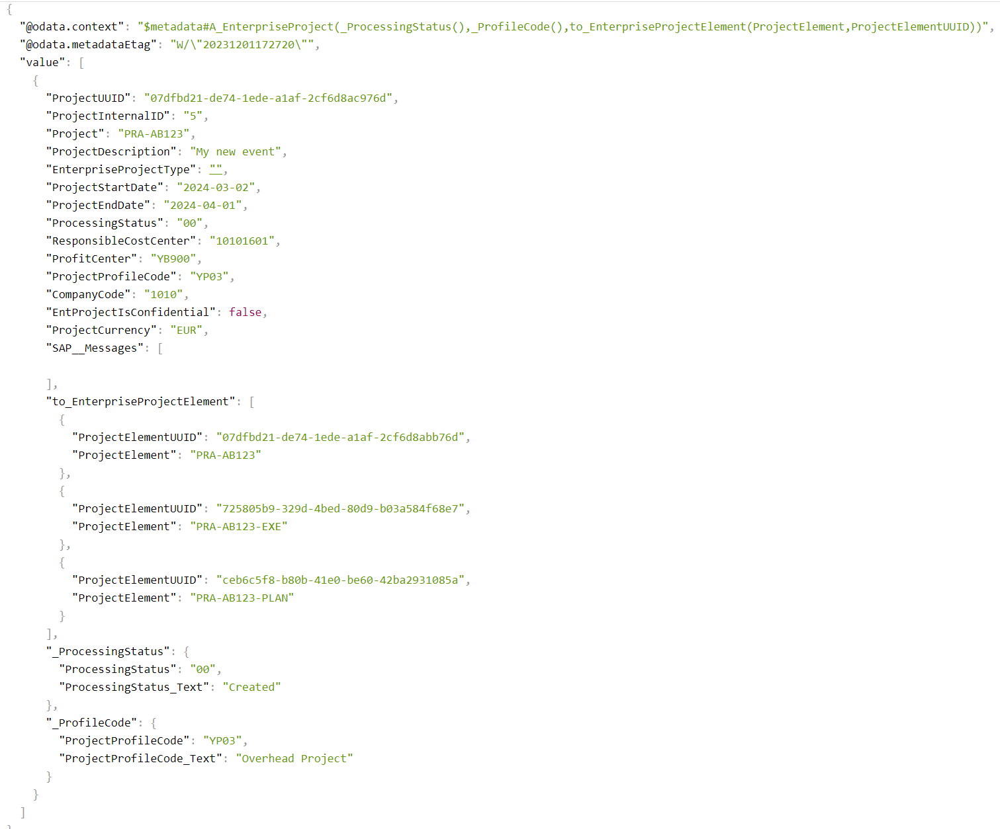

# Test API

## Introduction 

In this exercise, you will test the service created in the Part 2.

## Content

### Task 1: Create development space

1. In the new browser tab paste the URL copied in the [previous exercise](./arrangement.md).

2. When credentials will be requested enter the following data:
  - **DEVEXT_WORKSHOPER** in the field **Username**
  - Password provided by the workshop host in the field **Password**

   

3. You should see the list of entities as a response. Now change the URL by adding the following text (consider to replace **{YOUR_ID}**) and then press **Enter**:

~~~url
A_EnterpriseProject?$expand=*&$filter=Project eq 'PRA-{YOUR_ID}'
~~~

   

4. The response should look similar to the following (including **_ProcessingStatus** and **_ProfileCode** associations):

  

## Result

You have tested your service and verified that all the necessary additional entities (which previously were separate APIs) are available now with only one request. 

## Further reading / Reference Links

???
